Memorable moments from Big Island, Hawaii

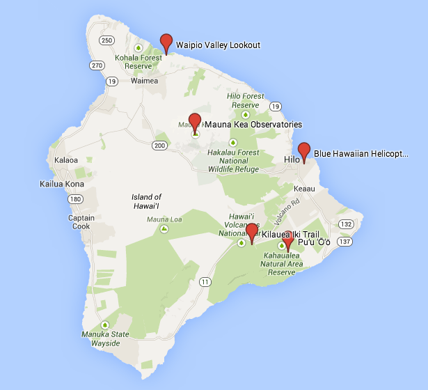

<!--truncate-->

Hawaii is a place worth of repeated visits. It is not meant to be consumed in only one trip. I've been to Hawaii twice. The first trip was on the The Big Island. In my view this is the best of Hawaii, for its live volcano, otherworldly terrain, hidden valley, and awe-inspiring fjords. 

Time of visit: August 2009

## Mt. Mauna Kea, sunset and stargazing

晓月坠，宿云微

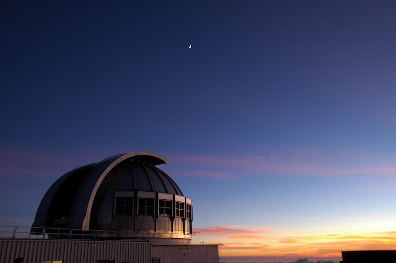

千里茫茫若梦

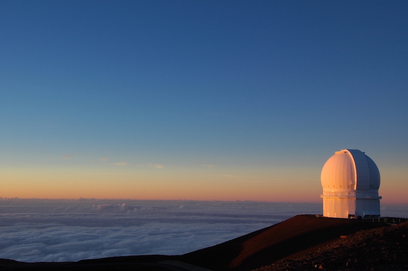

崖高人远

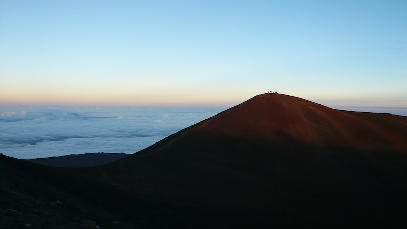

## Pu'u 'O'o, lava flow

今古河山无定据

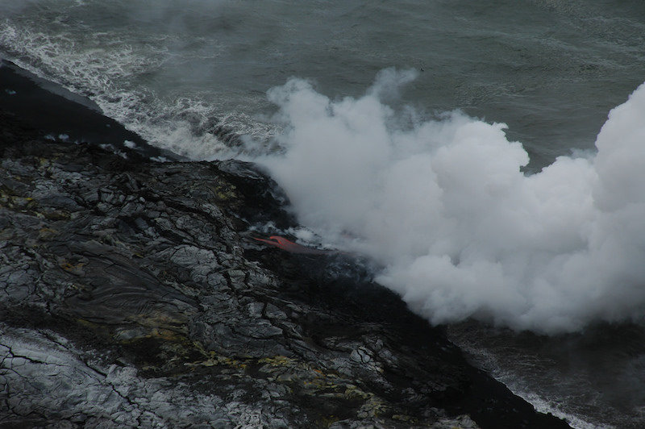

Helicopter ride, viewing The Big Island from the sky

剑气碧烟横

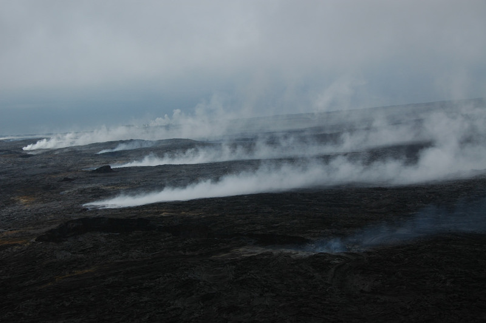

衰草连天无意绪

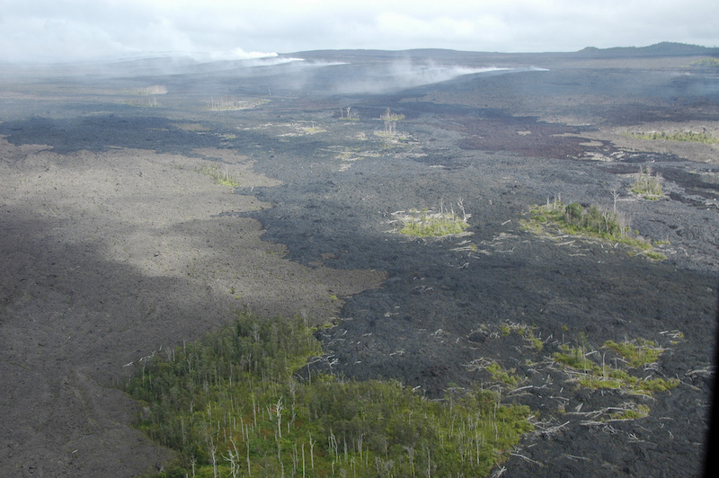

## Kilauea Iki Trail, volcano crater

Hiking on Lava

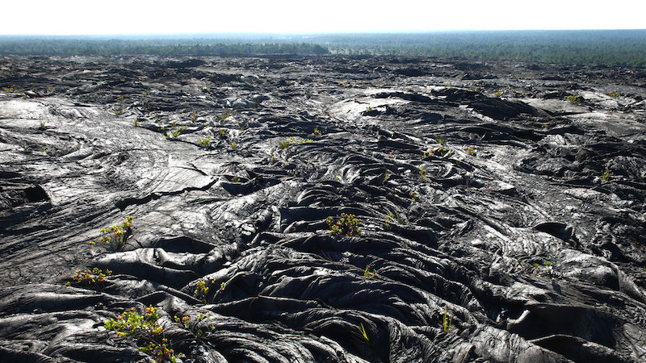

草木连天人骨白

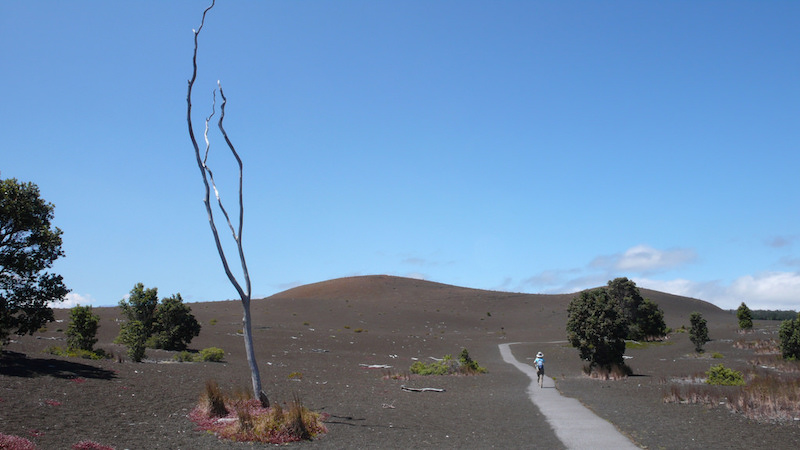
	
## Waipi'O Valley, hidden paradise

秋雨晴时泪不晴

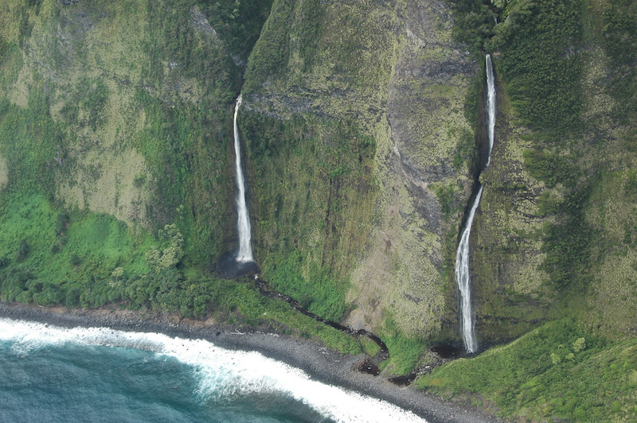
	
悄立雁门

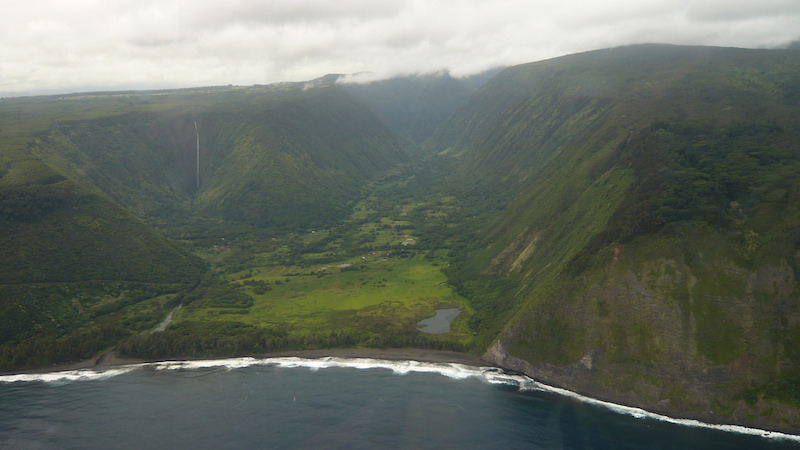