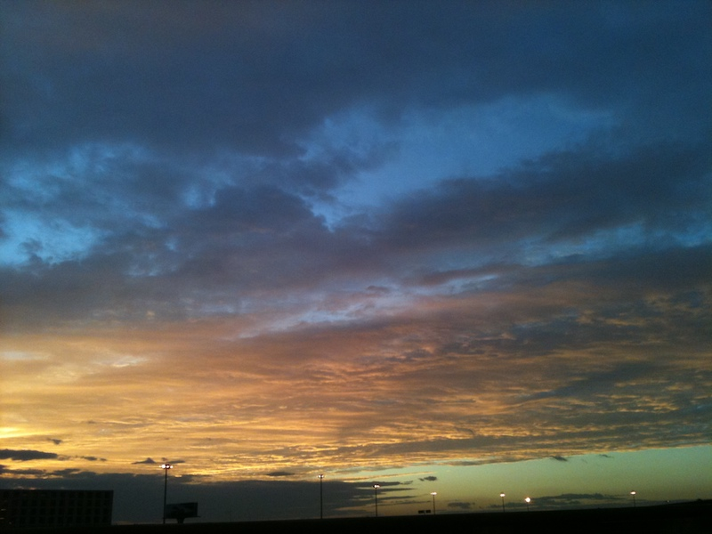

每逢秋姐，或者春姐出场时，各类祝福短信总是漫天飞舞。每年短信越发越多，但质量似乎越来越低。每每看到前同事们或者朋友亲戚们亲切的问候，想回复又不想重蹈三俗路线，于是被逼得只好填词了。

<!--truncate-->

前两年的春节借用的是沁园春的词牌，这次借很少有人用的雨霖铃涂鸦一番。（词中关键处借用了劳兄一句诗，特此申明）

---

绝尘而去，首都机场，骤雨初歇。

夏日酷暑无边，挥汗处，夜机催发。

执手相看微博，竟无语凝噎。

方案破，华中窘迫，暮霭沉沉钓鱼碣。

京城自古多拥堵，更那堪，喧嚣中秋节！

今宵友人何处？海内外，桃花源驻。

筑梦千重，应是良辰美景虚设。

便纵有层层梦境，更与谁人言!

