在黑天鹅随时可能降临的时代，坚持及时行乐的总方针路线肯定是王道

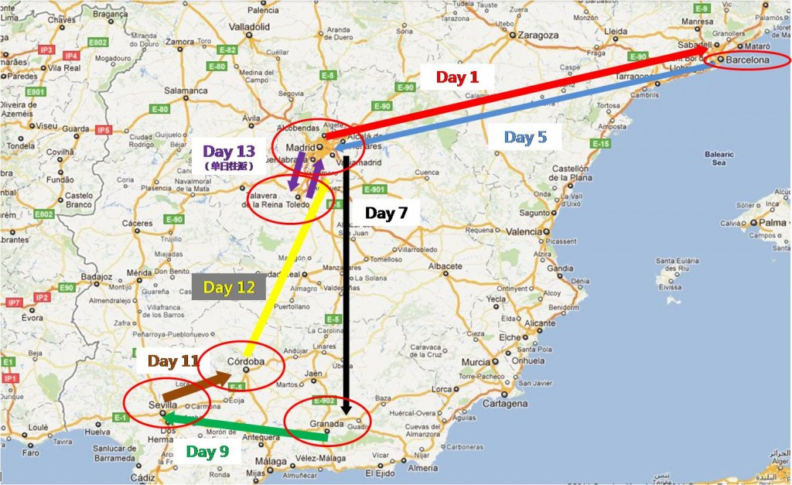

<!--truncate-->

## 无心睡眠

我好像已经很多年没有连续休假两个礼拜了。在记忆中每次休假都是十天左右，往返路途上大概花掉三天时间，剩下七天时间在当地游玩。这次想开了-反正这些地方越来越乱，现在不去，以后去的机会只会更加渺茫。在黑天鹅随时可能降临的时代，坚持及时行乐的总方针路线肯定是王道。

从北京直飞马德里后，在西班牙国内的交通全部通过火车解决。先从马德里去巴塞罗那(`AVE03093`)。巴塞罗那在东北角，位置偏僻，必须单独去一次，不过绝对值得。然后回到马德里(`AVE03070`)，再取道Granada（`ALTARIA09218`），从Granada去Sevilla(`MD13941`)，从Sevilla去Cordoba(`AVE03943`),
从Cordoba(`AVE02081`)回到马德里，再做一个单日往返的trip去Toledo玩玩(`AVANT
08292`, `AVANT08193`)。在每个地方呆的时间和酒店如下：

| 城市 | 天数 | 旅店 |
| :---- | ---- | :---- |
| 巴塞罗那 | 4晚 | Hotel Aristol|
| 马德里 | 2晚 | Hotel Europa|
| Granada | 2晚 | Puerta de las Granadas, Cuest de Gormerez |
| Sevilla | 2晚 | Monte Triana |
| Cordoba | 1晚 | AC Hotel Cordoba Palaceio by Marriott |
| 马德里 | 2晚 | Hotel Europa |

西班牙，我们来了！

## 破晓时分

国航从北京直飞马德里的航班上现在也有内容比较丰富的菜单式的影视节目了。排除一大堆当红猛片后，我毅然选择了冷门的A-Team，一个有点像RED的动作片，Liam Leeson和Bradley Cooper主演。Cooper的胸肌可真不是盖的，可以跟[乐嘉](http://baike.baidu.com/view/378600.htm)的比一比。A-Team火力十足，属于典型的Friday night guy's movie, 颇具娱乐性，应该在[XXX](http://en.wikipedia.org/wiki/XXX_(film))和[Fast Five](http://en.wikipedia.org/wiki/Fast_Five_(film))之间。话说回来，同样是从流行的电视剧系列改编成电影，它的票房命运比Mission Impossible差得太远了，看来Cooper的亲和力还是不如当年巅峰时期的Cruise呀。

十二个小时后，飞机抵达马德里。机场很小，人也不多，跟亚洲机场任何时候都人潮汹涌的状况截然相反。马德里比北京晚六个小时，当地时间才凌晨六点，正是暮色苍茫的时刻，当地人可能喝得醉醺醺地刚回家睡觉吧。我们坐九点半的AVE火车去巴塞罗那。从机场去火车站，乘Airport Express Bus就可以了，不需打出租车。资深global trotter[六城转](http://www.weibo.com/wildsheepchase)的世界观因为十七厘米的差异而有所局限，差一点没看到端坐在Info Desk后的服务员，幸亏得到世界观比较完整的我的及时提醒，揪出了柜台后的服务员，问明了乘车的方位。走出机场大厅，在出租车队列的尽头，我们找到了Airport Express Bus。2欧元的车费，哐唧哐唧半小时后，到达了马德里火车站。

还有两个多小时才发车，先吃早餐再说。走进一家cafe，空荡的餐馆里稀稀落落地散着几桌人，几个身材臃肿的中年大妈有一搭没一搭地闲聊着，一对青年男女双眼布满血丝地喝咖啡，一个神色茫然的旅客把腿搁在拉杆箱上发呆，两个落拓中年男子在角落玩角子老虎机（后来发现这种机器充斥于巴塞罗那的餐馆），时不时发出大珠小珠落玉盘的叮叮当当乱响把大家的眼光吸引过去，柜台方向里传来Depeche Mode的Behind the Wheel。我想，真是回到欧洲了。

## 无人之境

列车迎着初升的阳光向东驰往巴塞罗那，萧瑟的天底下，灰黄的田野，混着一丛丛的低矮小灌木，向身后疾奔而去。天色发青，田野的色彩似乎也没有[法国普罗旺斯](http://qing.weibo.com/1270520763/4bba9bbb32000018.html)那么浓郁。本来还想把Rick Steve的巴塞罗那guide book读一读，但在火车吭哧吭哧的催眠曲中，不知不觉就堕入了黑梦。我一进入motion中的车辆或者飞机就会产生浓浓睡意，几乎是条件反射。这个习惯是十年前在上海做项目的时候养成的。我跟马拉西亚同事Patrick住在徐家汇的Sheraton，每天一大早坐出租车去浦东的公司某分部的一个工厂去做审计，跑一趟单程几乎要花一个多小时。很快我俩就进入一种稳定的状态：一坐进出租车就各自开始甜蜜的小回笼，浑浑噩噩地坐到工厂然后开始审查那儿的防火安全措施。从那以后我在运动中的交通工具里就基本是废柴一个。

一觉醒来，已是中午时分，巴塞罗那正飘着淅淅沥沥的小雨。一个长得有点像David Strathairn的白发的哥接上我们。闲聊中他提到这个周末是公共假日，商店都不开门。我问，这个周末正好是西班牙的假日？的哥说，不不，不是西班牙的假日，是Catalonia的假日。久闻巴塞罗那所属的Catalonia地区自我意识强烈，从来不把自己当做西班牙的一部分。今日亲见，果然名不虚传。

我们的酒店Hotel Aristol, 在Sagrada Familia正北的山坡上，价格不便宜，245欧元一个间夜。巴塞罗那的旅游业太红火了，六城转禅精竭虑也无法在Booking.com订到更靠近市区价格更优惠的酒店。那些靠近旧城闹市区Ramblas的酒店早早全被订光，就这么一个昂贵的酒店还是从好不容易从tripadvisor上挖出来的。幸亏tripadvisor上有很多全世界的游客乐意分享自己的经历和教训，基本能提供一个比较全面公正的信息交换平台。反观我们国内的类似网站譬如大众点评，一开始还有点用处，慢慢地就做烂掉了，只有水军在上面贴广告。我2008年跟大众点评的创始人之一龙伟有过一次长谈，希望能把12580的渠道优势跟点评网的内容结合起来。但在[城头不断变幻大王旗的12580](http://guizishanren.com/poem-freak/)，这个想法就像其他无数火花，稍纵即逝湮没在时间的流沙里。

在酒店稍事休整后，我们出来觅食。西班牙人吃饭时间晚，午饭时间是1点到4点，有self-respect的餐馆要到9点以后才会开始提供晚餐。我们在街角随意找了家餐馆，虽然菜单上的字一个也不识，但还是硬着头皮点了几个菜。效果不错哟，羊腿很销魂！

填饱了肚子，我们顺着山坡一路走下去，穿过了一个又一个貌似老年退休公寓后，整个西班牙最著名的建筑，西班牙不世出的天才建筑巨匠高迪最让人目眩神驰的手笔，Sagrada Familia，就神一样地出现在我们面前。

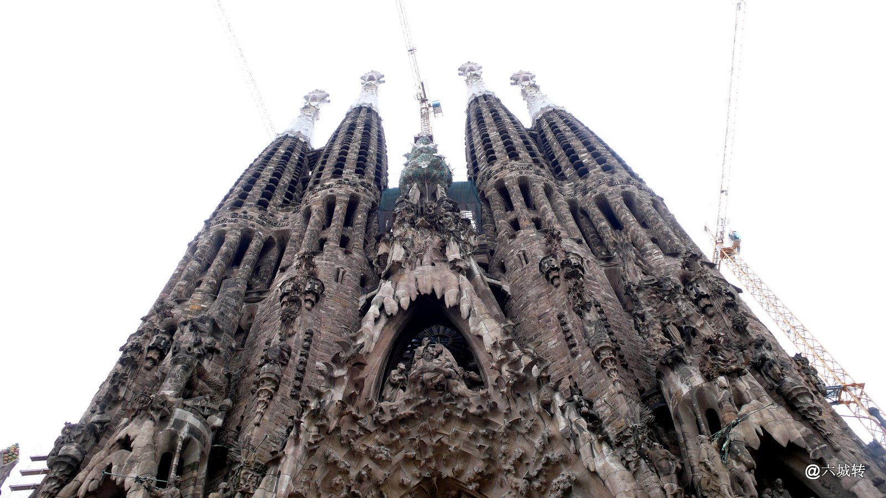

光排队就等了半个多小时，然后发现，通往顶部的电梯因为天气欠佳不开放。没关系，只要能进去就行。Sagrada Familia（圣家族大教堂）的专辑图片请见：

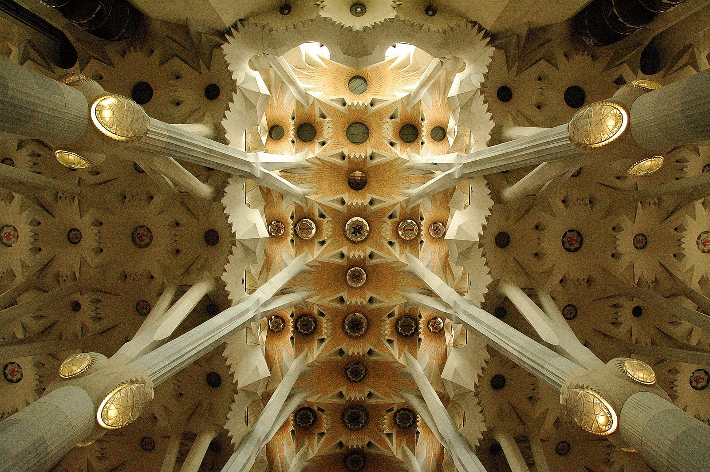

或者国外的话，

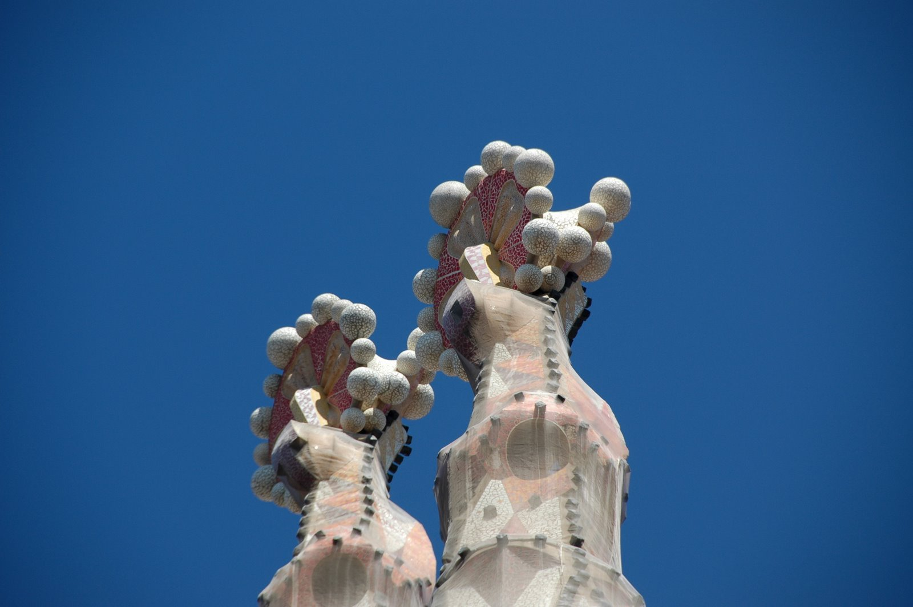

我们在里面整整呆了两个多小时，太震撼了。在高迪无止境的想象力中，这座教堂是一片森林。

## 拍摄Sagrada Familia的推荐地点

Sagrada Familia是巴塞罗那最著名的地标，是高迪最惊世骇俗的建筑作品，是摄影爱好者绝对不能错过的地方。要拍摄它需要注意时间，方位和地点。

Sagrada Familia的东西两面（其实是东北面和西南面）乍一看有点像，而且两面还各有一个长得有点像的公园，很多游客稍不注意可能就把两个侧面搞混了（坑爹呀，有池塘的公园是在东北面，没有池塘的在西南面）。显然，早上适合去拍东北面，下午/傍晚适合拍西南面。拍摄Sagrada Familia的难点之一就是不容易找到一个可以拍摄全景的位置（从下往上的仰拍不算，这里指的是从侧面的正拍）。我觉得西南面的拍摄效果更好。它的东北面是这个样子（拍摄地点是那个池塘的一点半方位）：

它的西南面有三个比较好的拍摄位置，都在西南角那个公园边上，用红色圆圈标出，其中两个我还附有马路对面的店铺标志。

在右下角位置的拍摄效果如下：

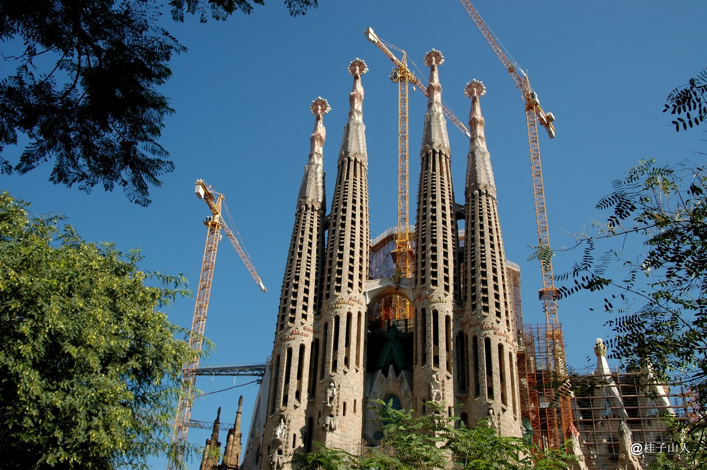

在左下角位置的拍摄效果如下（正好站在一个遛狗场的栅栏门口）：

在左上角位置的拍摄效果如下：

## 雨夜的浪漫

在Sagrada Familia里沦陷了两三个小时后，我们饥肠辘辘地去觅食了。据Rick Stevens说，有self-respect的当地餐馆要到9点以后才会供应食物，在那个点之前去的都是没有self-respect的游客。管他的，没有就没有，我想尝尝当地名闻遐迩的火腿了。乘地铁来到著名的老城区The Ramblas，却发现下起雨来。The Ramblas是一条极宽的马路，游客们像游行一样走在中间，路边布满各种餐馆，酒吧，花店，酒店。雨点越来越大，我们赶快从一个沿街小贩手里买了把雨伞，躲进了旁边看起来人气最旺的一家餐馆。

西班牙的餐馆有三个价格，吧台/Bar, 室内/Table, 和室外/Terrace。吧台最便宜，室外最贵。西班牙人最喜欢的坐在室外一边喝着小酒，咬着火腿，一边观赏路过的美女帅哥。坐的位置也很直接，大家清一色并排坐，背靠着餐馆，面对着马路。在国内一般80后是并排坐（70后对面坐，90后坐在一张椅子上），在这里不管是年轻人还是老爹爹老奶奶都是并排坐，唯恐错过街边美景。

吧台比较拥挤，我们就上二楼找张桌子坐下点菜。结果吃了我们整个西班牙之行中最贵的一餐，是个rip-off。以后知道了，别轻易让服务员点菜，就算不会念菜名，还是自己点比较好。这就是吧台的好处，所有的菜都在橱柜里，你看到什么手一指就行，起码自己知道会吃到什么。服务员给我们点了个assortment menu，送上各式各样的火腿和油炸tapas。火腿倒也罢了，那些tapas油炸得厉害，远不如我们当年在波士顿Harvard Square流留忘返的西班牙餐馆Casablanca。Casablanca的baby-back ribs入口即化，那个叫销魂哟！餐馆旁的Brattle Theatre，从1953年开始专门放经典老电影。每年的情人节2月14号这里都会放Bogart和Bergman的Casablanca。虔诚的影迷们一边看，一边默咏台词。哦，现在意识到为什么叫Casablanca了，西班牙这儿到处都是casa这个，casa那个的。

这个时候外面已经大雨如注了。旁边的一桌坐着四个欧洲中年男子，喝酒喝得很high的样子，喝完了sangria喝啤酒，觉得还不过瘾一定让老板娘找出一瓶Jack Daniels开始do shots。然后其中一个最有追求的男子（从他T-shirt的紧身程度来判断）摇摇晃晃地走向邻桌的三位美女，开始搭讪了。

2003年一个Auditor Night Out的周四晚上，我跟Richard去久仰大名的芝加哥名店Gibson's（Rush St），当时号称本地最好的牛排店。店内气氛很欢快，不是那种特装逼的北京前门二十三号的氛围，反倒很像英伦小酒吧，table很多，大家都紧紧地靠在一起，志得意满地大块吃肉大碗喝酒的同时也不忘互相打量，what's up.....how'ya doing......这时候四位盛装打扮的中年美妇款款走进大门，立时吸引了所有人的眼光，这四位直接从Sex and the City走出来的美女显然是girls-night-out来的。她们坐下后，我和Richard就目睹了一场盛况空前的泡妞大战。无数勇士，井然有序地一轮一轮地扑向她们这一桌，用各种方式跟她们搭讪。四位美女守之以礼，持之以度，兵来将挡，水来土掩。巧笑盼兮，美目盼兮之间，无数猛男灰飞烟灭。最后成功入座的一位胜利者让人大跌眼镜，他的穿着极为普通，竟然穿了一条短裤，yeah, 短裤。我和Richard经过慎密的分析，觉得这哥们儿不是Gibson's的老板就是超级富豪，否则难以把一条短裤穿出如此强大的气场。

眼前这位倒是墨迹了好一阵子，但美女们始终不为所动。其他三个人结账后也一起涌过来，又群攻了一把，仍然未果，遂悻悻地离开了。我去看他们桌边墙上的名人照片，只认出NBA的巴克利和荷兰足球明星古力特。眼光向窗外一撇，他们哥几个又跟一楼门口的一位美女搭讪上了。

我们离开餐馆时雨已经停了，The Ramblas的人又多了起来。我们随着人多的地方走，不经意间来到一个演唱会的现场，黑压压地都是人。上一个乐队刚刚撤场，台上的工作人员在为下一个乐队做准备。这个准备的时间好长，我们活活等了半个多小时。当年我们去看Guns 'N Roses的演唱会，Axl Rose一行在纽约喝多了，迟到了三个小时，给他们暖场的乐队换了N批，我也不记得那些乐队换场的时间有这么长。乐队千呼万唤始出来，我也不认识，应该是当地的。听了两首歌，我们就回家了。

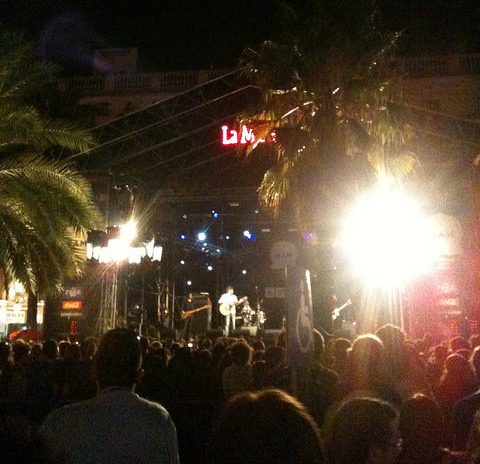

## 美食地图

马德里好玩的地方全在市中心，只要住在Puerta del Sol地铁站附近（也就是Mayor Plaza），就可以玩遍主要景点。我们昨晚过足了海鲜饭的瘾后，今天的早餐午餐晚餐全部在当地小店解决。我们发现，这些小店里的特色美食完全不是那些正儿八经的餐馆可以比拟的。以下是我们亲身经历后推荐的四大当地著名小吃店。（我们的酒店Hotel Europa也在地图上标出了）

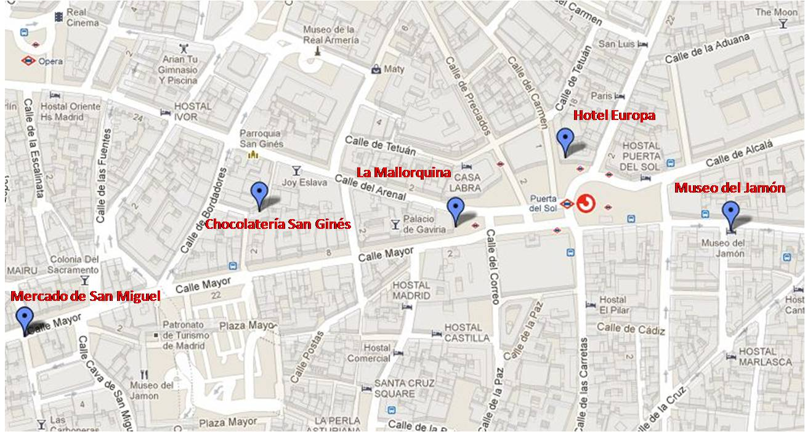

### 早餐：La Mallorquina (`Calle Mayor, 2, Madrid`)

这家1894年成立的pastry店历史悠久，声望卓著。早上十点多店里挤满了人，买了后就站在柜台边吃，虽然没什么特定的队，但秩序井然，大家不吵也不闹。所有的pastry都有样品放在柜台橱窗里，直接点就可以了。西班牙早点没有法式早餐那么精致，但热情洋溢，亲切怡人。图里的这个面包里面是巧克力，甜而不腻。

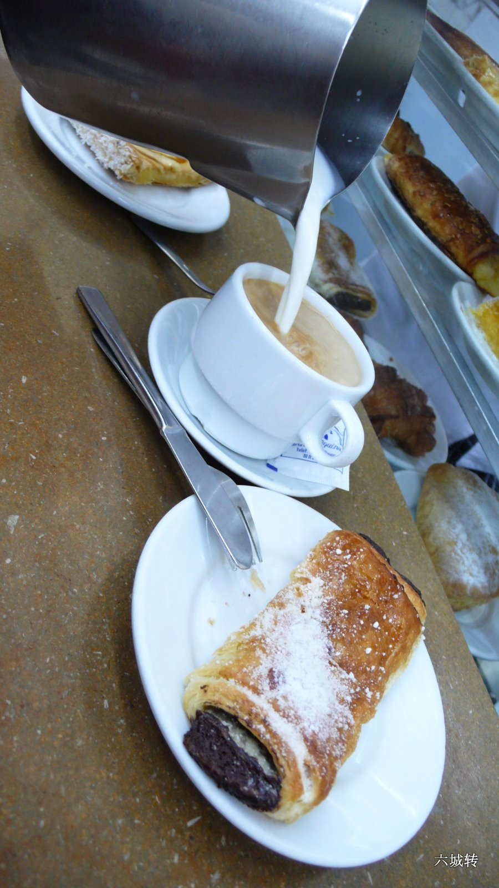

### 午餐：Mercado de San Miguel (`Pza. de San Miguel, Madrid`)

从马德里最大的广场City Mayor的西侧出来就会看到这个市场。这是个妙不可言的地方，美女成群，帅哥扎堆，还有男高音现场表演歌剧！我在iPhone上录了好几段，我的太阳，祝酒歌等等，可惜酒店的网络不够稳定，无法上传到youtube，更别谈优酷了。这几天优酷的网速就好像它的股价一样直线下跌，回北京后再分享吧。这是个农夫市场，有琳琅满目的各种新鲜水果，当地小吃，果汁饮料，啤酒鸡尾，当然，还有无数高高挂起的让人食肠大动的火腿。很有点像波士顿的Faneuil Hall Market，人来人往，熙熙攘攘，不过这里的气氛要欢快得多，环境也更加干净。右侧的鹅肝面包，非常可口！上侧的烤土豆是当地风味，蘸着酱吃相当过瘾，左侧的火腿和奶酪是西班牙的主力部队，自不必说。

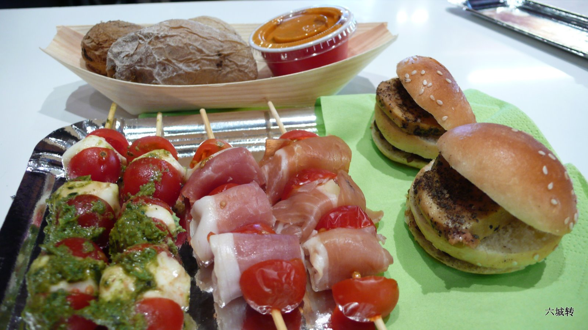

### 下午茶：Chocolatería San Ginés(`Pasadizo De San Ginés, 5, Madrid`)

把两种最不健康的食物放在一起，一个是油炸的面包条，一个是黝黑性感的巧克力，你就得到了Churros con Chocolate，最具西班牙特色的甜点。跟咱们的油条蘸豆浆的吃法是一个路子，但这位伦家的热量可高多了。出来玩总得放纵一下自己吧，大老远跑过来一趟还吃什么pizza/pasta多没意思。。。。这家被Rick Steves力荐的名店在City Mayor南侧的一条小巷子里，不好找。它的内部装饰也挺有特色，这个角落放个小雕像，那面墙上摆面镜子，旁边再装个龙飞凤舞的灯架，颇有我们上午刚拜访过的西班牙皇宫的范儿。

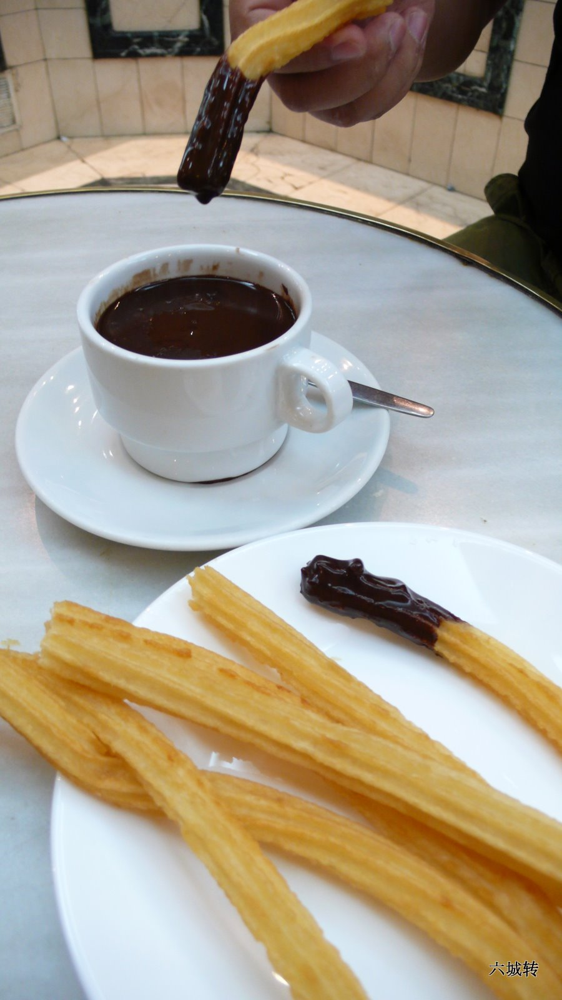

### 晚餐：Museo del Jamón (`CARRERA SAN JERÓNIMO, 1, Madrid`)

这家赫赫有名的餐馆（其实是家连锁）自号“火腿博物馆”，真是豪气干云，气吞山河。一进门就被墙上悬挂的N排肥大的火腿震慑住了。奋力挤近柜台点了份心仪已久的Jamón ibérico，再来点儿橄榄，就着面包吃下去，不亦快哉！

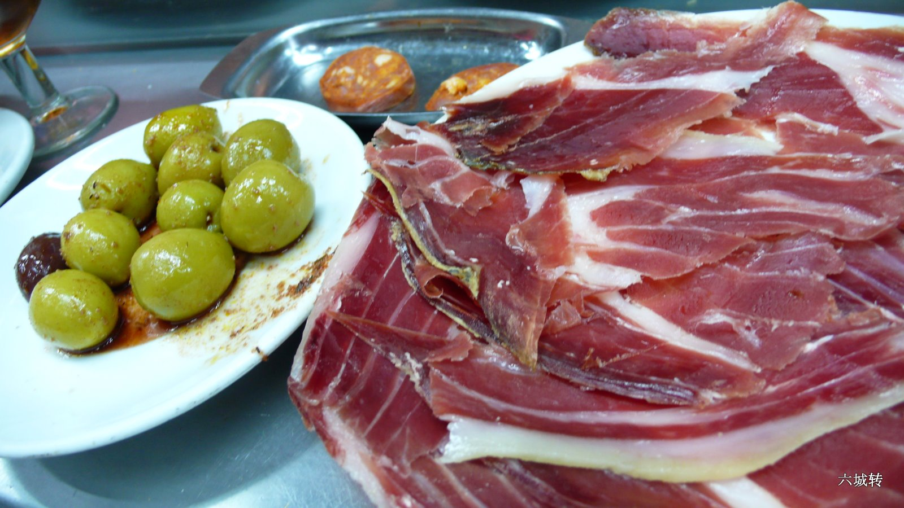