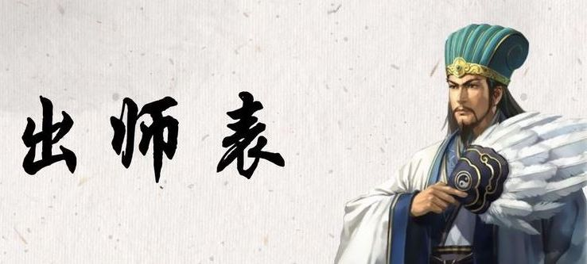

度过了北京历史上最美好的五年。临别之际的感受。

<!--truncate-->

吾本桂子山人，躬耕于南洋，戎马倥偬于欧美，不求闻达于纳斯

贵人不以吾学浅，慧眼识才，二顾吾于酒店大堂之中，托吾以当市之事，由是感激，遂许贵人以驱使

后值江湖汹涌，受任于敲钟之际，奉命于融资之间，知春露晓，上东夕照，尔来四年有半矣！

众友知吾志远趣广，故频频寄吾以大事也

入京以来，夙夜笙歌，恐音调不效，以伤众友之托，故广结英豪，深入战壕

今这里已定，燕南已足

当怀揣三P，东渡西岸，再创辉煌，直捣谷底，联合资本，扩展项目，还于旧愿

此吾所以报众友之望而忠众友之职分也

至于京华烟云，把酒言欢，则青山不改，绿水长流也

今当远离，临表涕零，不知所言