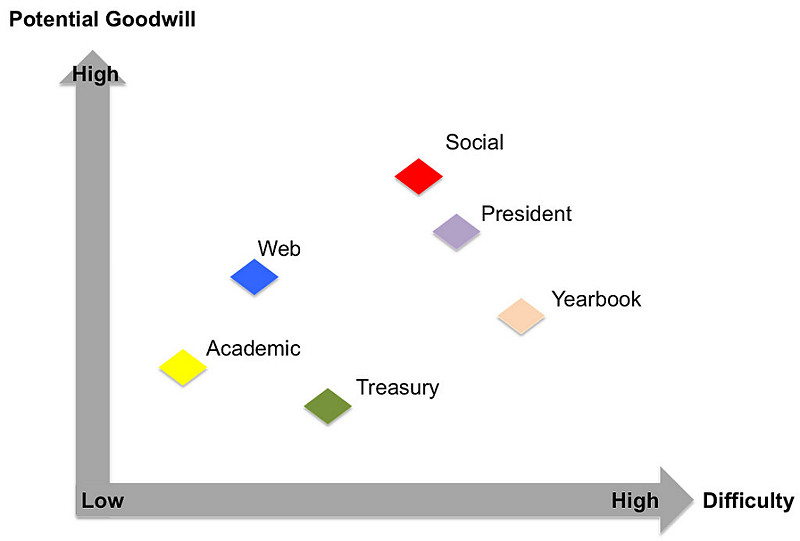

In the beginning of every quarter, Sloans will elect various class officers. For these Sloans who are willing to sacrifice their study hours and step up for the greater good of the class, the below analysis might be helpful in their consideration. If I could make a 3D chart I would add one more dimension for the variance, but we'll start with a simple one for now.

<!--truncate-->

*[Confession of a Stanford Sloan Fellow Series](/blog/stanford-sloan-chronicle-summary/) EP05*

---

## Treasury

Usually collect money from Sloans (not the other one) ...
hard to amuse people with that ... have to deal with a lot of
cash-settlements ... just like in a typical CFO job, if you do well,
people take it for granted without understanding what a challenging
effort the job entails; if you don't do well, people keep whining about
it.

## Academic

Liaison between Sloans and teaching faculties ... collect
feedback and provide feedback to faculties ... not an easy job to walk
that balance and gain goodwill from both sides ... the perceived
correlation between efforts & results is not as obvious as in other
officers' jobs ... haven't run into any academic crisis yet so let's see
how this one goes.

## Web

Hard work as people always have a million IT issues ...
people's expectation on response time makes the job even more
challenging ... clear perceived correlation between efforts and outcome
so their hard work does bring substantial goodwill

## Social

Tremendous amount of work ... very hard to balance needs
from the entire class with such diverse backgrounds and opinions ...
execution could be a significant challenge because of the large number
of people involved in those events ... luckily people do appreciate the
efforts (regardless of how good the actual outcome is) , not to mention
those efforts are very visible, so it still can be a very rewarding
experience.

## President

(Almost like the Speaker of the House) as the agenda
setter for the class has considerable power to influence the
effectiveness/collaboration among the chairs and between students and
staff; not an easy job though as its deliverables are not as
clearly-defined as those for other officers.

## Yearbook

Hardest of all ... because the monster effort only kicks
in at the end of the 12-month Sloan period as people are moving on to
other ventures and priorities ... almost feel like the last one to turn
off the light ... but no doubt people's happiness level will be raised
substantially when the yearbook comes off the printer.

In terms of variances or risks, I think Social, President and Yearbook
have bigger potential swings (it's either love or hate from the critical
and opinionated Sloans) ... and Web, Treasury, and Academic probably
have narrower confidence intervals.
