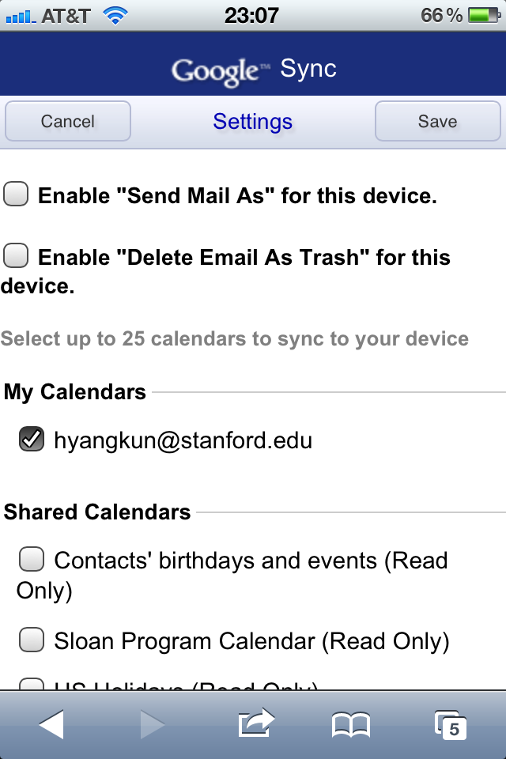
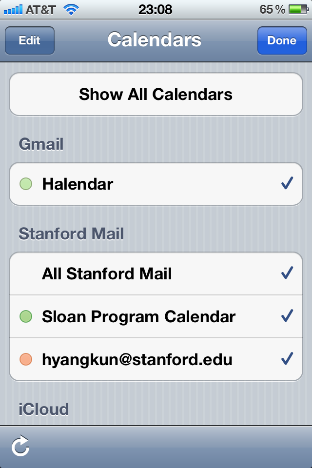

To set up Stanford email on your iPhone, follow this procedure:

<!--truncate-->

*[Confession of a Stanford Sloan Fellow Series](/blog/stanford-sloan-chronicle-summary/) EP12*

---

To set up Stanford email on your iPhone, follow this procedure:

1. On your iPhone, go to this page: [https://mdm.stanford.edu/](https://mdm.stanford.edu/)

​2. Just follow the on-screen instructions.  They're fairly self-explanatory. You'll need to download **MDM**, and MDM will install everything automatically for you. When you're prompted for password, use the **FIRST** password if you have set up a two-staged login process with your Stanford email account.

​3. Now you have all three things running on your iPhone, email, calendar and contacts. Under Contacts, you can access "**Stanford Mail Global Addressbook**", which is really neat when you need to look for stanford.edu email addresses.

So what's the big deal? Isn't this straightforward?

Well, as long as you don't follow this page's instructions, yes things are very straightforward. This page has confused the hell out of me until I finally came to realize it was wrong. [STRIKEOUT:[http://itservices.stanford.edu/service/emailcalendar/mobile/iphone_config](http://itservices.stanford.edu/service/emailcalendar/mobile/iphone_config)]

So far so good...are we done? No. The best part is yet to come.

Even though you've now synced your gsb.stanford.edu calendar, it's of little use. Most people usually use the calendar either from their Gmail (android phone users) or iCloud (iPhone users). Few would use their gsb.stanford.edu calendar. I don't.

The value of our gsb.stanford.edu is that we can view a shared calendar created by Sloan Program's staff - "**Sloan Program Calendar**", which is extremely important and you'll need to use that everyday. It's the **class schedule** for every course throughout the entire quarter.

But the problem is, by default, you can only see items on your gsb.stanford.edu calendar, not including the items from the shared calendar accessible to your gsb.stanford.edu account. So you have to pull more tricks to make that happen.

On your iPhone, go to this page: [http://m.google.com/sync](http://m.google.com/sync). Check the two "Enable" boxes. Under "Shared Calendars", check "**Sloan Program Calendar (Read Only)**", as the below figure:

Once this is done, you'll see this on your "Calendars" on iPhone:

You can see one more calendar appears - "Sloan Program Calendar". This is the **holy grail** and it syncs with the original calendar so what you see on your iPhone is always up-to-date and accurate.

Voila!
