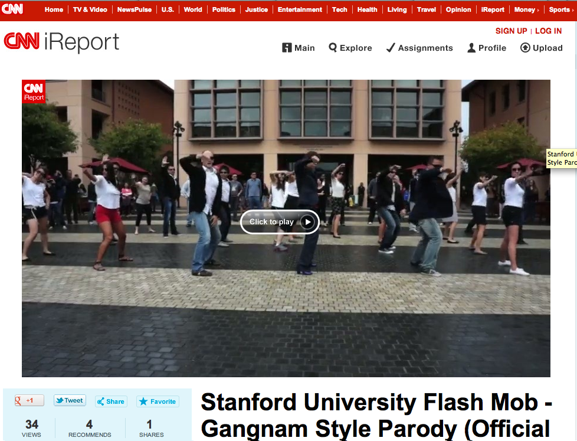

This must be the dance of my life!

<!--truncate-->

*[Confession of a Stanford Sloan Fellow Series](/blog/stanford-sloan-chronicle-summary/) EP20*

---

At 11:50am, on Friday, Oct 12, 2012, Stanford GSB Sloan Fellow Class of 2013
surprised and amused hundreds of students and faculty members in Knight
Management Center by performing a spectacularly successful flash mob, dancing to the massive global No. 1 hit song "Gangnam Style". Stanford GSB Dean Garth Saloner, together with Associate Dean Rajan and Sloan Program Director Hochleutner had a cameo appearance at 3:28 of the video.

This video can be viewed from the following channels:

YouTube:

<iframe width="560" height="315" src="https://www.youtube.com/embed/c0qbFR_Zm4I?si=sYpz9lIR8fTIk-Vh" title="YouTube video player" frameborder="0" allow="accelerometer; autoplay; clipboard-write; encrypted-media; gyroscope; picture-in-picture; web-share" allowfullscreen></iframe>