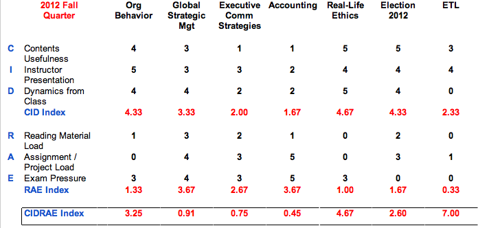

taking a pulse for the Fall Quarter ... the complete summer-to-fall evaluation can be found here:

<!--truncate-->

*[Confession of a Stanford Sloan Fellow Series](/blog/stanford-sloan-chronicle-summary/) EP26*

---

taking a pulse for the Fall Quarter ... the complete summer-to-fall evaluation can be found here:

[CIDRAE Evaluation for Stanford GSB Sloan Fellow Program](https://docs.google.com/spreadsheet/ccc?key=0AiXMz-HsLt8fdHpqM3B5UGhNaEljWmg1Q1BGQ0ZyT2c)

...and: t[he same CIDRAE score for my Summer Quarter 2012](/blog/summer-quarter-course-evaluation/)

...also: [what is CIDRAE score?](/blog/evaluate-stanford-course/)
