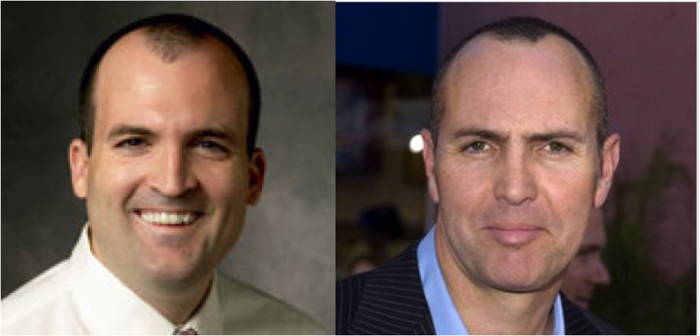

I enjoy Professor [Frank Flynn](http://www.francisflynn.com)'s class [OB206: Organizational Behavior](http://explorecourses.stanford.edu/search?view=catalog&filter-coursestatus-Active=on&page=0&catalog=&q=OB+206%3A+Organizational+Behavior&collapse=) tremendously.

<!--truncate-->

*[Confession of a Stanford Sloan Fellow Series](/blog/stanford-sloan-chronicle-summary/) EP27*

---

I enjoy Professor [Frank Flynn](http://www.francisflynn.com)'s class [OB206: Organizational Behavior](http://explorecourses.stanford.edu/search?view=catalog&filter-coursestatus-Active=on&page=0&catalog=&q=OB+206%3A+Organizational+Behavior&collapse=) tremendously. His class runs for 3.5 hours on every Friday, but he manages to engage the whole class from the beginning to the end very effectively. In terms of pure presentation and lecturing, he's the best among all the professors I've seen in Stanford so far - bar none, just a wonder to be hold.

He always reminds me of a very memorable character from the movie "The Mummy" (1999) starring Brendon Fraser and Rachel Weisz. That character is High Priest Imhotep played by charismatic [Arnold Vosloo](http://www.imdb.com/name/nm0903677/) (below right). Take a look at this:

Sorry for a second there I almost forgot the main theme of this post.

In one of the classes Prof. Flynn gave us a thorough structural analysis of Martin Luther King's "I Have a Dream" speech in 1963.   Every minute of that class is pure gold. Two famous speeches in US history can be found here:

Martin Luther King, "I Have a Dream", in his Address to March in Washington DC, Aug 28, 1963.

Robert F. Kennedy's Statement in Indianapolis, IN on Martin Luther King's Assassination, April 4, 1968.

We watched the movie "[Bobby](http://www.imdb.com/title/tt0308055/)" in 2006 while living in Cambridge, MA. That's a great movie about RFK. After six years, we're finally back to some familiar spot.
