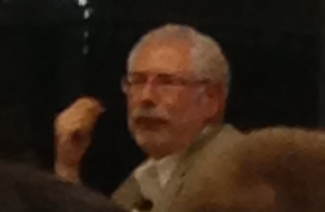

In today's E-Provocateur speak series hosted by Stanford GSB's Center for Entrepreneurial Studies, Silicon Valley startup legend Steve Blank traded some hilarious remarks with Sand Hill Road legend Andy Rachleff.

<!--truncate-->

*[Confession of a Stanford Sloan Fellow Series](/blog/stanford-sloan-chronicle-summary/) EP28*

---

In today's E-Provocateur speak series hosted by Stanford GSB's [Center for Entrepreneurial Studies](http://www.gsb.stanford.edu/ces/), Silicon Valley startup legend [Steve Blank](http://steveblank.com) traded some hilarious remarks with Sand Hill Road legend [Andy Rachleff](http://www.benchmark.com/people/alumni-partner/andy-rachleff/). Steve lived up to his reputation, firing up the crowd with straight-up insights.

- Entrepreneurship is not a job, rather it's a **calling**. You can't
possibly compare McKinsey and entrepreneurship at the same time. McKinsey is just a job.
- Entrepreneurs are just like **artists**. They have creativity and
passion. They are not ordinary people, and they don't do ordinary jobs.
- Who would use a 5-year plan? Soviet Union! Look at what happened...
(China still uses 5-year plan to engineer the entire economy)
- VCs won't tell this to the founders: most founders will get replaced
when the startup companies find a sustainable revenue model. If VCs tell them in advance, VCs lose the deal. (finally somebody spoke the truth)
- You can only teach entrepreneurship to volunteers.
- Business-school students are not suited founders for tech startups.
They are possible for operating executives, co-founders, or founders of non-tech startups. For technology companies, the best founders are always engineers and scientists. (not surprised to hear this in Stanford/the Bay area)
- Never look back. Never look at your past glory. Your greatest
venture is always your next one.
- Disproportional founders come from dysfunctional families. Founders
from normal companies are at disadvantage.
- Customer development cannot be outsourced. It has to be done by the
founder CEO him/herself.
