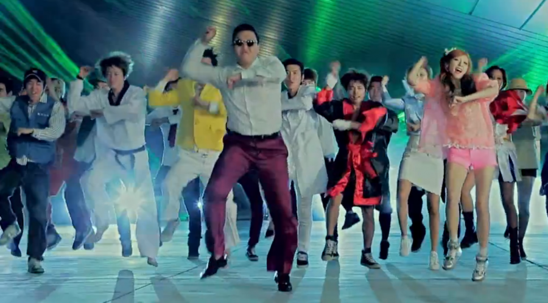

The dance "Gangnam Style“ was performed by 26 Sloan Students from Stanford University Graduate School of Business, for the NCAA Men's Basketball Game Stanford vs Cal State on Nov 12, 2012 (Stanford won, of course).

<!--truncate-->

*[Confession of a Stanford Sloan Fellow Series](/blog/stanford-sloan-chronicle-summary/) Special Episode*

---

None of us expected this to happen when we applied for [Stanford
University's GSB Sloan Program](http://www.gsb.stanford.edu/programs/msx).

After our [highly successful flash mob on Oct 12 in GSB Town & Square](/blog/bubbles-and-flash-mob/), I was exhausted and thought that was it, I would hear [Psy's Gangnam Style](http://youtu.be/9bZkp7q19f0) no more. Then an invitation came, asking us to perform the same dance/song for Stanford University's varsity teams, such as Men's Basketball, Women's Basketball, and Women's Volleyball. We thought, wow, we're becoming cheerleaders for Stanford in televised NCAA games! As a movie junkie who has soaked up too much Hollywood trash over the past two decades, I was keenly aware how competitive it was to become a cheerleader in a top university like Stanford. This would triumph all other accomplishments we could possibly amass in the Sloan program; this would mark the pinnacle of our
alternative career track in entertainment; this was an offer we could not refuse; and the rest, was history.

<iframe width="560" height="315" src="https://www.youtube.com/embed/hR_uJFkDIGU?si=5DIjxZVF-IO47Tij" title="YouTube video player" frameborder="0" allow="accelerometer; autoplay; clipboard-write; encrypted-media; gyroscope; picture-in-picture; web-share" allowfullscreen></iframe>

Saluting to all the Sloan dancers who were part of this historical moment for GSB. Thank you for standing by your commitment and taking time out of your crazy GSB schedule to endure so many hours of sweaty dance training sessions.

*S.Ang, J.Barton, R.Beri, N.Carter, J.Chang, T.Cheng, N.Choi, G.DasGupta,
H.Galland, D.Ganjre, B.Hadary, C.Haw, M.Hong, S.Kobayashi, R.Lal,
V.Malhotra, S.Miyagawa, S.Oh, Y.S. Ong, A.Osamu, A.Shiner, V.Singh,
C.Supko, J.Wu, H.Yang, R.Yang*

A big thank-you goes to *C.Haw* and *H.Galland* who designed the choreograph
like masters, trained the dance squad like slave drivers, and led the
troops in shining colors like true cheerleaders.

Special thanks to [M.B.Sangini](http://www.sanginimb.com/) who gave us
the inspiration and laid down a solid foundation for our dance at a time
when few of us knew if this was possible at all.

Obviously without *C.van der Wal*'s whole-hearted support there would be
no path to Stanford NCAA. Thank you Cor!

Also thanks
[E.Tamkivi](https://plus.google.com/photos/114452834132826040790/albums/5810360504099176929?authkey=CKyo4b-lyYzqhQE), *K.K.Manjon, N.Miyagawa and H.Huang* for capturing this precious moment for us!

Even Alexander the Great wept.