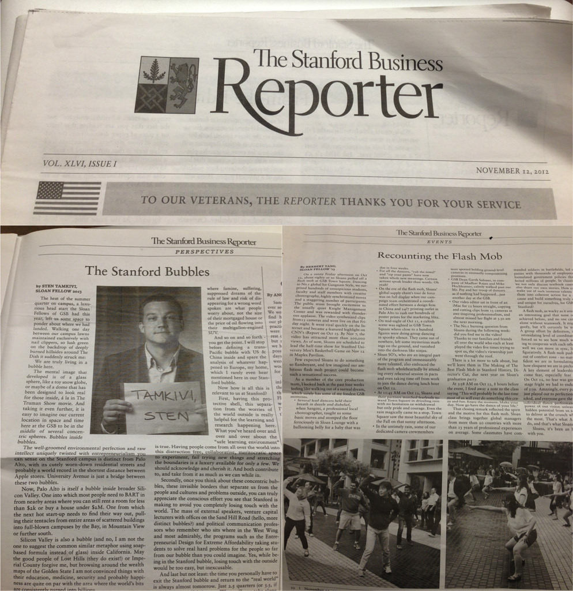

Feature story from Stanford Business Magazine for our flash mob

<!--truncate-->

*[Confession of a Stanford Sloan Fellow Series](/blog/stanford-sloan-chronicle-summary/) EP32*

---

The Stanford Business Reporter is Stanford Business School's quarterly newspaper. It has no online presence and is distributed for free around
GSB's Knight Management Center. In this issue, our Sloan Class of 2013
contributed two articles, [Sten](http://sten.tamkivi.com/)'s "The
Stanford Bubbles", and my "Recounting the Flash Mob". Our flash mob
videos can be found here, [Dance of My Life"](/blog/dance-of-my-life/).

In sunny Friday afternoon on Oct 12, about eighty or so Sloans pulled
off a flash mob at GSB Town Square. Dancing to No.1 global hit Gangnam
Style. We surprised hundreds of unsuspicious students, faculties and
staff members with creative choreography, highly synchronized moves and
staggering number of participants. The public stunt brought excitement
to usually quiet Knight Management Center and was rewarded with thunderous applause. The video synthesized clips from13 cameras and went live on that Friday night. It went viral quickly on the Internet and became a featured highlight on CNN's iReport on Oct 15. By Nov 7, the video has attracted more than 200,000 views. At of now, Sloans are scheduled to lead the half-time show for Stanford University Men’s Basketball Game on Nov 12 in Maples Pavilion.

Few expected Sloans to do something so flamboyant, and few imagined our
ambitious flash mob project could become such a sensational success.

As a member of the core production team, I looked back at the past four weeks feeling like walking out of a surreal dream, which surely has some of my fondest GSB moments.

- Several lead dancers held their breath in dazzle and disbelief, when Sangini, a professional local choreographer, taught us some basic moves and stomped the floor ferociously in Sloan Lounge with a ballooning belly for a baby that was due in four weeks.

- For all the dancers, "rub the towel" and "zip your pants" have now taken whole new meanings. Certain actions speak louder than words. Oh yeah.

- On the eve of the flash mob, Sloans’ global supply chain's tour de force was on full display when our campaign team orchestrated coordinated effort between design firm in China and 24/7 printing outlet in Palo Alto to rush out hundreds of poster prints for the marketing blitz.

- On mid-night of Oct 11, a cultish scene was sighted in GSB Town & Square where close to a hundred figures were doing group dancing in spooky silence. They came out of nowhere, left some mysterious markings on the ground, and vanished into the darkness like ninjas.

- Sloan partners, who are integral part of the program and immeasurably more talented, also embraced the flash mob wholeheartedly by attending in pacts every rehearsal session and even taking time off from work to join the dance during lunch hour on Oct 12.

- At 11:45 AM on Oct 12, 2012, Sloans and partners marched fearlessly toward
Town & Square in drizzling rain with no hesitation or withdrawal but only pride and courage. Our dance must have amused His Almighty that the rain magically came to a stop. Town & Square saw the most beautiful sky in all fall on that sunny afternoon.

- In the untimely rain, some of our dedicated camera crewmembers were spotted holding ground-level cameras in unusually compromising positions.

- GSB Dean Garth Saloner, in company of Madhav Rajan and Mike Hochleutner, calmly walked past our Mr. Psy and her gang of drrrty dancers as if nothing had happened…Just another day in GSB.

- Our video editor sat in front of an iMac for 12 hours straight, copying and cutting clips from 13 cameras in awe-inspiring professionalism, and almost missed her flight at 530am the next morning.

- The No.1 burning question from Sloans during the following week: did you find me in the video? Thanks to our families and friends all over the world who each at least played the video five times trying to spot us, the video's viewership just went through the roof.

There are a lot more, but we'll leave them in The Making of The Best Flash Mob in Stanford History, Director's Cut, due next year on Sloan's graduation party.

At 3:58 AM on Oct 12, 8 hours before the event, I fired away a note to the class saying, 

> This will probably be the last time most of us will ever do something this crazy and fun. Enjoy the moment. Make your day. Now go have the dance of your life.

That closing remark reflected the spirit and the motive for this flash mob. Sloan class brings together experienced global leaders from more than 20
countries with more than 13 years of professional experiences on average. Some classmates have commanded soldiers in battlefields, led companies with thousands of employees, or formulated government policies that affected millions of people. In classrooms we not only discuss textbook cases, but also share our own stories. How can we make use of such immense talents to put them into coherent action for a greater cause and build something truly creative and unique for ourselves, for GSB, or for Stanford?

A flash mob, as wacky as it sounds, sets an interesting goal that none of us has achieved before, and no one can achieve alone without collaboration from others. It might sound goofy, but it'll certainly be memorable. A group effort by definition, it requires intimidating level of coordination, but it'll force us to see how far we're willing to cooperate with each other and how well we can move in sync, literally and figuratively. A flash mob pushes all of us out of comfort zone - no matter how confident we are in formulating policies or how eloquent we are in pitching strategies. A key element of leadership is to overcome fear, especially fear from within. On Oct 12, no fear was greater than
the stage fry we had to endure for a span of 3:39.  Amazingly, every part of the plan just played out to perfection. No one panicked, and every one gave the absolute best individual dance performance ever. The power of our vision unleashed the most hidden potential from us and inspired us to deliver at the clutch moment when it mattered the most. That's what A-players always do, and that's what Sloans do.

My Sloan fellows, it's been an honor to dance with you.