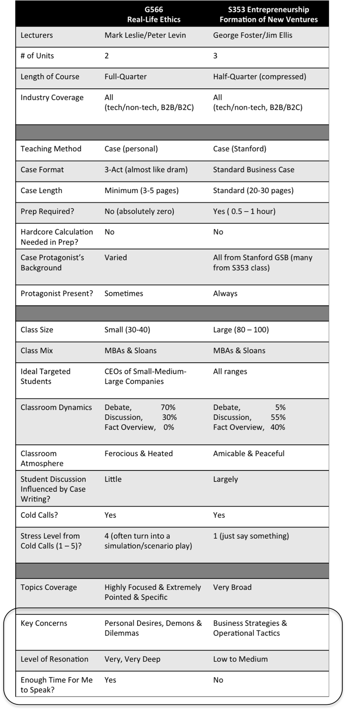

G566 Real-Life Ethics was my most favorite class in the Fall Quarter and S353 is my most favorite class in the current Winter Quarter. They share a lot of similarities, but resonate with me at very different levels. Here's a detailed breakdown of comparison between them:

<!--truncate-->

*[Confession of a Stanford Sloan Fellow Series](/blog/stanford-sloan-chronicle-summary/) EP46*

---

G566 Real-Life Ethics was my [most favorite class in the Fall Quarter](/blog/fall-qtr-course-evaluation/) and S353 is my most favorite class in the current Winter Quarter. They share a lot of similarities, but resonate with me at very different levels. Here's a detailed breakdown of comparison between them:

