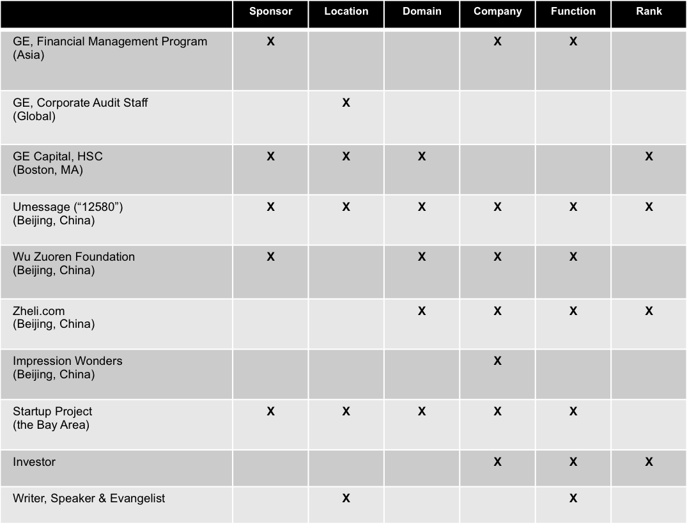

As I was burning midnight oil on my final assignment/personal essay for S353, I finally could not help but laying out my entire career transitions, in the past, present, and future, on a diagram - something I've been thinking about doing for a long time but never got the chance to complete.

<!--truncate-->

*[Confession of a Stanford Sloan Fellow Series](/blog/stanford-sloan-chronicle-summary/) EP51*

---

As I was burning midnight oil on my final assignment/personal essay for S353, I finally could not help but laying out my entire career transitions, in the past, present, and future, on a diagram - something I've been thinking about doing for a long time but never got the chance to complete. This diagram is built on a framework I developed a while ago [《Consideration in Career Transition》](/blog/career-choice/), which was written in Chinese and I haven't got the chance to translate into English (if you know of any free secretary service, please let me know. I can certainly use one or two.)

In short, there are six dimensions for any career transition (obviously, any list I have, is by definition collectively exhaustive and mutually exclusive, otherwise what's the point of developing a framework/theory?). They are, in descending order of importance: sponsor, location, domain, company, function, and rank. In short, they are "**POOOUA**”. In different career stages we all try to move toward our ideal career, but it usually takes multiple steps to complete the transition along all six dimensions and rarely do we get to the dream job at one go. Below diagram illustrates what kind of transition I completed at each turn of my career. It almost reads like a manifesto.

