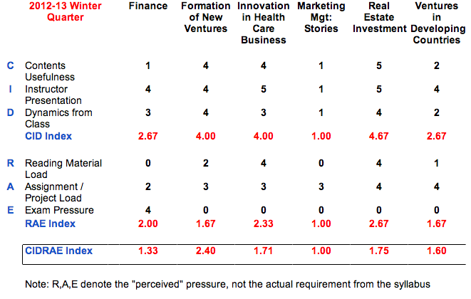

... continued from [Course Evaluation\_Fall Q](/blog/fall-qtr-course-evaluation/) ...

<!--truncate-->

*[Confession of a Stanford Sloan Fellow Series](/blog/stanford-sloan-chronicle-summary/) EP58*

---

A bit overdue, from Winter Q, which seems like a distant past.

