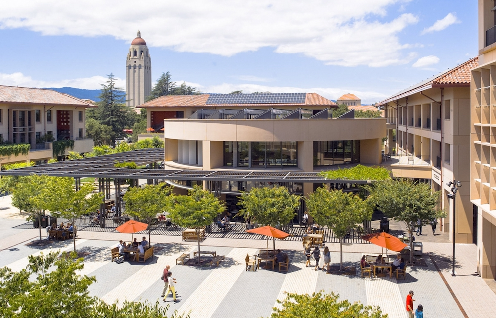

This series ran for 62 episodes, taking notes and reflections during my
12 months in Stanford Graduate School of Business' **Master of Science for
Experienced Leaders** (MSx, aka, Sloan Fellow) program. The original
episodes were scattered around in my blog, together with photo series,
dance videos, rock band videos, and self-invented theoretical
frameworks. I didn't intend to put them in nice order because the
structure of this blog was meant to force readers to read every article.

<!--truncate-->

This series is not finished yet. Despite of the various works I've done
during the Sloan year, I'm yet to unveil my most satisfactory and ambitious project for my distinguished Sloan Class of 2013. Tentatively I'll debut that on our ten year anniversary dinner and dance.

Having said that, everybody can use an index to navigate through this
journey up to today. Hence, here it is:

1. [Survival Guide for the First Three Days](/blog/first-3-days-in-stanford/)

2. [How to Set Up Stanford Email on OSX Mail](/blog/setup-stanford-email-on-osx-mail/)

3. [How to Plan a Beach Party](/blog/how-to-plan-a-beach-party/)

4. [Let’s Get It On](/blog/lets-get-it-on/)

5. [Sloan Officer Analysis](/blog/sloan-class-officer-strategy/)

6. [Live Stanford Life to the Fullest](/blog/live-stanford-life-to-the-fullest/)

7. [Difficult Communication, A Revisit](/blog/difficult-communication-a-revisit/)

8. [Phil Libin Talk (CEO of Evernote)](/blog/phil-libin-talk-evernote/)

9. [Stanford MBA vs Stanford Sloan Fellow](/blog/stanford-mba-vs-sloan-fellow/)

10. [Set Up Home Network in EV](/blog/set-up-home-network-in-ev/)

11. [Social Chair](/blog/social-chair/)

12. [Set Up Sloan Program Calendar on iPhone](/blog/set-up-sloan-calendar-on-iphone/)

13. [TechCrunch Disrupt SF Day 1](/blog/techcrunch-disrupt-sf-day-1/)

14. [Tribute to Mid-Autumn Festival](/blog/tribute-to-mid-autumn-festival/)

15. [Fall Quarter Courses](/blog/fall-quarter-courses/)

16. [Elections 2012_Oct 02](/blog/elections-2012-session-2/)

17. [ETL Seminar_Oct 3](/blog/etl-seminar-oct-3/)

18. [10 Reflections of a CFO](/blog/10-reflections-cfo/)

19. [Powerpoint & Business Plan](/blog/powerpoint-and-business-plan/)

20. [Dance of My Life](/blog/dance-of-my-life/)

21. [Demystify Board of Directors](/blog/demystify-board-of-directors/)

22. [New Spin on iShare](/blog/new-spin-on-ishare/)

23. [Geoff Yang’s Winning Entrepreneurs](/blog/geoff-yang-winning-entrepreneurs/)

24. [Evaluate Courses with CIDRAE](/blog/evaluate-stanford-course/)

25. [Summer Quarter Course Evaluation](/blog/summer-quarter-course-evaluation/)

26. [Fall Quarter Course Evaluation (Interim)](/blog/fall-quarter-course-evaluation-interim/)

27. [Famous Speeches](/blog/famous-speeches/)

28. [Talk with Steve Blank and Andy Rachleff](/blog/talk-with-steve-blank-and-andy-rachleff/)

29. [Usefulness of Learning Various Accounting Concepts in B-School](/blog/usefulness-of-accounting-in-b-school/)

30. [View from California](/blog/view-from-california/)

31. [A Dummy’s Guide to Business Plan](/blog/dummys-guide-to-business-plan/)

32. [GSB Reporter – Bubbles & Flash Mob](/blog/bubbles-and-flash-mob/)

33. [A Fictional Debate](/blog/a-fictional-debate/)

34. [Application to d.School](/blog/apply-to-stanford-dschool/)

Special: [Gangnam Style Goes to Stanford NCAA Half-Time Show](/blog/gangnam-style-goes-to-ncaa-game/) (companion to [Dance of My Life](/blog/dance-of-my-life/))

35. [My BBL, My Choices](/blog/my-bbl/)

36. [Rock Band Debut of The Spillovers](/blog/rock-band-debut/)

37. [Fall Quarter Course Final Evaluation](/blog/fall-qtr-course-evaluation/)

38. [Sell Used Textbooks](/blog/sell-used-textbooks/)

39. [Reflection Notes from S353 Jan 15](/blog/reflection-notes-from-s353-jan-15/)

40. [Reflection Notes from S353 Jan 17 Fitness Anywhere Case](/blog/reflection-notes-from-s353-fitness-anywhere-case/)

41. [Why Search Funds Might Make Sense](/blog/why-search-funds-make-sense/)

42. [15 Things to Know in Strategizing Your Sloan Courses](/blog/15-things-to-know-in-strategizing-your-course-portfolio/)

43. [Where Is Stanford Sloan Fellow?](/blog/where-is-stanford-sloan-fellow/)

44. [Music Play List for Chinese New Year Party](/blog/must-play-list-for-chinese-new-year-party/)

45. [Should You Do Stanford’s Famous Startup Courses?](/blog/should-you-do-stanfords-famous-startup-courses/)

46. [Comparison of S353 (Formation of New Venture) and G566 (Real-Life Ethics)](/blog/comparison-S353-and-G566-in-GSB/)

47. [Sloan Fellow Life Cycle & How To Make The Most Out Of It](/blog/sloan-fellow-life-cycle-how-to-make-the-most-out-of-it/)

48. [My Yearbook Message](/blog/my-yearbook-message-for-Stanford-Sloan/)

49. [Chinese New Year Party](/blog/chinese-new-year-party/)

50. [Key To Startup Success Reflection from S353](/blog/key-to-startup-success/)

51. [An Entrepreneur’s Manifesto](/blog/an-entrepreneurs-manifesto-POOOUA-model/)

52. [Stanford Business Magazine Quote](/blog/stanford-business-magazine-quote/)

53. [10 Things To Do Before Coming to Stanford Sloan Master Program](/blog/10-things-to-do-before-coming-to-stanford-sloan-master-program/)

54. [The Spillovers Live! at Stanford Coho Cafe](/blog/rock-out-stanford-coho/)

55. [GCBC Talk_Stay Full Stay Smart](/blog/stay-full-stay-smart/)

56. [How To Make A Star](/blog/how-to-make-a-star/)

57. [Swan Song by The Spillovers](/blog/swan-song-by-the-spillovers/)

58. [Course Evaluation Winter Q](/blog/course-evaluation-winter-q/)

59. [Course Evaluation Spring Q](/blog/course-evaluation-spring-Q/)

60. [April Orientation Performance at CEMEX Auditorium](/blog/april-orientation-performance-at-cemex-auditorium/)

61. [What Do You Want to Get in Stanford_PFIKER Model](/blog/goals-in-stanford/)

62. [GCBC Talk Herbert Introduction](/blog/Herbert-GCBC-Talk/)

63. [A Day In A Sloan’s Life](/blog/a-day-in-a-sloans-life/)
