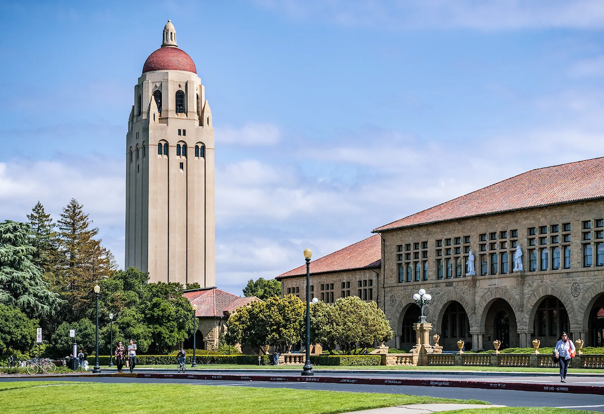

住在湾区斯坦福大学周围时经常去的中餐馆

<!--truncate-->

在湾区呆了两年，我常去的中餐馆（不在这个名单上的餐馆，要么离Palo Alto太远，要么我很少去）。其他亚洲口味（马来，印度，越南，韩国，日本，泰国，Asian fusion）中值得推荐的餐馆改日另荐。

## Palo Alto 地区

**赵师傅**, [Chef Zhao Kitchen](http://www.yelp.com/biz/chef-zhao-kitchen-palo-alto), 2180 W Bayshore Rd, Ste 120, Palo Alto, CA 94303, (650) 485-2221。上海正宗本帮菜。

**苏杭小馆**, [Su Hong Eatery](http://www.yelp.com/biz/su-hong-eatery-palo-alto)， 4256 El Camino Real, Palo Alto, CA 94306，(650) 493-4664。江浙风味，家常菜，店小客多。
	
**大四川**，[Da Sichuan Bistro](http://www.yelp.com/biz/da-sichuan-bistro-palo-alto), 3781 El Camino Real, Palo Alto, CA 94306, (650) 849-2000。四川风味，店面很小，环境可称低劣，但口味正宗。

**大班**，[Taipan](http://www.yelp.com/biz/taipan-palo-alto), 560 Waverley St Palo Alto, CA 94301, (650) 329-9168。粤菜馆，中餐馆里难得的高大上级别，服务，口味，环境，价格，位置，都在Palo Alto首屈一指，适合商务宴请。

**鸭子阁**，[Peking Duck Restaurant](http://www.yelp.com/biz/peking-duck-restaurant-palo-alto), 151 S California Ave, Palo Alto, CA 94306, (650) 321-9388。口味一般，勉强及格，主要胜在厅足够大，桌子足够多，位置离斯坦福最近，而且，所有的人都知道鸭子阁，因为她在女娲补天的时候就存在了。

## Palo Alto 以南

**[Michelle’s Pancake House](http://www.yelp.com/biz/michelles-pancake-house-cupertino)**, 19060 Stevens Creek Blvd, Cupertino, CA 95014, (408) 517-9886。台湾风味，猪肉白菜馅饼呱呱叫，百吃不厌。

**上海乔家栅**, [Shanghai Garden](http://www.yelp.com/biz/shanghai-garden-cupertino), 20956 Homestead Rd, Cupertino, CA 95014, (408) 517-9812。上海风味，周末的豆浆油条很不错。

**同同水饺**，[Tong Dumpling](http://www.yelp.com/biz/tong-dumpling-cupertino), 10869 N Wolfe Rd, Cupertino, CA 95014, (408) 725-8166。北方口味，专攻各式水饺。

**三好拉面**, [QQ Noodle](http://www.yelp.com/biz/qq-noodle-cupertino), 10889 S Blaney Ave, Cupertino, CA 95014, (408) 253-5858。西北口味，油泼扯面 + 酸辣哨子面！减肥小有所成后报复性午餐的良选。

**[Shanghai Flavor Shop](http://www.yelp.com/biz/shanghai-flavor-shop-sunnyvale)**, 888 Old San Francisco Rd, Sunnyvale, CA 94086，(408) 738-3003。小笼包非常地道，号称美国西海岸第一。

**小肥羊**, [Mongolian Hot Pot Little Sheep](http://www.yelp.com/biz/mongolian-hot-pot-little-sheep-cupertino), 19062 Stevens Creek Blvd, Cupertino, CA 95014, (408) 996-9919。北方火锅，鼎鼎有名的地球人都知道的小肥羊，超级火爆，做好排队准备。

**麻辣小站**， [Spicy Station](http://www.yelp.com/biz/spicy-station-cupertino), 10118 Bandley Dr, Cupertino, CA 95014, (408) 366-1088。周黑鸭！世界杯必备！店面很小，主要是个take-out场所，但服务很好，生意兴隆，鸭头鸭翅鸭脖相当销魂。

## Palo Alto 以东，东湾

**食神**，[Food Talk Cafe](http://www.yelp.com/biz/food-talk-cafe-fremont), 43755 Boscell Rd, Fremont, CA 94538, (510) 668-0898。店小客多。

**韶山冲**, [Shao Mountain](http://www.yelp.com/biz/shao-mountain-fremont), 43749 Boscell Rd, Fremont, CA 94538,(510) 656-1638。湖南风味。

**吃香喝辣-重庆江湖菜**, [Newark Cafe](http://www.yelp.com/biz/newark-cafe-newark), 35201 A Newark Blvd, Newark, CA 94560, (510) 713-0128。四川口味，辣，辣，辣！烤鱼和麻辣香锅很不错。

**三好拉面**，[QQ Noodle](http://www.yelp.com/biz/qq-noodle-milpitas), 416 Barber Ln, Milpitas, CA 95035, (408) 894-9171。西北口味，油泼扯面 + 酸辣哨子面！这家离斯坦福远一些。

**清真一条龙**, [Darda Seafood Restaurant](http://www.yelp.com/biz/darda-seafood-restaurant-milpitas), 296 Barber Ct, Milpitas, CA 95035, (408) 433-5199。算是西北口味，羊肉，大盘鸡等。

## Palo Alto 以北，三藩以南

**[Cooking Papa Restaurant](http://www.yelp.com/biz/cooking-papa-restaurant-foster-city)**， 这家比Mountain View那家更大更有名。粤式早茶，隔窗观水，风景宜人。人极多。

**[Joy Restaurant](http://www.yelp.com/biz/joy-restaurant-foster-city-2)**, 1489 Beach Park Blvd, Foster City, CA 94404, (650) 345-1762。算是台湾风味为主吧，临近三藩湾，适合饭后在一箭之地的堤坝上散步。（春天堤坝上的野花很美）

**[Everyday Beijing](http://www.yelp.com/biz/everyday-beijing-san-mateo)**, 637 S B St, San Mateo, CA 94401,(650) 373-7878。京东肉饼！北式早点。

**采蝶轩**，[Zen Peninsula](http://www.yelp.com/biz/zen-peninsula-millbrae), 1180 El Camino Real, Millbrae, CA 94030, (650) 616-9388。离旧金山机场(SFO)非常近，粤式早茶，服务效率很高，店面气派恢弘，适合婚礼庆典。

## 三藩

**御厨园**, [Z&Y Restaurant](http://www.yelp.com/biz/z-and-y-restaurant-san-francisco), 655 Jackson St, San Francisco, CA 94133, (415) 981-8988。湾区最正宗的川菜馆，排队时间最长，人气最高，名气最响。

**岭南小馆**， [R&G Lounge](http://www.yelp.com/biz/r-and-g-lounge-san-francisco), 631 Kearny St, San Francisco, CA 94108,(415) 982-7877。岭南小馆的成功，基本上可以写进HBS案例了（我正在写）。路过旧金山的朋友，如果只有时间去一家餐馆的话，不是岭南小馆就是御厨园，这是湾区中餐馆里的泰山北斗，一时瑜亮。