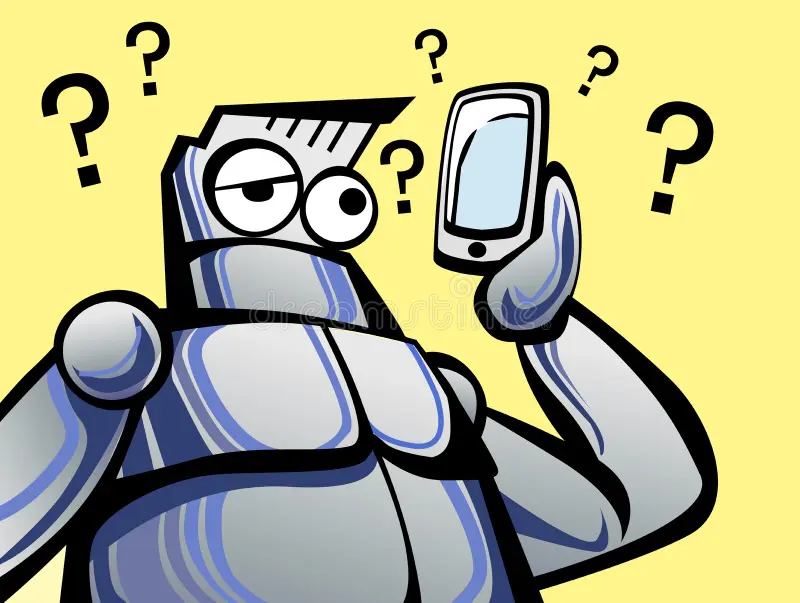

The six habits of a highly likely technology noob:

<!-- truncate -->

1. Your have more than **ONE** personal email addresses and your friends are always confused which one to use and spend countless hours verifying and re-verifying if you have received that missing email.

2. You use work email address for personal emails.

3. You still use XXX@yahoo.com for email (except if you're from Taiwan or Japan originally).

4. You have more than **TWO** mobile numbers in one country and your friends are always confused which one to call you at and they often end up not calling you at all out of frustration and confusion.

5. You have more than **ONE** WeChat account. You forgot how to delete the first one and you keep your two WeChat accounts in the same chat group and confuse the hell out of everyone else.

6. You still don't have your personalized URL on Linkedin, so your Linkedin URL reads like an unrecognizable random character string.

How many have you been hit on?