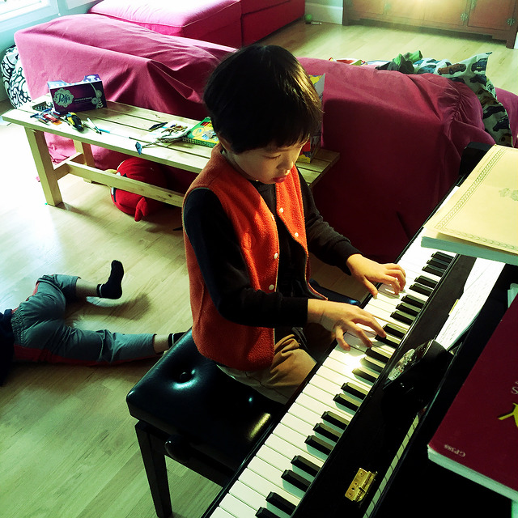

Amusing moments of two brothers

<!--truncate-->

松梢藏远山[^1]，晨辉跃阑干

窗外风渐歇，堂内琴正酣[^2]

凌客[^3]心力憔[^4]，黑白键气豪

湖畔[^5]问天下，浥尘[^6]志更坚

My friend [LYZ](http://weibo.com/u/1743289671) has responded with a much better one, as usual:

凌客远来烽烟倦

瓜舍[^7]湖畔暂偷闲

松影琴声浮云淡

浥尘一曲且悠然

---

1. Paul and Goblin的院子里有两棵树，左边一棵是松树，右边一棵也是松树
2. Paul and Goblin's elder son is playing Bach
3. 凌客 = Linkqlo
4. 充满挑战的一年
5. Lake Oswego
6. 来自王维七言绝句《渭城曲》之“渭城朝雨浥轻尘”, P&G 老大的中文名
7. Paul在江湖上人称九瓜