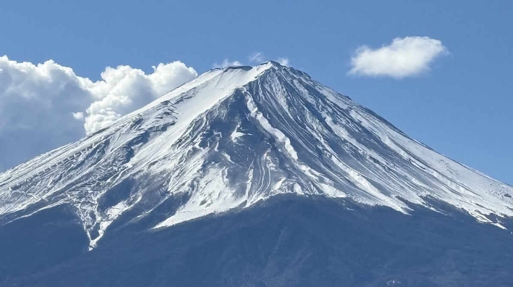

骑折叠车小布在富士山脚下绕河口湖西湖50公里，在天梯小镇完美看日落

<!-- truncate -->

1. 小布带上新干线完全没问题。

2. 小布进车站需要用袋子罩上。
	
3. 从新宿=>河口湖的新干线或者大巴都需要提前几天预订。
	
4. 从河口湖回新宿的车票更加难买，因为车次较少。 坐火车的话，可以先从河口湖坐列车去大月，再从大月去新宿，车次会多很多。
	
5. 坐在新干线最前面的车厢，可以看到富士山逐渐出现在铁轨前方。
	
6. 要想看富士山清澈的山顶，需要在十点以前到达河口湖。十点以后就开始有云雾缭绕在山顶了。
	
7. 绕湖骑行的时候走逆时针。
	
8. 河口湖北面有个地方可以走到湖边，边上有芦苇，樱花树，是拍富士山的绝佳机位。只有在湖的北面才看得到富士山。
	
9. 在北线从河口湖骑到西湖的中间，有一段上坡比较陡，大概8-10度，但是六速的小布还是可以骑上去的。除了这一段，整个五十公里主要以平路为主。
	
10. 湖边并没有专门的自行车道。自行车跟汽车共享车道。日本的司机还是比较照顾自行车的，都会稍微往右开一点。
	
11. 带把车锁。新仓山浅间公园 (Arakurayama Sengen Park）非常值得一游。走上四百米的台阶，会有一个完美的机位，拍出五重塔 + 樱花（得到四月份） + 富士山的明信片复刻场景。可以把自行车锁在台阶下的停车场。
	
12. 富士吉田市 (Fujiyoshida)是著名的“天梯小镇”。要拍出名闻遐迩的网红照，最佳机位在 Shimoyoshida Information Center。这里正好是个拐角，可以拍到背景为富士山的街景。最佳时间为傍晚华灯初上时(5点钟以后）。
	
13. 在富士山脚下的五湖里，山中湖风景最美。但从河口湖去山中湖有 16 公里。
	
14. 如果时间充足，可以去大名鼎鼎的忍野八海。骑小布去忍野有点难度，因为中间需要翻一座山，坡度颇高。
	
15. 最优的路线大概是，早上在新宿坐首班7点的新干线，9点到河口湖站。骑快点可以在三小时内，完成河口湖和西湖两个湖的环骑，总共30公里，大约12点回到河口湖。在河口湖吃过午饭，然后在2点前骑到山中湖。一个半小时完成山中湖环骑。4点前可以到忍野八海，在忍野拍照骑行一个小时，然后预留一小时时间骑回富士吉田市，赶上落日的余晖拍完天梯小镇的街景。这个方案里没有时间去浅间公园，但是可以涵盖忍野八海和山中湖。

---

*Originally published on [herbertyang.xyz](https://herbertyang.xyz)*
