自从 Team Chirus（藏羚羊队）成功完成了千岛湖环湖 140 公里骑行后，我们的信心和野心都在膨胀，一直在寻找机会完成国内骑行圈的下一个目标 - 环太湖 300 公里。今年江浙沪区域的夏天实在太热，高温天气持续了4-5个月的时间。好不容易等到十月中旬，温度终于下降到 15-25 度区间。我们准备用三天时间，顺时针环太湖，每天 100 公里，完成夙愿。

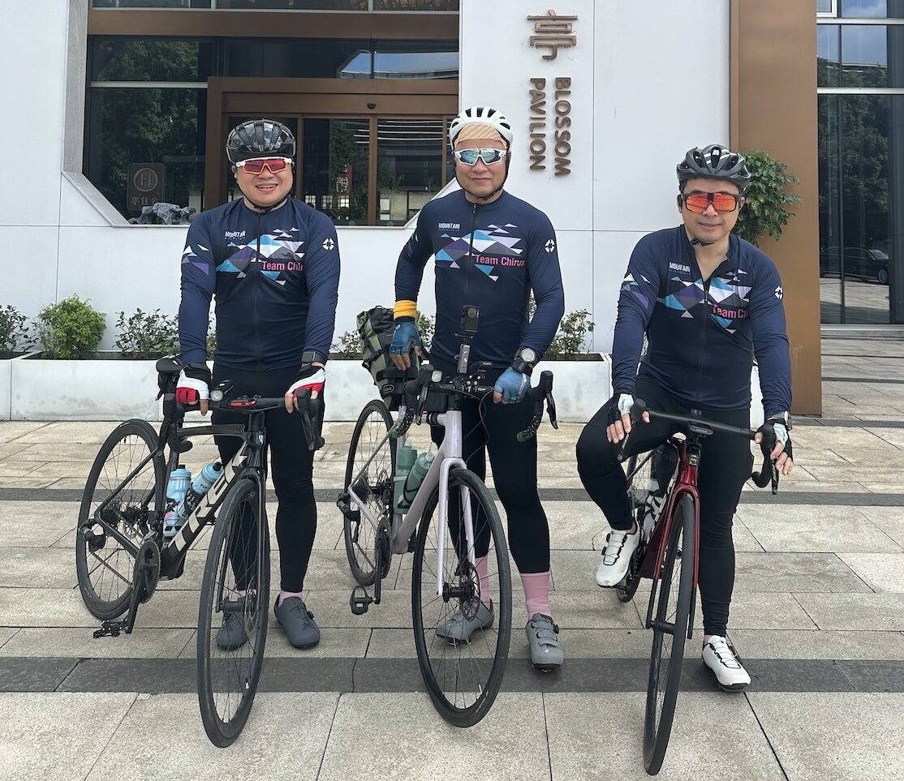

<!-- truncate -->

选择这三天的酒店是第一个挑战。酒店需要彼此之间间隔大概 100 公里左右，周围有比较多选择的餐饮娱乐服务，而且尽可能贴着湖边。太湖周围有**苏州**，**湖州**，**宜兴**，**无锡**这四座城市。从苏州出发，第一个比较热闹好玩的景点是湖州（以著名的骨骼清奇的喜来登酒店为标志），但它离苏州只有 60 公里。下一个网红咖啡馆是 1314（“一生一世”），在湖州和宜兴之间，距离到苏州是正好 90 多公里，但它周围没什么像样的酒店，荒凉得很。我只好选择一家离太湖骑行道还有好几公里的宜兴酒店作为 Day 1 晚上的落脚处。

Day 2 的酒店肯定是在无锡了，但无锡很大，占据了太湖的整个北面，酒店的选择太多了。宜兴跟无锡之间，太湖的西北角有个马山半岛（上面有人定胜天的典范**灵山圣境**）。如果完全贴湖线，白描马山，会多出起码 20-30 公里。我选了在无锡东部的一家酒店，离宜兴酒店 80 公里，留下白描马山的余地，而且离太湖不远，可以很快回到环太湖道。

第三天又回到苏州，仍然是头天入住的酒店。这天的骑行距离不好规划，高德地图无法展示完全贴湖的骑行道，而且这一段会经过太湖的两个“耳朵” - **西山**和**东山**。白描这两座山会各自添加 50-70 公里的骑行距离。我们还是量力而为，这次就不走东西二山了。

我规划路线 + 酒店需要的所有信息和数据，都来自于**小红书** + **大众点评** + **高德**。小红书基本上就是中国版的 **[Reddit](https://www.reddit.com/)**，但是数据不开放，进入不了大语言模型的训练机制，很可惜。如果有 AI 工具能打通这三家的数据库，将给我节省大量时间。**Deepseek** 给我的建议颗粒度太粗，达不到我的要求。

所以，人类领队还是有价值的。

第二个挑战，是托运行李。我们希望做到自给自足，不要依赖很多骑行俱乐部会提供的保姆车后勤服务。有三个选择，要么我们完全走 bikepacking 路线，把三天的行李都通过车头包，车尾包，横梁包放在自行车上；要么用顺丰的同城快递服务；要么就用滴滴的接送车服务（司机把车送到下一站；我们轻装上阵骑行；行李全部放在从上海开来的 SUV 上）。

第一个选项很快就被排除了。我发现即使三个包 - 车头，车尾，横梁，全部用上也装不下秋季里三天的骑行衣服和随身行李。我们得以后买专门的带后架的长途公路车才有可能解锁 bikepacking。第二个选项似乎行不通。同城快递没有 100 公里这么长距离的，而且还是跨城。最后，还是采用滴滴接送车的服务，把三人所有的行李都放在车上，早上从酒店出发的时候约司机来把锋的 SUV 送到晚上入住的酒店。骑到了酒店再从前台拿车钥匙。滴滴司机通常希望接收方 - 酒店前台留一个手机号码，但前台通常只愿意留一个固话号码。这个问题倒也不大，滴滴这个平台的司机还是很让人放心的。我们在千岛湖骑行也是采用这个办法。事实证明，这是最稳妥效率最高的方式。

Day 1 的天气还有热，离开酒店时28度，大阴天，没太阳。出发了！

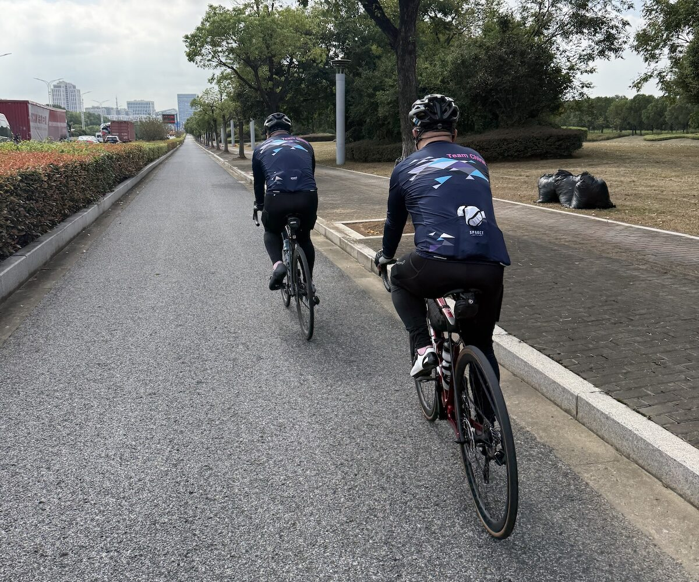

跟半年前骑行千岛湖的稚嫩状态相比，这次我们三人都进化了不少。昆的踏频稳定在 75次/分钟，有氧巡航速度慢慢提升到 25-26 公里/小时。青买了崔克自行车，直接入手真空胎，锁鞋和棒棒糖。锋的破风和跟骑的技巧已经很娴熟了。我们三人可以轮流领骑破风，保持一个紧凑的队形。

更加令人欣喜的是，这次我们的队衣几乎都小了一号。青从 3XL 缩到 2XL；昆的上身从 3XL 缩到 2XL。我们用的还是淘宝上思帕客店（Spakct）的定制服务，提前预订好秋季的长袖和长裤。Spackt 的服务不错，可以在上衣添加队名 - Team Chirus。

在外骑车，队服很重要。一个人提速追赶上前面的骑手没什么了不起，需要整个服装统一的车队用 peloton 沉稳坚毅的节奏以坦克大军碾压过境的姿态超过前面的车队，才可以把逼格拉满。

去太湖之前，说实话我对太湖的路况和景色没什么太高期望。千岛湖颜值无敌，路况上佳，绝对是长江三角区天花板。太湖名气太大，是骑行圈必须打卡之处，但很多人爆胎，而且我可以想象很多湖边美景都被没落的房地产公司垄断，有可能会骑很长的公路，未必能贴湖骑行。

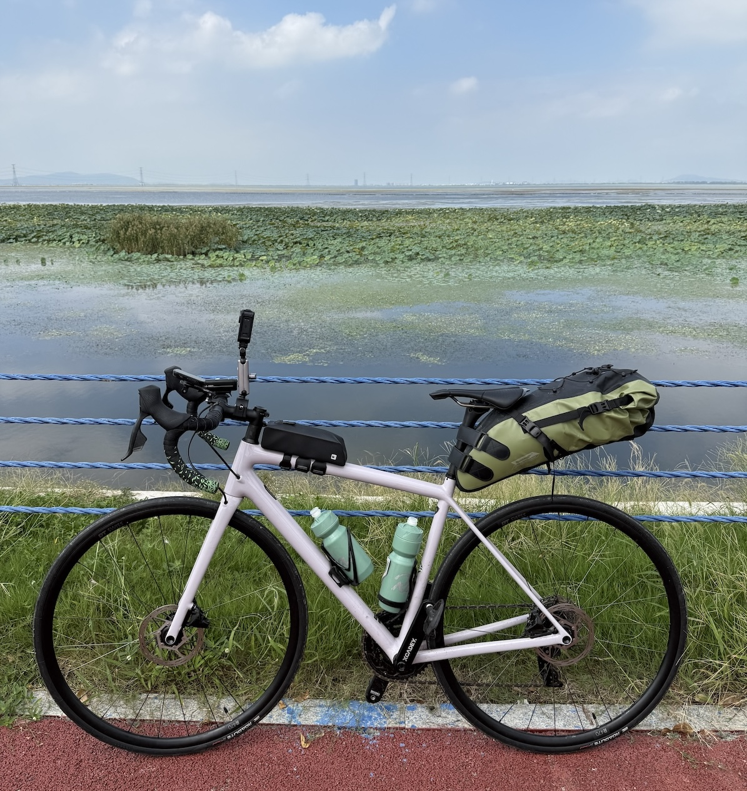

但实际上，这次环太湖 300，几乎有 70-80% 都是完全贴湖骑行。太湖绿道的长度和质量超出我的预期。虽然很多绿道明显是逐渐废弃失修了，没有跑步的人，旁边也没有蓬勃发展的小区，但这些绿道对于公路车来说足够好了。没有人气小区，就没有送货的快递小哥，就没有市区里无处不在的电动小摩托，更加没有散步的小孩和老人。鲜衣怒车，不亦快哉！

我本来准备铁头一路顺着大路骑到底，多亏锋提醒一句，我们怎么没有贴着湖骑？看到苏震桃公路边有条通向湖边的泥泞小道，我们就过去探探路，来到了湖边的草梗路。这里几乎空无一人，只剩下空荡荡的太湖和杂草渐生的绿道了，非常适合放无人机。

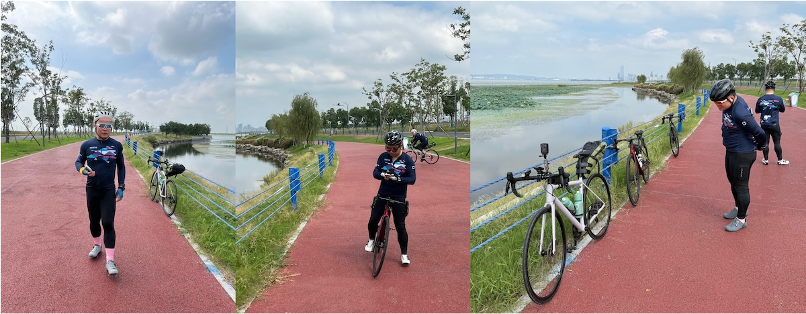

青新买的大疆 Flip 无人机排上了用场，手忙脚乱一通操作猛如虎，Flip 开始跟着我们飞了。Flip 规避障碍物的功能有限，跟着青飞的时候，青一旦超过我，Flip 愣头愣脑地直接就撞在我背上。这个无人机攻击有点防不胜防啊。我们路过一个（违章）开过来的SUV时，虎虎生风的 Flip 差点跟车迎面撞上，司机都看呆了。

南太湖大道边常有流动的咖啡摊。我们在这里歇脚补充一下热美式。老板说他在这里摆摊已经十二年了，同时期去年的生意是现在的三倍。我问他，骑手都去哪儿了？他说，去年很多骑手来自上海，今年来自上海的车队少了很多，据说有不少人去开滴滴了。希望他的咖啡摊能继续摆下去。骑行的乐趣之一，就是可以随时停下来，看看风景，跟当地人聊聊天。这样的路边咖啡摊，我们后来还遇到了很多。

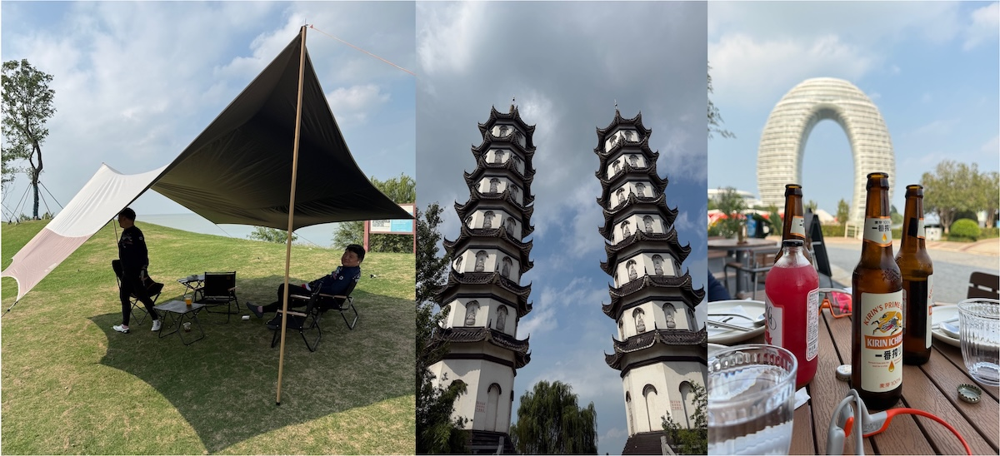

路过七都双塔，中午时分来到湖州著名景点喜来登酒店。这个酒店真是够抽象（丑）的，一个毫不遮掩的铜钱矗立在湖边，把湖边生生地割裂成一个所有人必须绕行的旅游区。一位后面追上来的孤独骑手在月亮广场饶了一圈，寂寞地在 7-11 店前开始啃面包。我们三个咂着啤酒，把头盔，锁鞋，手套都脱下来，彻底放松了一下。

过了湖州，下午沿着湖边绿道向宜兴继续骑。一个小伙子跟了我们一段，借着停车找路的时候，过来问我们有没有修车工具，他的车头把松了。

我大喜过望，马上从犀牛车尾包里拿出洛克兄弟的工具包递给他。这个防雨车尾包在四月份千岛湖骑行的大雨中立了大功。这次因为行李都是放在车里请司机送到下一站，其实未必需要它这个显眼包，但我还是带上了。在领队的自我修养里，怎么能不带上全套的修车工具呢？我的修车工具里包括一块砖头一样重的电动打气泵和所有口径的扳手。我一边骑一边琢磨，怎么还没有人爆胎呢？

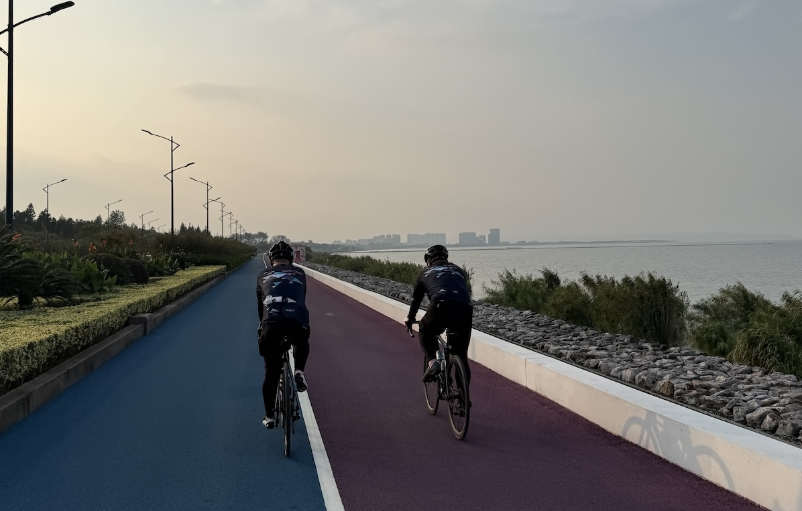

现在终于排上了用场，耶！其实小伙只需要一个扳手把车头把拧紧就行，但好歹也是让我的工具包刷了一把存在感，没白带。小伙就是湖州本地人，经常在这段骑行。后来我需要打个 Zoom call，青和锋就在旁边等我，在湖边跟当地大爷聊天 - 他们对小巧敏捷的无人机很感兴趣。小伙话不多，也不急着冲到我们前面去，就在路边坐着看着夕阳逐渐坠入湖里，可能想跟我们一起骑吧。我的 call 打完，天色渐晚，他也就跟我们分手了。

秋天太阳落得早。过了 1314 咖啡馆，湖边暮色昏暗，散步的路人越来越少，渐渐地只有我们三辆车，和无数的蚊虫！青在后面大声喊问，这么多的虫子，是因为我们骑在湖边还是因为到了晚上？我说我也不知道，没在这种情况下夜骑过。虫子扑面而来，必须带上骑行墨镜，但这样又影响视力。左边长草丛生，更远处省道 230 的大卡车呼啸而过，右边是黑沉沉的太湖。我们三人没法说话，月光下咬牙猛踩。

后来终于在一个三岔口转上国道 104，开始前往宜兴酒店最后几公里的爬坡。一旦离开湖边，回到公路旁，蚊虫就完全消失了。可以从容摘下墨镜，在明晃晃的路灯下骑行。以后知道了，晚上不要在湖边骑行，景色全无，蚊虫无数。

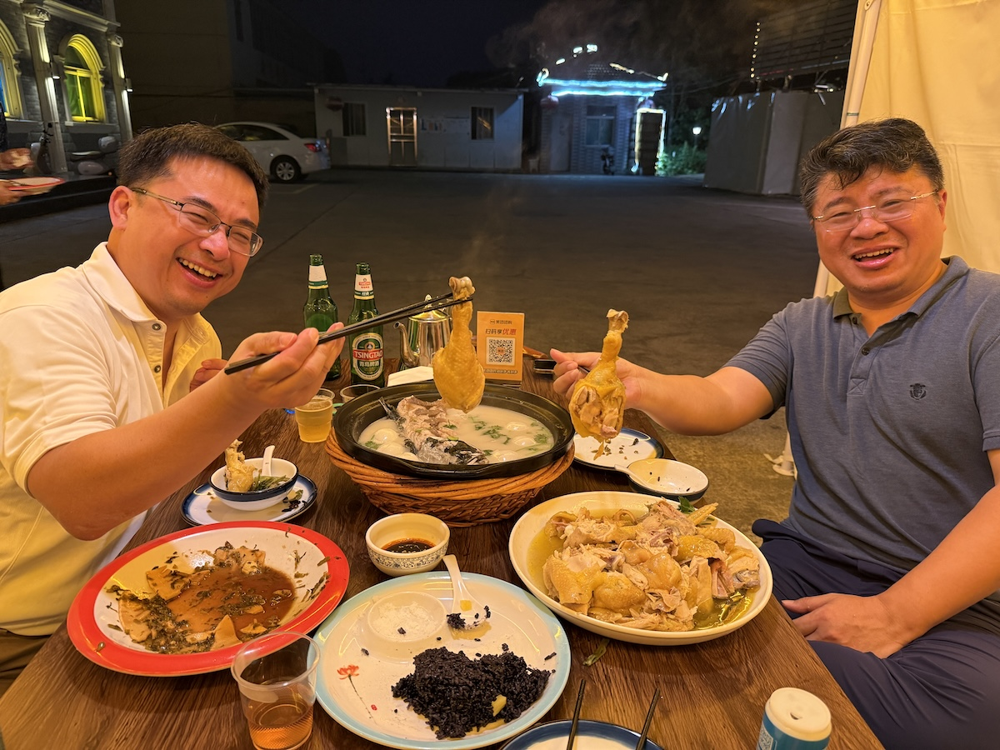

终于骑到了宜兴的丁山国际大酒店。第一天骑了 114公里，超额完成目标。锋和青在第一天就打破了自己以前的 PB (personal best) ，各奖一个鸡腿。当地的老母鸡尺寸惊人。它每天也得踩单车么？

吃完饭去市区找了家 KTV 唱歌。现在似乎所有的 KTV 都有K米点歌，可以在微信小程序里直接点歌。也就是说，KTV 的前端千变万化，各自有获客渠道和硬件 buff 加持，但后端用的其实是都是同一套系统（“API”）。用户在不同的前端（KTV 店）里点的歌在后端（K米点歌小程序）里都可以看到。

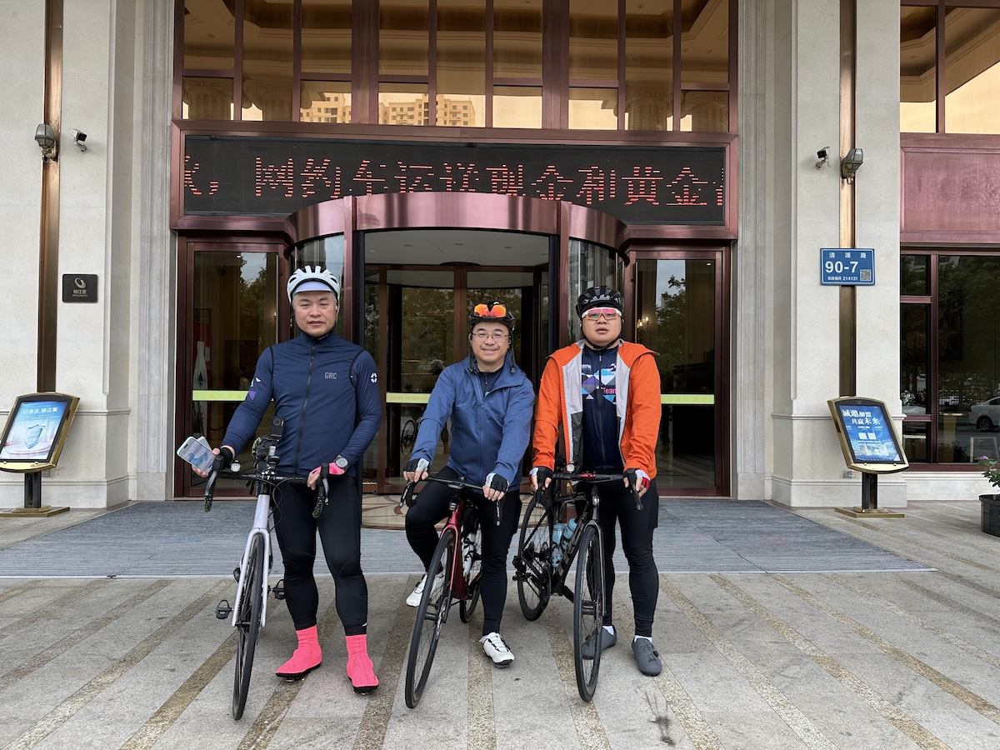

第二天清早就开始下雨，一场硬仗开始。青和锋这次都带了防雨衣，但是没有买骑行背心。在雨中穿着骑行背心，就是妥妥骑行大佬 pro 范儿；一旦穿上雨衣，就变成老年人骑游团（是“骑游”，不是“骑行”，差别很大）了。没事，能不淋雨就好。

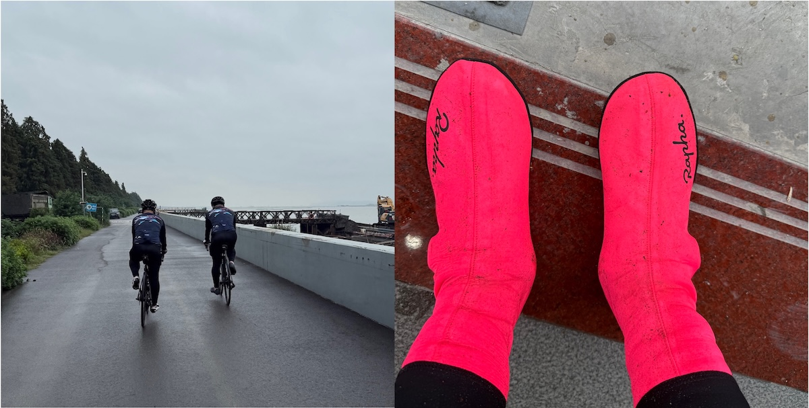

在爆胎事故频发的省道 230 上左转来到丁蜀太湖绿道，完美避开轰隆隆的大货车。这一段路比较荒凉，连绿道都不算，就是沿湖的沥青路，但是路况极好。我们很快就把“养生巡航 25公里”的队规抛在脑后，疯狂飙车。以紫砂壶出名的宜兴似乎是个比较工业化的城市，靠近太湖这么好的地方，竟然完全没有开发网红打卡景点。

雨越来越大，这时候我的 Rapha 锁鞋雨套就发挥作用了。当初被其颜值吸引，冲动入手后一直没有用过，觉得太张扬了。在这样的雨天，如果没有雨套，锁鞋会完全湿透，而且跟锁踏衔接的地方容易打滑，不舒服而且不安全。昨天沉重的工具包帮助骑友，今天骚包的雨套遮雨防滑，物尽其用。

在 S230 骑了一半距离，我们在一个公共车站停下来歇歇。两个骑手，一黑一白，车轮连车轮，飞一般顶着大雨从我们身后疾驰而过。

过了一会儿，其中一位黑衣小哥折回来了。

爆胎了么？是啊！

你同伴呢？他就这么绝尘而去了么？我们不是一起的啊，就是在路上碰上的。

这位黑衣小哥从湖州开始，准备一天内完成环太湖 300 公里。他每天上班通勤都是来回 35 公里，经常在湖边骑行，但环太湖还是第一次。以他这样的经验值，他竟然不怎么会换胎补胎。这也不奇怪，我骑行恐怕近万公里了（闪电加上小布），但补胎方面仍然是菜鸟水平。

青则不一样了。他最近为了从北京坐高铁来苏州，买了专业的需要拆两个轮子的自行车包，刚刚把拆轮子的流程突击补习过。我虽然自己动手能力很菜，但是见过很多次猪跑，也可以帮一下。我们俩加上黑衣小哥，三个臭皮匠就开始换胎了。锋的感冒还没有完全好，正好在长凳上美美睡上一觉。

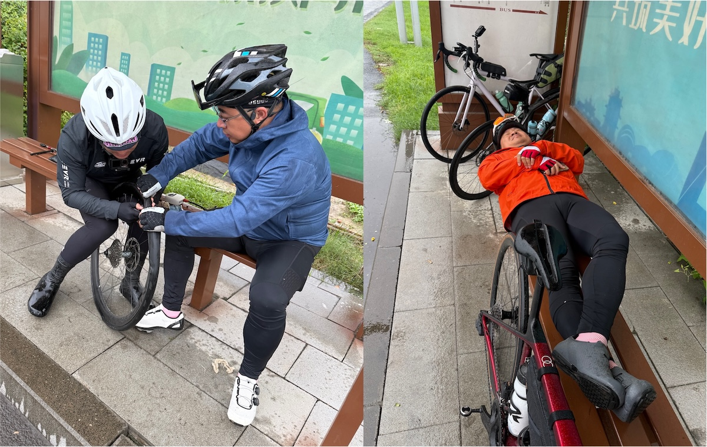

这个过程花了一个小时。三个人都似懂非懂，但磕磕碰碰地在青的带领下，还是完成了换胎补胎的全流程。我在后轮外胎上摸到了两跟铁刺。如果外胎的异物没有被找到，很容易发生换了内胎然后新内胎马上又爆掉的问题。两年前我在日本濑户内海骑行的时候就遇到这个情况。这次学乖了。

青从此从青总摇身一变，化身青师傅。可以直接在路边摆个摊帮人补胎了。宜兴的旅游业不怎么发达，需要他这样的人才。

后来又碰到一位雨中拦路求助的骑手，典型的爬坡手身型，车也很帅，但是运气不好，两个胎都爆了。他的需求比较独特，希望跟我换内胎。但我的胎跟他差别太大，气嘴规格不同，想换也换不了。他太太开着一辆保姆车给他提供后勤，车后座上还有一个小孩，看来是全家出动帮助爸爸出来参加比赛了。我们祝他好运，继续前行。

一路往北在雨中骑完 S230，在分水村吃完午饭，下午就沿着马山半岛的环太湖大道骑行。中间终于碰上了几个车队，都是参加比赛的。但总体来说，这两天遇到的骑手数量远远低于我的预期。难道太湖周末不是人满为患，挤满了江浙一带所有想刷圈的俱乐部车队么？看来小红书的世界跟实际还是有一定距离。

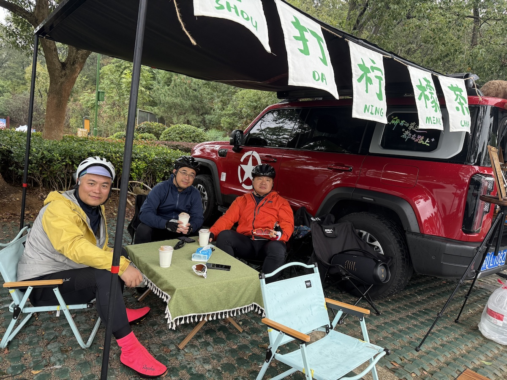

在马山半岛湖边的一家咖啡摊继续休息。摊主小方姑娘说她预订的公路车很快就要到了，很向往马上就要开始的骑行生涯。她说自己入了好几个坑，希望公路车这个坑不要太深。我说，你没有去搞精品民宿吧？没有，那个坑太深了，深不见底，进去后我就出不来了。那就好。骑公路车很开心的，三两好友一起出行，一路上克服各种困难，遇到各种有趣的灵魂。

小方竟然有卡瓦斯口味的咖啡！我刚刚在[南疆喀什之行](https://herbertyang.xyz/docs/gallery/2025/xinjiang-day-1/)品尝过，这不就是在奥兰多环球影城哈利波特城堡喝过的 butter beer 么？那必须尝一尝。这时候路边一个黑影一闪，似乎有点眼熟。

小方还有个功率强大的音响，放的是粤语老歌。音响里传来面对面看着你的眼睛不再追寻你的背影，小方问我这是什么歌，我脱口而出这是张学友的《风的线条》，我大概有35 年没听过这首歌了，没想到在太湖边上一个00后小姑娘的咖啡车旁再次邂逅。

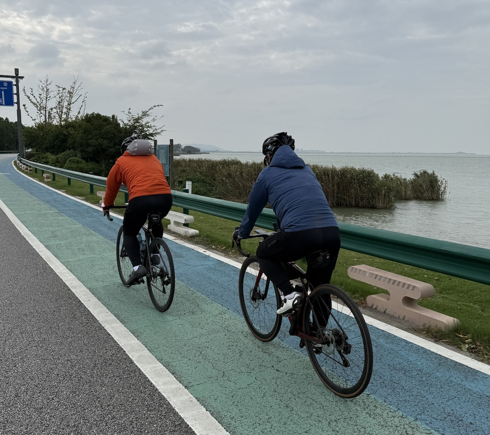

在马山碰到了不少单飞的兔子。我遇到兔子就热血上头，想把他们抓回来，青和锋就在后面开始摇头。有两个车队疾驰而过，我尝试提速跟了一下。都是 38公里的巡航，太猛了，难怪他们骑整圈太湖可以达到 30 公里的均速。前面的车队在上坡前，后面的几个人似乎听到了我花鼓的声音，回头看了一下。或许有点意外，这大哥竟然跟上来了？然后他们就摇车上坡绝尘而去了，留下我慢慢喘息等着青和锋赶上来。

前面一个黑影停在路口，那不就是我们帮忙补胎的小哥么？看来他的胎是没事了。小哥跟我们骑了一段，说我还得赶路，得先走啦。你赶快去吧，祝你好运！这里离湖州大概还有一百多公里，已经是下午五点多，他将还有漫长的一天。

晚上住在无锡东的维也纳酒店。第二天骑了90多公里，小雨大雨几乎就没有停过。吃完饭去打台球，青的黑八技术炉火纯青，绝对进攻流，完全不需要考虑防守。但牛在几乎逢⑧必进，神乎其神，简直就是黑八小王子，看得球馆教练目瞪口呆。打台球跟骑公路车有个共同点，都需要骨盆前倾，重心前移。虽然这天晚上输给青够呛，但这个领悟对我第三天的骑行颇有裨益。

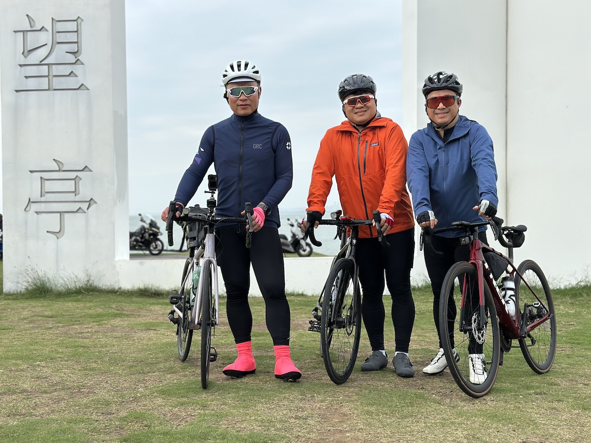

第三天天晴了，终于不下雨了。从维也纳酒店往东，离开无锡，很快进入到苏州境内，又回到了太湖边。在望亭湖边的咖啡摊照例补上美式咖啡，在望亭合影。

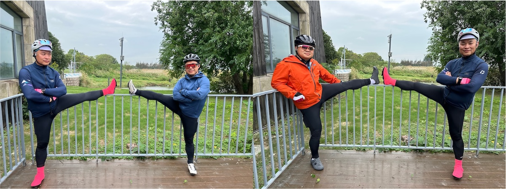

这一天的太湖骑行很惬意，一路沿湖就行，不需要找路。中间路过网红餐厅 Third Cup。服务有点拘谨，但是蒜香面包和咖啡相当地道，小山头可以俯瞰太湖全景。

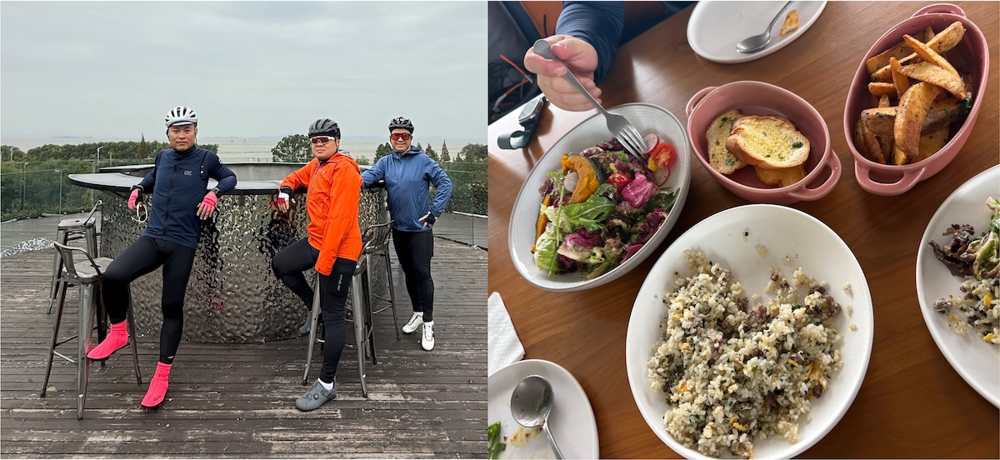

路上经过游人熙熙攘攘的西山和东山。这两个“耳朵”是苏州上海骑行圈经常拉练的地方。如果白描一圈，各自都是 50-70公里。这次我们的小目标仅仅是 300公里，就不去挑战自己了。如果环太湖加上马山，东山，西山，可以达到满格的 500公里。

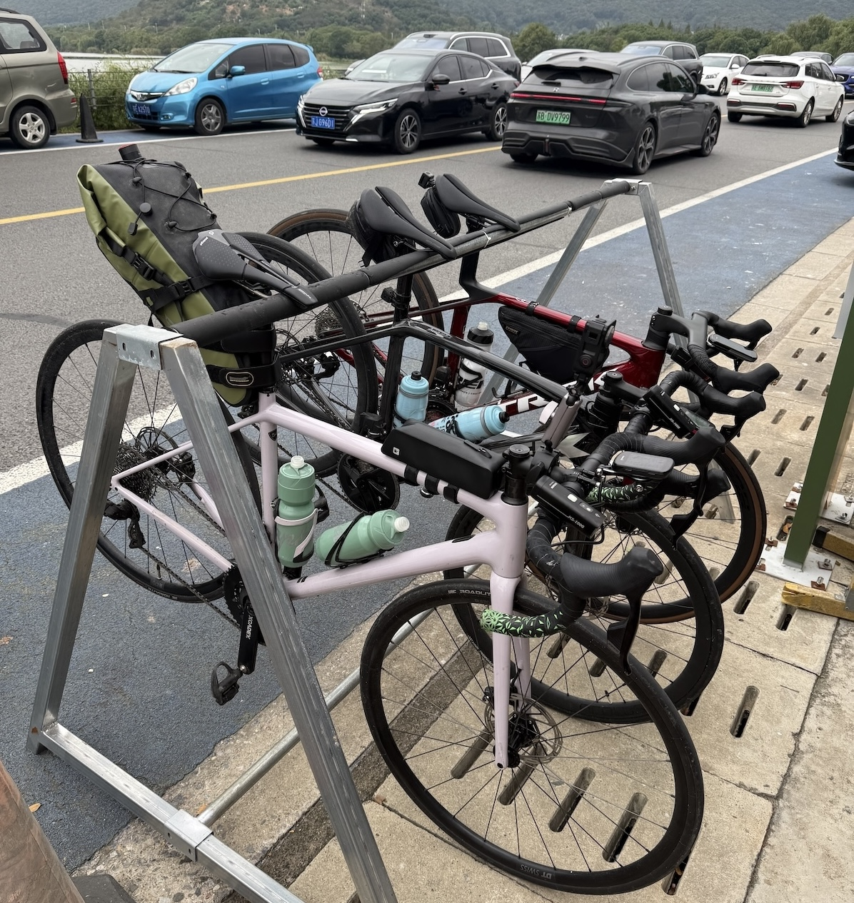

整个太湖快要骑完，都没有碰到什么陡坡，连个练习摇车的机会都没有。千岛湖相比之下起伏的坡度要高多了。进入了苏州市区，就离开了太湖湖线，重新回到充斥着小摩托，互相抢道，喇叭乱响的世界。

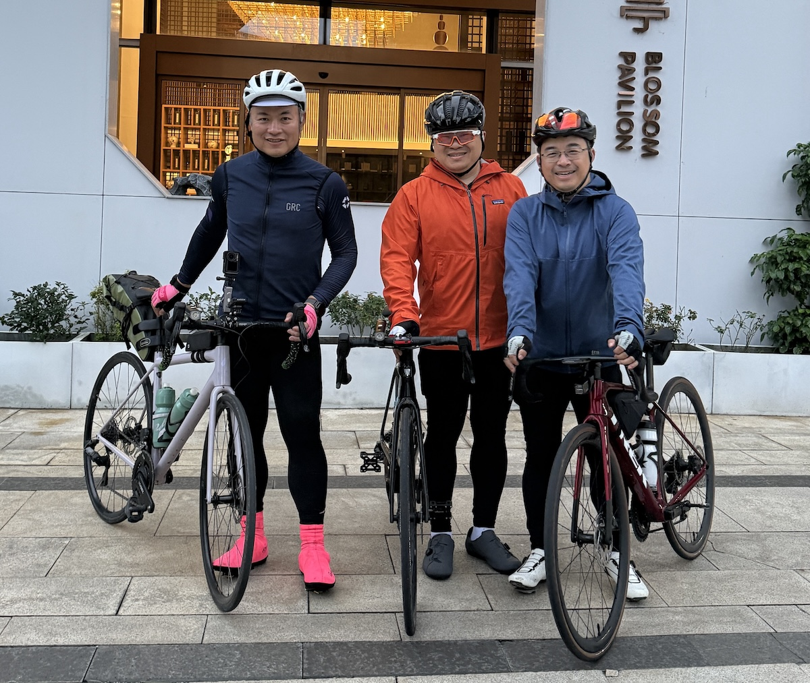

回到了苏州的第一天酒店花间亭，正好是五点钟，雨点开始滴滴答答。这家酒店最惊艳的一点，是旁边二十米就有一家闪电 Specialized 店！青提前预订了三辆公路车的清洗服务，每辆 98元，良心价。这三天风雨里骑下来，车已经脏的不成样子。青要装车上高铁，我和锋要把车放在车上 4+2 回到上海，如果没有这个洗车的服务，还相当麻烦。

这次骑行，零摔车，零爆胎，零事故，感冒宝宝恢复一枚，帮助骑友两位，捕捉兔子🐰 N 只，目睹集团车队四五批，咖啡采样无数，完美收官！

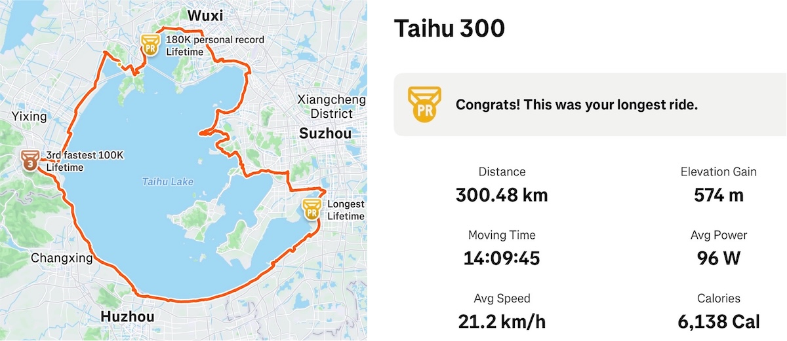

下一次 Team Chirus 的骑行，应该去哪里呢？欢迎建议！

---

*Originally published on [herbertyang.xyz/blog](https://herbertyang.xyz/blog)*
