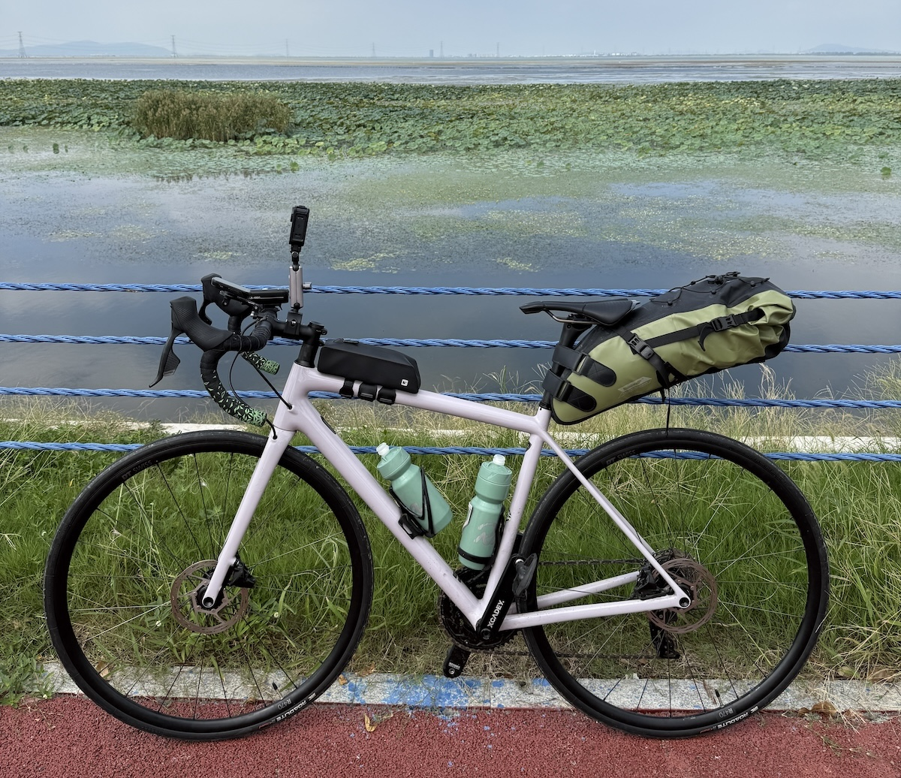
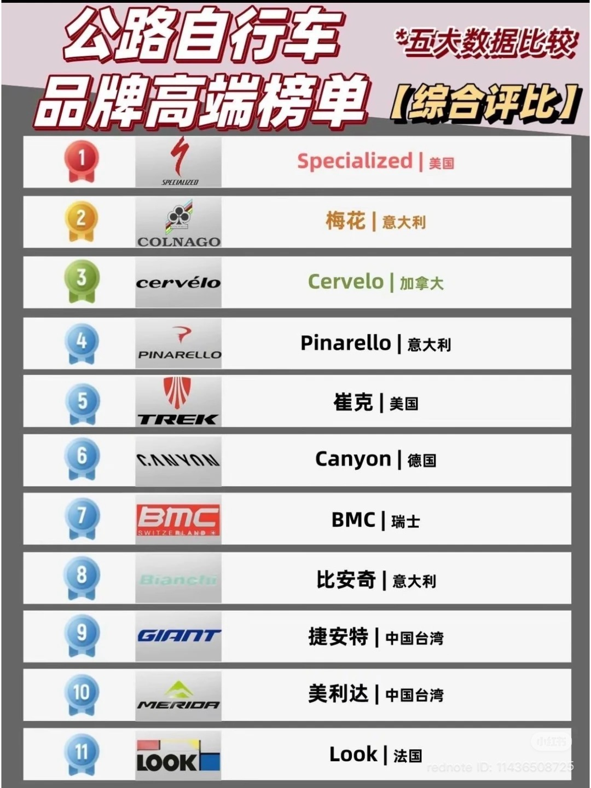

疫情期间我先开始[骑折叠自行车 Brompton](https://herbertyang.xyz/blog/why-i-love-riding-brompton/)，然后从2022年6月份开始尝试公路自行车。后来陆续把身边的朋友拉入公路车的深坑巨洞，组建自己的车队 Team Chirus，在2025年完成千岛湖和[太湖的环湖骑行](https://herbertyang.xyz/blog/2025/10/27/cycling-around-taihu-lake-300-km/)，逐渐积累了一套拉新入坑的经验之谈。骑自行车有各种好处，希望更多的朋友可以加入到骑行的行列。

<!-- truncate -->

## 1. 决定价位

第一个决定，是购买万元以上的车还是万元以下的车。万元以上的车，大的品牌也就是 10-15 个，都是国际品牌（欧美，台湾），基本都是碳纤维的车架。万元以下的车，国内品牌甚至互联网上的品牌就很多了，用的材料铝合金比较多。

我建议第一辆车的价格在 1-3 万元之间，先培养骑行习惯和兴趣，慢慢再升级。

公路车圈子里有个说法，一个男人需要的自行车的数量 = N - 1 。N 等于家里的自行车多到老婆要跟你离婚的数量。我现在仍然只有两辆车，全家和谐。

我的公路车，是闪电 Specialized 的 Aethos Composite，是一辆性能比较均衡的车，据说适合爬坡。但对我来说，其实主要还是骑平路，环湖，环城比较多。这辆车可以参加大环赛，但我也不会去参加骑行比赛，就是跟朋友们相约骑车而已。

这辆车的特点，是它的贝壳色 - 有点淡淡的樱花粉，但又不是粉得辣眼，有点乳白，甚至有点淡紫，我一见入魂。

## 2. 选择公路车的种类

决定了价位后，下一步要想清楚买什么种类的公路车。有几类车，属于高阶玩法，建议在初级阶阶段先避开：

- **TT bike** (Time Trial)。这是铁人三项的用车，速度极快，逼格极高，入手极难。新手就不要考虑了。
- **Gravel bike** (瓜车)。有种说法，瓜车才是自行车的终点。的确很诱人，但是需要较高水平才能驾驭。瓜车可以驾驭多种路面，前叉比较宽，可以用比较粗的轮胎，有减震的设计，可以骑泥路和碎石路。可以在购买第二辆车的时候再考虑瓜车。现在公路车（万元以上）的性能非常好，从上海骑到西藏，横穿欧洲，环台湾，环海南岛，完全没有问题。
- **Endurance bike**。这种车在欧洲很多，因为很多人需要每天骑几十公里上下班，或者做 bikepacking （这是骑行的另外一个终极目标）。它需要装比较多的行李，车架需要更加能承重（可能需要换成钛合金），适合各种天气，而不是一味地像公路车这样追求减轻重量。但对初级车手来说，还不需要考虑这些。

## 3. 寻找线下公路车店

在网上研究各种品牌，容易看花眼。最简单，最高效的方式，是找几家离家最近的公路车品牌店买车。

线下品牌店对骑行非常重要。购买的时候，现场看车，验车的体验是难以替代的。网上说得再好，线下店没有卖的，也没有意义。而且，车架的颜色也很重要，通常是店里有什么就买什么 - 这跟买车的道理一样。

开始骑行后，会经常需要去店里购买零部件，升级，维修，保养。很多线下店会组织每周的骑行活动。这些活动，会逐渐成为骑行生活里有机的一部分。店里的销售，技师，和领队，都是学习骑行，提升技能最好的老师。一家历史悠久，在骑行圈内众人皆知的线下店，是新手入圈最好的良伴。

线下店，有的是一线大品牌的专卖店，有的是服务多个品牌。有能力在全国一线城市广泛铺开线下网络的，也只有闪电 Specialized 和崔克 TREK（类似于汽车里的奥迪和BMW）。

## 4. 选择品牌

这是最激动人心的环节。在万元以上的档次，高端品牌选择如下：

**Specialized**, **TREK**, **BMC**, **Colnago**, **Cervelo**, **Pinarello**, **Canyon**, **Scott**, **Cannondale**, **Factor**, **Bianchi**, **Look**, **Cube**. 

Specialized 和 TREK 在国内拥有最广泛的基础。出去参加业余车友的骑行活动，40% 是闪电，40% 是崔克，然后是其他相对比较小众的品牌。如果不知道买什么品牌好，从闪电或者崔克入手是最容易的 - 在不同的价位都有合适你的车型。

公路车的核心技术含量都在车架。这个技术仍然是欧美领先。国内比较好的一线品牌有**瑞豹**和**喜德盛**。台湾的捷安特 **Giant** 很早进入大陆，但因为有很多比较入门级的车型（譬如，各大公园里可以租的自行车），所以品牌的逼格就低很多了。台湾的另一个常见的品牌是美利达 **Merida**，也比较经济实惠。

国内骑公路车的风气开始并不久，在疫情期间爆发了一波，现在趋于平淡和真爱。不可否认，对于很多人来说，骑行是件相当装逼的事情，大家都比较追求品牌。在凌晨五点的各大骑行俱乐部门口骑行队伍整装待发的 moment，就是一个大型装逼现场，大家互相 check out，看车架，骑行服，头盔，锁鞋，轮组，轮胎，等等。如果是闪电线下店组织的活动，绝大多数车手都是骑闪电 - 当然，很多领队也不介意其他品牌车的加入 - 正好从竞争对手里把客户抢过来。

我参加过很多次这种活动，包括全天的去江浙山区里的骑行活动。说实话，很少见到除了上述这 13 家欧美品牌以外的车。

如果只是跟朋友们一起骑行，也不需要太在乎，自己骑得开心就好。最后，骑行届也是看双腿实力的，有人如果可以把捷安特骑得虎虎生风，拉爆 Cervelo/Pinarello 的话，大家也是很佩服的。

在欧洲，骑行已经是大部分家庭生活的一部分，反而没有那么讲究品牌，什么实用就骑什么，有很多我从来没听说过的品牌。

## 5. 第一辆公路车需要买什么

选择好了品牌，就开始选车了。

在万元以上这个价位，几乎默认全部都是*碳纤维*的车架 - 足够轻。钛合金的车很少，主要见于 endurance bike，适合长途旅行。有的商店会搭配铝合金做前叉或者后叉，来降低价格。通常，整车应该在十公斤以下。

注意这么几点：

- 直接买整车，不要零装。直接开始骑，找到感觉后再慢慢地根据自己的喜好更换零部件。
- 先不要买高性能的档次，从基础款开始。传统车里，奔驰有 AMG，奥迪有 RS。自行车里，闪电有 S-Works，崔克有 SLR。我的这俩 Aethos，如果升级为 Aethos S-Works，价格大概提升5万元。店里的销售会根据对你钱包的判断，有时直接劝你一步到位购买 S-Works/SLR 档次的车。对于新手来说，没有必要直接上10万元的公路车。
- 公路车是没有脚撑的。在店里，千万，千万，不要问“有没有脚撑”，会直接进入社死状态，被店员的白眼淹死。公路车追求越轻越好，脚撑是完全没有必要的，而且对骑行有危险。脚撑有价值的场景，是平时在城里骑行或者上下班。但这种情况，就不需要几万元的公路车了，买辆复古钢车或者 Brompton 就可以了。
- 公路车是没有车锁的。这个问题，问都不要问 - 显得你的认知太过初级。几万元的公路车，信仰的是，车在人在。不会有人把公路车锁在路边跟共享单车停在一起的。
- 显然，公路车也是没有货架的。公路车追求的是极致的速度，任何这些有实际用途但会增加重量的部件都不会出现在有自我追求的公路车身上。
- 先不用买锁鞋。锁鞋是下一步。对于新手来说，先开始骑最重要。穿戴锁鞋并不难，但是适应它有个过程。一开始没有必要给自己添加难度。

好了，买好了车，可以发朋友圈了。恭喜入坑！这个时候的你，还是骑行圈比较青涩的新人（虽然你两鬓的灰发和眼角的皱纹无情地出卖了你江湖大佬的彪悍资历），因为你跟新车的合影里还没有全套的 Rapha，或者 PNS，或者 MAAP。

没关系，我们现在开始循序渐进地升级打怪。

## 6. 公路车骑行升级顺序

建议按照这个顺序来升级你的公路车技能树：

1. 没有穿锁鞋的新人在骑行俱乐部里是没有尊严的。虽然穿了锁鞋，也未必是骑行大佬。但不穿锁鞋，一定是骑行菜鸟。有规律地骑行了3-6个月之后，开始穿锁鞋是必经之路。不用担心会零速度摔跤，我从来没摔过。穿锁鞋比你想象中要容易很多。穿了锁鞋，骑行效率会提高 20-30%，速度可以提升 2-3公里/小时。除了提速，锁鞋有很多益处，可以纠正骑行姿势，可以降低打滑风险（尤其在摇车的时候）。而且，只有穿了锁鞋，才能开始做 fitting。换锁鞋，需要去店里把车的曲柄换掉。
2. 在2区心率范围内可以经常地骑40-50公里后，就可以考虑安装功率计了。要想有效地在长途骑行中，尤其是上坡下坡平路之间合理分配体力，功率计是必须的。不同的骑手体重不一样，年龄不一样，路段不一样，速度也不一样，唯一可以做公正比较的数据，就是单位时间内输出的功率（更精确的，是功率除以体重 - 功体比）。功率计比较贵，好的需要大几千甚至上万，最普通的国内品牌也是小几千元。安装功率计，得去店里找技师。
3. 穿了锁鞋，安装了功率计，有了一定的骑行经验，就应该做次 fitting 了，有专门的店提供这种服务，从几百到几千的服务都有。飞艇老师会根据你的身材，骑行体态，做出各种测量，提供专业的建议，调整车架，坐垫，脚踏的角度，斜度，高度。
4. 现在的你，均速可以骑到 28-30公里/小时，如果想再上层楼到30-35均速，则可以考虑把轮组（通常基本款都是铝制的）升级到碳刀轮组了。这是另外一个让人眼花缭乱的世界，大概需要3-5万元。

我的追求没有那么高，仅仅是到了第三阶段，止步于碳刀轮组。两年前我跟着俱乐部骑崇明岛，80公里的均速骑了28公里/小时，对我而言这个成绩足够足够好了。我现在的理想，也就只是跟老朋友们一起环个湖，圈个岛，绕座城，稳定在2区心率，偶然在3区里挑战一下短距离的爬坡，4区心率是绝对不想碰的（太累了），比赛是完全不参加的（太危险了）。

希望这个攻略可以帮助你早日加入骑行江湖，吹吹海风，听听山涛，享受户外乐趣。