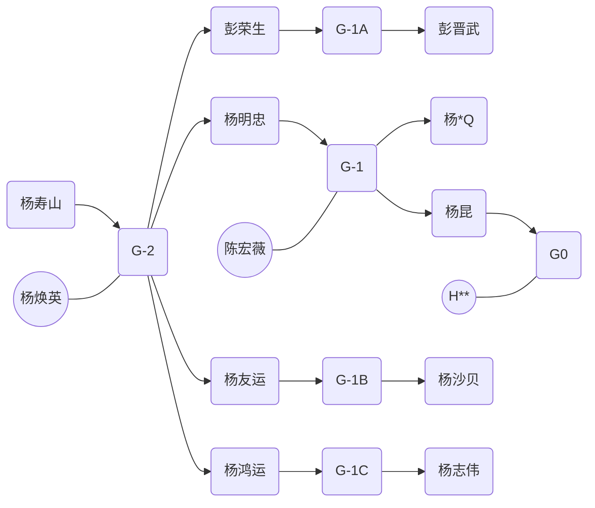
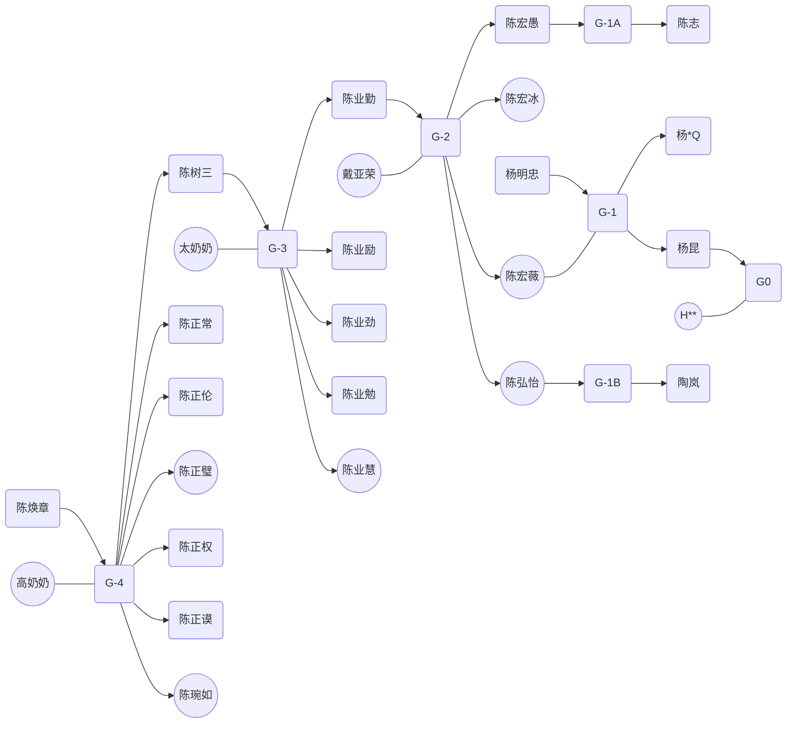

# 家谱

## 武汉汉口杨家

G-2:
- 杨寿山
- 杨焕英

G-1:
- 彭荣生
- [杨明忠](../yang-ming-zhong/)
- 杨友运
- 杨鸿运

G0:
- 杨青(Steve)
- 杨昆(Herbert)

G+1:
- 杨*Z(Brandon)

## 武汉汉口陈家

G-4: 
- [陈焕章](../chen-huan-zhang/)

G-3:
- [陈正纲（陈树三）](../chen-shu-san/)
- 陈正常
- 陈正伦
- 陈正权
- 陈正璧
- 陈正谟
- 陈琬如

G-2:
- 陈业勤（陈练明）
- 陈业励（陈宜）
- 陈业慧
- 陈业劲
- 陈业勉

G-1:
- 陈宏愚
- 陈宏冰
- [陈宏薇](../chen-hong-wei/)
- 陈弘怡

G0:
- 杨*Q
- 杨昆(Herbert)

G+1:
- 杨*Z

