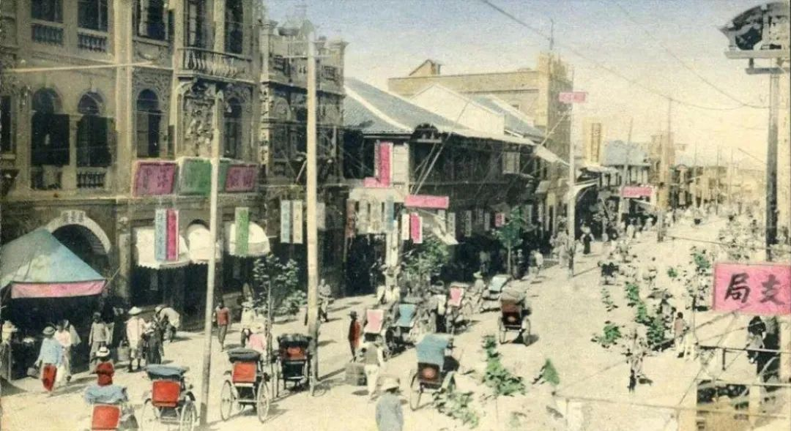
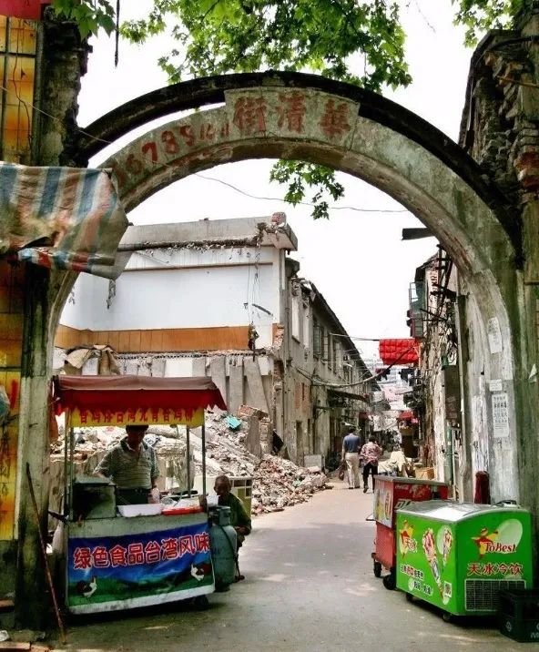

# 老汉口，汉阳帮是柱头（上）

*日期：2023年3月7日*

旧时，“汉阳帮”包括夏口（汉口旧称）、汉阳、汉川、黄陂、孝感、沔阳6县，故称为“六一帮”。1926年末夏口县改为汉口市后，只有五县了，又称“五一帮”。

原本汉口属于汉阳的一部分，汉阳帮商人来汉口跨过汉水就来了；东西湖地区原来也属于汉阳，来汉口也不需多花工夫。他们对汉口的商业发展贡献很突出。

汉阳人来汉口做饮食的比较多，如汉阳马鞍山田家大湾人田玉山开设的四季美汤包馆、汉阳朱家台人朱荣臣开设的本帮菜馆老会宾酒楼、刘木堂开办的以回鱼菜著称的老大兴园等。此外，还有汉阳人在汉口开办浴池业等。

这些，在汉阳人眼里只不过算小生意，其中涌现了一批汉口影响较大的汉阳/蔡甸商人，包括下面几位。

## 陈焕章

陈焕章早年随父在汉口新茂元粮食行协助经营。1918年继承父业开设新茂昌粮食行，1920年改组为新茂昌协记粮食行任经理，并成为汉口最大的粮商之一。1926年被选为汉口粮业帮董，1928年当选为汉口商会委员。1932年，与人合资在汉口开设德昌号任经理。除经营粮食外，还经营棉花、桐油、布匹、食盐、煤油等。武汉沦陷前夕避居汉口法租界。

1945年抗日战争胜利后，陈焕章任汉口商会筹备会副主任，并于次年在汉口恢复经营德昌号，1948年又开设慎昌号。1949年后，曾任武汉市工商业联合会筹备会副主任委员、武汉市各界人民代表会议协商委员会第一届、第二届委员、武汉市粮食局顾问。

## 万泽生

万泽生早年入汉口有成钱庄当学徒，后升为“上街”。时广东潮州巨商陈星帆出银5万两开设丰成钱庄，聘其为经理，获利甚丰。1911年陈星帆将钱庄改名丰盛钱庄，与万合股经营，万任经理。1914年后，先后开办义源炭号、亚新丝光染纱厂、玉丰米厂及丰太、太生两家当铺以及丰太估衣店。1919年当选为汉口总商会会长。1931年与人合资创办楚胜火柴厂，任总经理。1938年武汉沦陷，开设同茂参号。1942年曾出资1万元作为新四军第五师军费。

## 韩永清

韩永清是汉阳合成乡人。他出身贫寒，但肯学肯动脑子，被迫在艰苦环境中磨砺自己。早年为生活计随母迁居汉口。19岁时，一次偶然机会被湖广总督张之洞看中，推荐到巡警道署当通译。由于办事干练，广结人缘，很快便被同乡杨坤山推荐到英国和记洋行内担任长沙收购庄经理。后又从长沙回汉口，旋调到汉口总行任稽查。

1910年，英商在安徽芜湖开办新厂，委派韩任买办。由于他有机会跑南京，经过对比，他向洋行提出在南京开办和记洋行分行，意见被采纳。1913年南京和记洋行正式开业任买办，在他的经营下，设有冷藏厂、制蛋厂等厂，辟有自己的专用码头，后还垄断了苏、皖、鲁、赣北的畜产禽蛋等收购权。不久，当选为江苏省参议院议员。

1912年，孙中山在南京就任中华民国临时大总统，亲书“博爱“横幅（长130厘米，高65厘米）相赠，还委任韩为总统府顾问。1920年后，先后任南京下关商会会长、“湖北旅宁同乡会”会长及国际慈善组织“华洋义赈会”董事，热衷于慈善事业，人称“韩善人”。1930年辞去英商南京“和记洋行”买办的职务，隐居上海，被选为湖北同乡会会长，同时加入了国际慈善机构红十字会组织，任东南主会总办事处监理兼上海红十字会会长。

在企业飞速发展之际，韩永清开始经办自己的实业，采取投资和与人联办的方式，开办了大陆银行、盐业银行等实业，又与武汉实业家贺衡夫联合开办了武汉桐油公司，并出资与人和办天津永利久大化学工业公司、厚生纱厂、新生纱厂、大同面粉厂及参股开滦煤矿、镇扬长途汽车公司等公司和大陆银行、盐业银行等企业经济实力如日中天，成为当时全国颇具名气的大实业家，相继被黎元洪总统、冯国璋副总统及苏、皖、鄂等省长官礼聘为顾问，并荣赝二等大绶宝光嘉禾勋章、二等文虎章，后晋升一等大绶宝光嘉禾勋章

超有钱的人玩的是单挑，是决斗，玩的是爽，是味，小赌不过赢，豪赌才风光。在赌场韩永清赢得了汉口整条华景街的房地产。为了炫耀他的富有，决意把这条街好好修建一下，不仅盖住房，而且要盖一座钢筋混凝土结构的菜市场。韩永清以前有经营食品业务的基础，认为新式菜场可以领引汉口人的新生活。

1924年，华景街改造工程完工，那些收租账房文人墨客为讨好韩永清，将之易名为“华清街”，菜场也叫华清菜场。菜场楼上最初辟为“集贤茶楼”，不久由红帮张春元经营，改为“保春茶楼”；后又由另一个红帮大爷周胜余顶下，改为“宁汉茶楼”；民国二十四年（1935年）7月7日改为“宁汉戏园”，开张之日由楚剧名演员严楠芳等演出“天河配”。

华清街开市那天，在前后街口高扎彩楼，要全街商户张灯结彩，燃放鞭炮，并聘请汉剧名伶余洪元等七八人到菜场清唱，一时热闹非凡。

华清街在当时的历史条件下，曾经是全市有影响的高档副食品销售中心。全街有三分之二左右的商户经营肉、鱼、鸡、鸭、蛋、海味、干货、水笋、酱咸菜、豆制品，各种时令菜和西餐用的蔬菜应有尽有。外商洋行、外侨、高级中西餐厅、饭店、酒楼、“三北”和“民生”轮船公司客轮以及市民中婚丧喜庆需要的荤素菜肴等大多在此购买，因此生意特别繁盛。

武汉沦陷后，街市光景一落千丈。1944年农历冬月初四，此街遭美机轰炸，破坏严重，菜场；楼层烧毁。抗战胜利后，人们在废墟上重建了家园，市场一度恢复。1947年韩永清在上海病死，儿子韩安州继承产权。此时币值暴贬、市面萧条，华清街经验处于困境。直到武汉解放，这条饱经沧桑的街道才获得新生。

## 档案

*作者：王琼辉*

*[原文链接](https://mp.weixin.qq.com/s/lTHoQ-v1luwQr47QADYshA)*