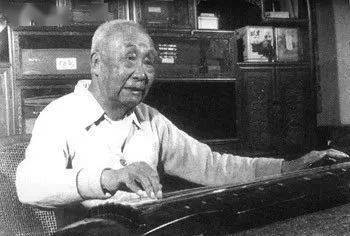

# 查阜西先生文选（三）：怎样克服古琴谱的缺点 

文丨查阜西

*日期：1953年*

古琴曲谱是我国最早出现的乐谱。到宋末或明初就已发展成为定型的简字指谱，它不像五线谱或简谱那样，明白地表示出音高，和节奏；而只是表明按弦的部位，和拨弹的指法。本来一个乐谱，最主要的是要指出正确的音高和节奏，古琴的简字指谱既然指示了在一定琴弦上一定部位发音，这就可以求出它所代表的音高。至于节奏，其中虽有一部分自然地决定于右手的“顺、逆”和“向、背”，另一部分也可以用比较详细的简字注明，但仍有许多地方古琴谱至今还没有方法表达，由演奏者自己揣测，因此出入甚大。还是古琴谱的一个重大的缺点。

由于此，不少古琴家曾提出一些改革古琴谱和统一节奏的意见。早在半世纪以前清代同治年间的祝桐君和清代末年湖南的杨时百，这两位先进古琴家就刊传了加添工尺附点板眼的新谱。最近如四川古琴家侯作吾先生在前年摆出了一套有相当体系的、想基本上改革古琴谱的谱式，上海古琴家吴振平先生今年年初把他演奏得最熟的古琴和他自己创作的琴曲写成包括指谱，五线谱、简谱、工尺谱的四式谱，汉口古琴家陈树三先生在本月里创作出一种“三线七弦琴简谱”。所有这些古琴家，在不同的时代改革琴谱，想要把古琴普及给更多的人们，他们的意愿和他们的创造所达到的一定的成就都是值得钦佩的。

但他们也还有着旁的不同的动机，祝桐君的工尺按拍琴谱，是为了“入门”，不但张鹤和徐允临在《琴学入门》的序里说得明白，而且在全书十二曲中只把七个比较小的琴曲附点板眼也可说明。杨时百在《琴镜》的序里也说明了他的四行镜谱是为了“……以此谱与彼谱对镜参观，即可以镜古人之得失，更足以自镜其得失……惟志在自镜镜人……”当然，他二人是在半世纪以前的古琴家，他们抱着这种态度也是很容易理解的。

现时这几位创制新谱的古琴家的态度，可以用陈树三先生给作者的一封信里的话作为典型性的代表，他说：“古琴之所以不普及，不能强调是‘曲高和寡’，而是因为琴谱不统一。不但节奏不同，而且易生门户之见。应该像五线谱那样地统一，不应拘泥古法。我的意思想把各谱用五线谱记出，使天下一律，就能把千百张琴拿来同奏，毫无出入了。”这种意见，指出了就旧社会里在部分的古琴家身上体现着一些“主观”“狭隘”“偏私”的缺点，这是正确的。古琴谱有缺点，也确是事实，上面已说明了。我和一些古琴家和其他音乐家交换意见中，都同意像陈树三先生们的这些意见。我们也同意：只要古琴有前途，改进古琴谱也是有必要的。但是对于立刻改革琴谱，立刻确定古琴各谱的节奏，和用改革的谱为工具达到统一和严密古琴的节奏，以为这样就可以使古琴获得更多的群众而普及起来，却认为大有讨论的必要。而且纵然今天立刻改用更严密的新谱，显然也只能把现在古琴家所能演奏的东西记写下来，演奏若有出入，就更加歪曲了古琴的真面目。

其次我们还需要研究一下由于古谱的缺点和所发生的不良后果究竟在哪里。在今天，一方面是四百多首有着千年历史的古琴曲被埋藏在近百种不够严密的刻本古琴谱中，另一方面人民已经开始向我们要求这一部分宝贵的遗产。在北京、上海等地古琴家们已被邀请演出；好些地方古琴家们演奏后，一般群众最突出而较普遍的反应是：“这种音乐中一定有好的东西”或是“这种音乐中可能有很好的东西”。群众的这样的反应，也表示着对我们今天的演奏还不肯十分信任，这和古琴家们自己不信任自己是一样的情形。如杨时百肯定古人有得失，自己刻了谱却还说只是为了“自镜镜人”。古琴家们，包括先进的古琴家们拿起一个古琴谱，试弹了几段，往往一样地说：“这个谱里面一定有好东西，”或是说：“这里面可能有好东西，”可是，正由于谱有缺点，他们往往不再继续按着这一个谱。那些坚持按打下去的，也多并不深入体会甚至还要把那些较难体会而实际是最好的部分随便改动，随便对付。现时古琴家的演奏中，凡是追不出明确的渊源或师承的，很多就是这样得来的东西。在旧社会里，你可以说“我行我素”，人家说不好，你尽可以“孤芳自赏”，以“曲高和寡”的老调对抗，但是今天群众是十分严肃的态度，抱着接受祖国音乐文化遗产的意愿来听我们的的演奏的，我们能再用过去的态度来支吾吗？说到这里我们就会理解到，由于古谱存在的缺点，由于我们在旧社会里自由散漫和傲慢的习惯，所造成的绝大部分古琴家们演奏中的缺点，这也许才是“古琴之所以不普及”的主要的原因。也很显然，目前工作重点不能强调统一不良的节奏和创立新谱，而是要顽强地去克服由于古谱的缺点所产生的不良后果。

最后，再来谈谈我们的正面意见——怎样来克服古谱的缺点。总的说来，我们的意见是，要依靠劳动和依靠群众。也就是我们应该端正发掘古谱琴曲的态度，选择有意义和良好内容的古谱，忠实而顽强深入地去体会，把它正确的旋律、节奏搜寻出来，掌握下来，同时提出考据性的说明，然后由古琴团体和音乐界的领导方面的协助，通过录音或用公演作不断的评选，最后再拿到广大的群众中去考验。只要能有一个这样出来的古琴曲被广大的群众所喜爱，那也就是我们不小的成绩了。

对于同意上面的意见而想着手发掘古谱的同志们，我们还想进一步贡献两个意见。一是必须选择和端正地传达琴曲的内容。二是尽管大胆发挥自己的天才和智慧。

古琴谱的琴曲中，尚保存着本来面目的，如像《幽兰》描写“黑暗时代好人被遗弃”，《广陵散》描写“策反失败”，《秋鸿》描写“身南心北”等内容的并不很多，有不少内容良好的古琴曲在不同的时代和背景下被歪曲了。例如现时弹《高山》《流水》的人很多，都是清代的谱。根据荀卿的记载，高山的效果是“巍巍乎”，这明明是以“崇高”来暗示所想表达而又不说明的内容，而清代琴谱和琴家都把这一标题琴曲说成是想要表达“恬静”和“仁寿”，变成了道家神秘主义的思想和内容了。《流水》的效果是“荡荡乎”，明明是以“浩大”来暗示所想要表达的某种内容，而青城道士张孔山却把它加上七十二滚拂，模拟自然界各种水流的声音，去适应标题的表面。这很显然都是不可取的。同样在按谱《风雷引》和它的序曲《资益吟》时，我们应该同意明代萧鸾否定《闪电吟》的庸俗，而主张以它来描写“迁善改过，迅若风雷”；在按谱《禹会涂山》时，应该不止是想象“冠裳之盛”而是更要强调争取“化干戈为玉帛”；《禹凿龙门》不是赞美“鬼斧神功”，而是“手胼足胝，三过家门不入”的长期刻苦劳动精神；《圮桥进履》并非鼓励“功成身退”的明哲，而是“虚心请益”的楷模。一句总话，发掘古琴曲必须选择和端正它的内容。我们提出这一问题的理由是因为所有古琴曲都是正式的标题音乐，不像曲牌和大部分旧时其他民间乐曲，它们的标题和内容是早已被公认脱离了关系的。另一个更重大的理由是使古琴音乐更好地为人民服务，这本是我们民族音乐哲学的优良传统——司马迁《乐书》说的，音乐是应该用来“补短移化，助流政教”的。

按谱古琴曲时我们尽可以大胆地发挥每人自己的天才和智慧，倒过来利用古琴谱节奏不严密所给我们的灵活范围，发挥创造力，把按谱琴曲组织成为有最大感染力的优美旋律，去充分表现它那良好内容。毛主席曾昭示我们要“百花齐放”和“推陈出新”这是由于我们伟大的祖国前辈艺术家本来就留我们了优秀的、多方面的艺术传统，在这种优良而丰富的传统的基础上，我们这一代尤其有责任去把它们发扬光大起来。在古琴方面，哪怕是一百个人用同一个标题的琴曲，甚至同一个谱，只要每人都肯去苦修苦练地打按并使它能满足群众，使群众得到有益的感染，这也就是这一个古琴曲的“百花齐放”。假使我们这个意见还可取的话，我们就似乎没有理由来强调急于改革古谱和统一古琴曲的节奏了。我们的天才和智慧只要结合着足够的劳动，其将发挥的创造力是不可限量的，古琴谱的缺点当然也是能被克服的。

*（首刊于《人民音乐》1953 年）*

## 档案

[原文链接](https://www.sohu.com/a/451925659_723051)