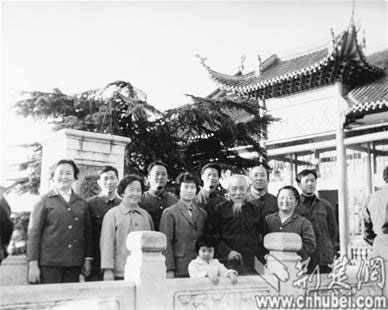

# 两把传世古琴 两段知音缘

*日期：2012年5月25日*

长满“断纹”的木头，老象牙做的琴轸、雁足，看上去普普通通的古琴，竟然是宋、明时代传下来的“文物”。日前，记者得以在武汉古琴前辈、古琴大师陈树三弟子金德华老师家里目睹了这两把传世的古琴，更得知古琴背后的传奇故事，遥想当年老琴家们的音乐情义。

## 初识

大师陈树三送她明朝古琴

17岁那年，还是“资本家”女儿的金德华踏入古琴大师陈树三老师家，一下子就被古琴的声音吸引了。“有一种奇怪的感觉，跟其他的音乐不一样，听起来飘飘然的。”注意到这个姑娘，陈树三先生立刻问她，“小姑娘，想学古琴吗?”还给她放了一段卫仲乐的《阳关三叠》，这也成了她学习的第一支古琴曲。“那个年代，有几个人知道古琴啊。”如今已70多岁的金德华回忆起与古琴结缘的第一刻，仍然满脸放光。

也许是因为“知音难觅”，古琴大师陈树三先生竟然主动“招徒”，还让她写下“保证书”，不迟到、不早退、认真学琴不放弃……后来，陈树三先生带过的20个学生里，只剩金德华和另外一位同学刘庆义坚持了下来。上世纪六十年代，夜深人静，金德华点着蜡烛弹古琴，古琴声音穿透力强，传得悠远。“我父母都嫌我吵。”

过去，古琴是不卖的，只代代相传。作为陈树三先生的得意弟子，金德华曾经受到老师赠送的两把古琴。一把是明代宁王朱权曾使用的古琴，名“曲仙”，可惜在文化大革命时被摔断。另外一把，金德华使用至今，叫做“松风水月”，这一把古琴，有人曾给金德华估价千万。

## 琴缘

“180元”偶得宋朝古琴

“人家说500年一断，木料上的断文显示的正是古琴的年龄。”金德华向记者展示了她那把“松风水月”上的“断纹”，像水波一样，所以也叫“流水断”。一把古琴，穿越几百年，经过不同的朝代、历经战火，辗转传递，至今竟然仍能发出苍凉悠远的琴声，可谓奇迹。

上世纪八十年代，金德华曾经花费180元从一位落魄老先生那里购得一把宋朝古琴，“刚见到琴时，我心凉了半截，用一块破布裹着，没有琴弦，脏得要命。”老先生说，“姑娘，我劝你买下，这绝对是把好琴。”语气甚是不忍。现在，这把琴成了金德华的宝贝，据行家估计，这把宋琴年代更久远，价值超过“松风水月”。尽管有人开价千万，金德华一直舍不得卖。

金德华介绍，几十年前，古琴几乎无人知晓，是一门被遗忘的乐器，所以她今天拥有的两件“让人眼红”的古琴，得来时却全是因为“情分”或“缘分”。陈树三先生收徒弟、赠送古琴，都不收钱。为了在文革时保住古琴，他曾下跪“留琴”，其他家产都不要。时隔几十年，传世古琴身价不可同日而语，古琴大师们却已然不在。

伯牙子期“高山流水”的传世故事，让古琴与江城结下不解之缘，武汉古琴界也涌现出黄松涛、陈树三、范文远、王忠贞等前辈大师。“上世纪50年代，全国弹古琴的恐怕都不到一百人，很萧条。”金德华介绍，为了弘扬古琴文化，上世纪五十年代，几位前辈曾在如今的江汉公园举办了第一场简陋的古典音乐演奏会，之后也经常举办一些雅集。但古琴毕竟“曲高和寡”，学习起来费时费心，长期以来都很“边缘”。金德华说，古琴是一种需要耐得住寂寞的乐器，一学几十年，没有止境。琴社希望将古琴文化和中国传统的养生文化结合起来，迎合忙碌的现代人的身心需要。

*来源:荆楚网*

*神州乐器网讯*