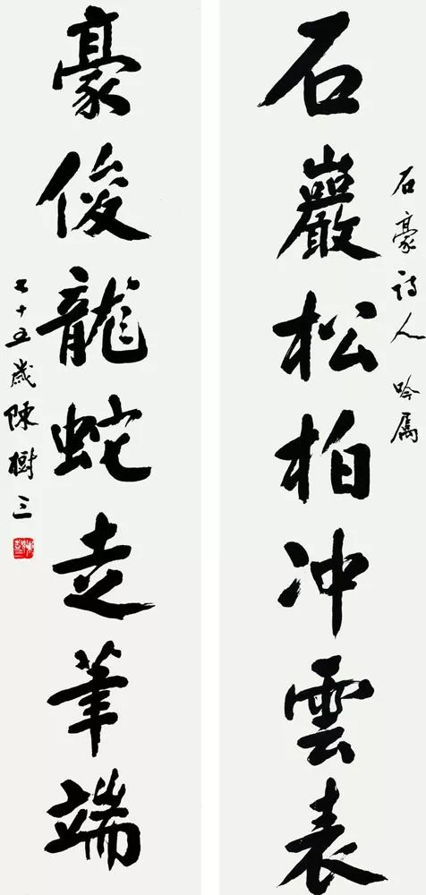
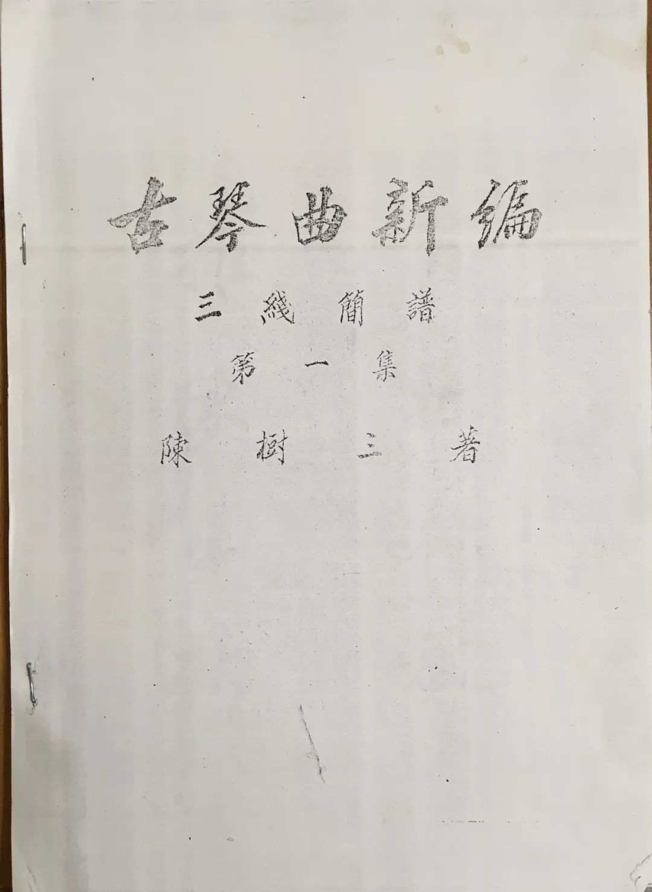

# 纪念武汉琴家陈树三先生诞辰119周年活动

*日期：2018年3月20日*

## 活动通知

阳春三月、草长莺飞，再过几天就是中华民族缅怀故人的传统节日清明了，武汉琴台古琴文化艺术研究会诚邀诸位琴友、会员、理事一起追忆武汉的著名琴家陈树三先生。

2018年是武汉的著名琴家陈树三先生诞辰119周年。在追思故人的传统节日清明节到来之际，武汉琴台古琴文化艺术研究会决定举办一次学术座谈会，以纪念这位为武汉古琴事业、知音文化做出巨大贡献的老琴人。

陈树三先生是上世纪中叶武汉地区琴文化界的中流砥柱，在战火纷飞、颠沛流离的年代，陈先生以历代琴人爱国为民的高尚情怀自守，不遗余力的保护、弘扬古琴艺术，为知音故里保存古琴文化的星星之火；在新中国成立后，他又老当益壮，在琴学研究、创新、传承上取得了诸多新成就。陈先生在数十年习琴经历中所积淀下的执着忘我的精神、精益求精的作风、勇于创新的魄力、无私奉献的情操，非常值得当今古琴研究者、爱好者学习、借鉴。

此次座谈会上，我们将邀请陈先生的弟子，研究会顾问金德华老师、副会长刘庆义老师，对陈先生的生平情况、习琴经历和艺术成就成就进行介绍，并就陈先生在琴学研究上的重大成果“古琴三线谱”进行研讨；当天，我们还将展示由陈先生发现并收藏的明、清老琴。

活动时间：2018年3月31日上午9点
活动地点：武汉琴台古琴文化艺术研究会（汉阳区金龙公馆写字楼9楼东侧）

## 陈树三先生

陈树三（1899-1975），湖北省文史馆馆员，省政府参事室参事，省政协二届委员、三届常委、四届副主席，全国政协三、四、五届委员，民革中央委员，省民革副主任等职。         

武汉“陈太乙”药店的第二代传人，著名法官、古琴家，琴棋书画无所不通。古琴师承于张宝亭、赵正义。对于古琴艺术的贡献在于他自创的“三线谱”，它将古谱转换成现代曲谱，更方便于后人弹唱，这一贡献曾引起业内轰动，时任中国古琴会会长的查阜西曾专程来汉切磋探讨。

## 武汉古琴研究会

是由全市热爱古琴艺术和文化的古琴爱好者、团体自愿结成的学术性、全市性、非营利性的社会团体，成立于2016年6月10日，武汉市文化局为业务主管单位。研究会驻地位于武汉市汉阳区金龙公馆。

## 档案

[原文链接](https://mp.weixin.qq.com/s/LVUeYd4r0QDgrpUftaoIAA)