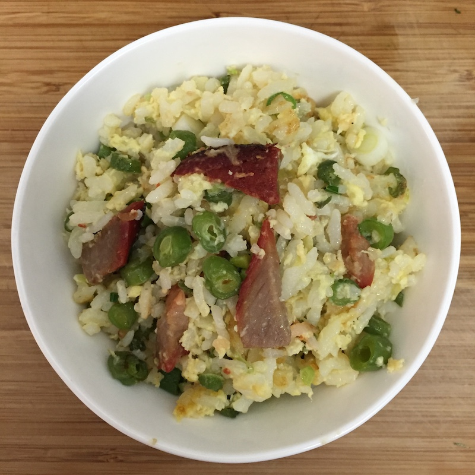

# 杨氏蛋炒饭

1. 头天晚上把饭煮好，用白饭
2. 准备好姜末，蒜蓉，葱花
3. 四季豆洗净，掐两头，切末
4. 准备好切成末的叉烧肉（或者香肠）
5. 三个鸡蛋打碎，鸡蛋汁拌匀，放少许盐
6. 锅加热，入油，放入姜末和蒜蓉爆香
7. 先大火炒四季豆，改中火（6-7）稍微焖一下
8. 把叉烧肉放入锅，放盐调味，跟四季豆在一起继续中火焖
9. 四季豆熟了后，跟叉烧肉一起出锅
10. 把鸡蛋汁浇在已经煮好的白米饭上，拌匀
11. 锅洗净，大火重新加热，放入跟鸡蛋汁拌匀的白米饭翻炒
12. 放入四季豆和叉烧肉，继续翻炒，转至中火稍微焖一下，然后出锅