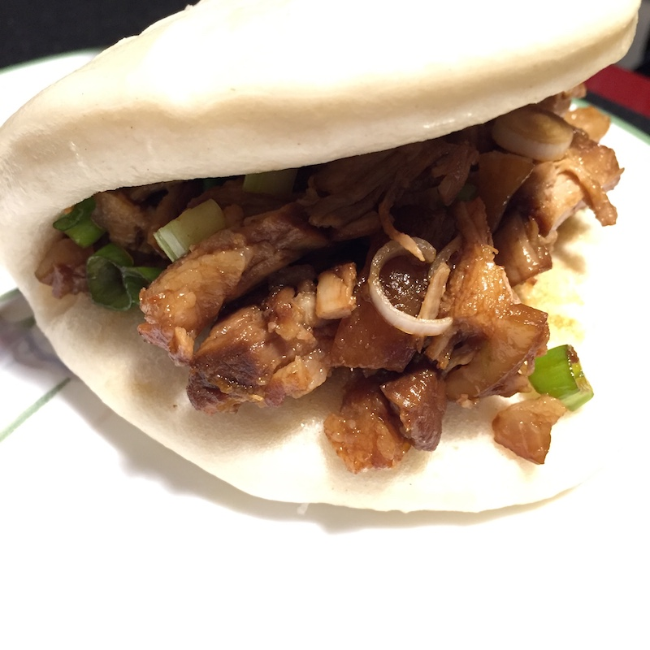

# 肉夹馍

1. 五花肉解冻后切成块
2. 肉块放入冷水锅，加姜块，料酒，焯水。水热了后将嘌呤捞出直至水开。继续大火煮将嘌呤捞净。
3. 把肉块捞出锅放入高压锅内，放入葱段，姜片，料酒，生抽，老抽，八角，桂皮，加水直至漫过肉块。换高压，定20分钟。
4. 高压锅时间到后，放压，开锅，将八角和桂皮捞出扔掉，将肉块和汤汁倒入另外一个锅。
5. 大火不加盖加热，放适量糖，收汁直至汤汁煮干。
6. 将肉块捞出切碎剁烂，夹着挂包吃