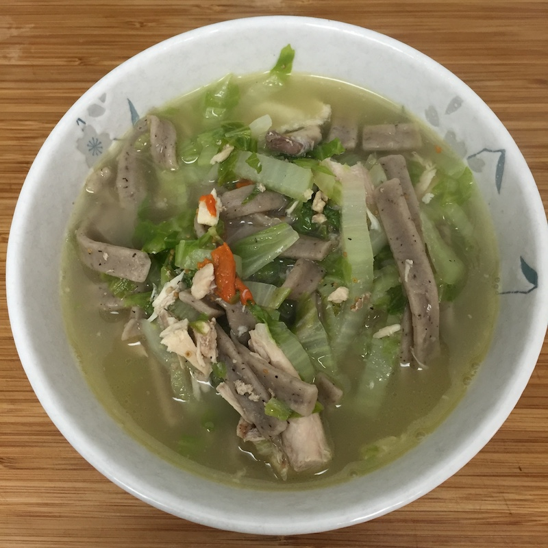

# 鸡汤白菜荞麦面

1. 买有机鸡，解冻后切成小块，用盐，啤酒，料酒，姜粉腌制一个小时
2. 切葱条，准备枸杞，姜块
3. 腌制好后把鸡块和汁液倒入砂锅，砂锅加冷水，放入姜块，大火加热
4. 汤被逐渐加热后，用汤匙舀出嘌呤
5. 汤水开了后，加入枸杞，红枣，和葱条，转二档小火煨汤，开始60分钟的计时
6. 煨汤半小时后，加盐调味，继续煨半小时
7. 白菜洗净，切丝
8. 鸡汤煮好后，算好份量，盛入另外一个不锈钢锅
9. 不锈钢锅大火加热，放入白菜丝和荞麦面
10. 面汤开了后，加盐调味，转中火继续焖2分钟，起锅。