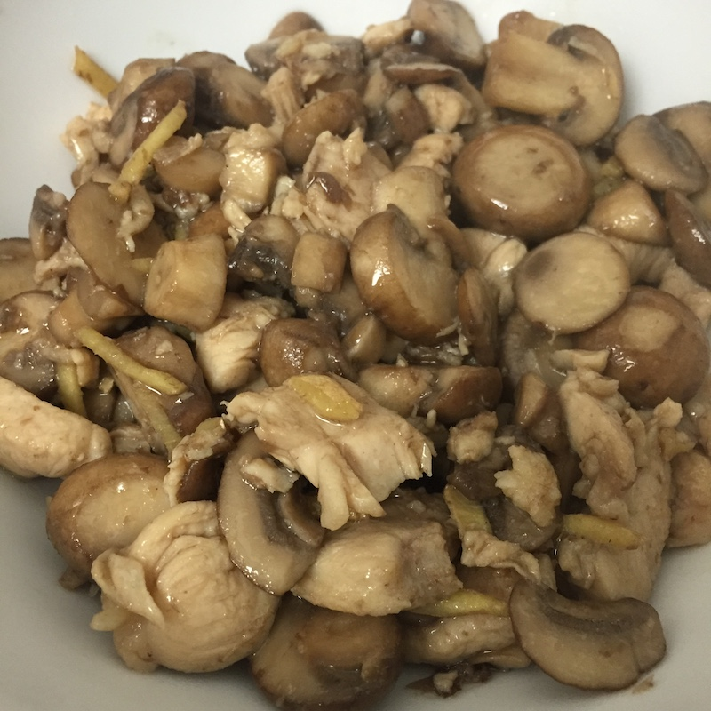

# 小鸡炒蘑菇

1. 鸡肉块提前两小时解冻
2. 姜块切成末，配淀粉水（淀粉 1:水 2）
3. 洗蘑菇
4. 在鸡肉快完全解冻之前，将块切成小块
5. 用料酒，盐，淀粉水将肉块腌10分钟
6. 大火把锅加热，倒油，油微热后撒姜末爆香
7. 把多余的腌汁倒掉后在锅里用大火爆炒肉片，待变色熟了后捞出锅放在一边待用
8. 将锅洗干净，加热入油，大火炒蘑菇2-3分钟（可以加入适当水防止干锅），加盐拌匀，盖上锅盖焖1-3分钟，大火从high调至7
9. 蘑菇焖好后，倒入鸡肉块，转大火爆炒2-3分钟出锅