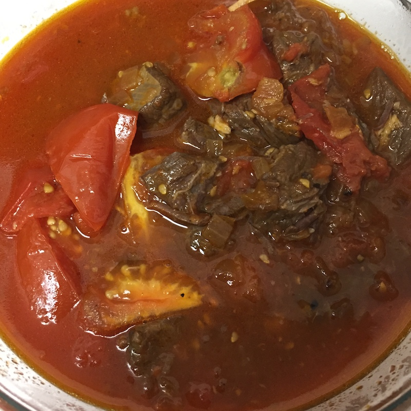

# 番茄炖牛肉

1. 牛肉解冻，切块
2. 葱切寸，姜切片，蒜切小块，洋葱切末
3. 深锅里放水大火烧，放料酒，姜片（部分）
4. 水开后放入牛肉块焯水
5. 深锅里水倒掉后，牛肉放一边，把锅洗干净
6. 大火把锅加热，锅热了后加油
7. 锅里放姜片，葱，蒜爆香，倒入约半个洋葱量的洋葱末
8. 加入牛肉块，生抽，料酒，黑胡椒粉，番茄酱，大火爆炒几分钟
9. 熄火，将锅里的牛肉和调料倒入高压锅，适当添加料酒和水，略微浸满牛肉
10. 确保高压锅的气压栓对准，关上盖，调制High，时间定为45分钟，Start
11. 将番茄洗干净，切成块
12. 高压锅可以揭开盖后把牛肉和肉汁倒入锅里，加入番茄继续大火炒，15分钟后收汁