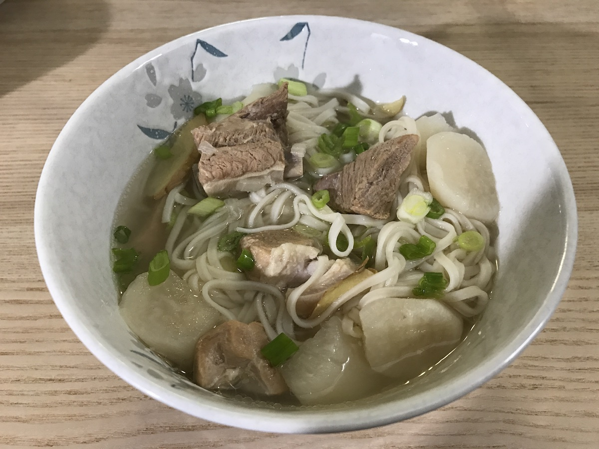

# 排骨煨汤

湖北人爱喝汤，小时候在家里几乎无汤不成席。武汉北面东西湖的莲藕特别粉嫩，很适合煨汤，跟排骨是绝配。排骨藕汤是最销魂的一道湖北菜，是湖北妈妈召唤海外儿女的超级大招。对湖北人来说，家的味道就是排骨煨汤的味道。可惜在美国从大华超市，Trader Joe's, Whole Foods, 到Mitsuwa都找不到这样的藕。爸爸灵机一动，计上心来，用白萝卜替代莲藕，效果惊艳。2016年旧金山湾区的冬天寒风凛冽，阴雨连绵，我们就窝在家里喝了整整一个冬天的排骨煨汤。

## 食材
- 排骨，白萝卜
- 料酒，盐，醋
- 生姜，洋葱
- 加强版：枸杞

## 厨具
- 汤锅
- 炒锅
- 高压锅

## 步骤
1. 排骨切块[^1]。
2. 拿一块生姜，纵切九刀，横切九刀，在底部不要切断[^2]。
3. 猪肉焯水：汤锅里放入冷水，放入生姜块，放入切好的排骨，大火煮沸[^3]。用小汤勺将浮在表面的血污捞出来去掉。
4. 将白萝卜[^4]去皮，切成滚刀块[^5]。
5. 切好姜片[^6]。
6. 切好洋葱，不需切末[^7]。
7. 血污去得差不多了，将排骨捞出来，用热水冲洗干净。
8. 炒锅加热，放油，加入切好的姜片和洋葱爆香。
9. 将焯过水的排骨放在锅中翻炒，放入适量料酒，少许香醋[^8]。加入适量开水，煮`5`分钟。再将白萝卜块放入锅中，一起翻炒，直至煮开。
10. 将排骨，萝卜和汤汁捞起，加适量水[^9]和其他配料（枸杞），一起装进高压锅。封盖，选择高压，加热`35`分钟。
11. 时间到后，等高压锅自动完成泄压，开盖，加入盐和胡椒。

[^1]: 沿着反面的骨节来切比较容易。
[^2]: 这种切法可以让生姜很容易被捞出来，同时充分跟锅里的汤水接触。 
[^3]: 蔬菜焯水是把水烧开了再把菜放进去（譬如四季豆这种需要焯水的蔬菜）。肉类焯水的目的是把生肉中的血污，腥膻以及异味去掉，需要在一开始还是冷水的时候就把肉放进去。
[^4]: 在萝卜的选择上，白萝卜的效果远胜胡萝卜。
[^5]: 滚一下，转120度，切一刀。
[^6]: 姜片最后会一起下锅，吃的时候便于夹出来。姜丝，姜末，姜块的效果都不适合。
[^7]: 这些配料的形状通常跟食材最后被食用时的形状差不多。
[^8]: 几滴醋可以让骨头里的磷，钙溶解到汤内。
[^9]: 用高压锅熬汤，水需要一次放足。当然，绝对不能过量。