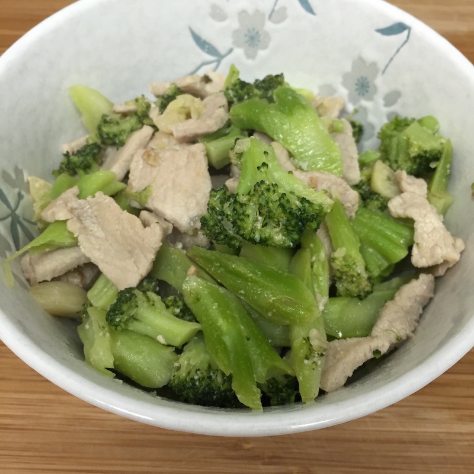

# 猪肉片炒花菜

1. 猪肉块提前两小时解冻
2. 姜块切成末，配淀粉水（淀粉 1:水 2）
3. 洗花菜，将花菜切成小块
4. 将花菜焯水，捞出锅放在一旁待用
5. 在猪肉快完全解冻之前，将块切成片
6. 用料酒，盐，淀粉水将肉片腌10分钟
7. 大火把锅加热，倒油，油微热后撒姜末爆香
8. 把多余的腌汁倒掉后在锅里用大火爆炒肉片，待变色熟了后捞出锅放在一边待用
9. 将锅洗干净，加热入油，大火炒花菜2-3分钟（可以加入适当水防止干锅），加盐拌匀，加点水淀粉盖上锅盖焖1-3分钟，大火从high调至7
10. 花菜焖好后，倒入肉片，转大火爆炒2-3分钟出锅