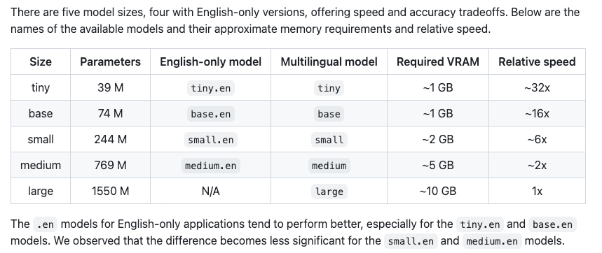
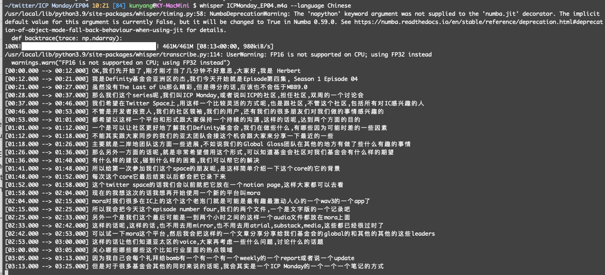

import Donation from '../../../donation.md';

# Transcribe Speech into Text

There are many tools that can handle transcription from speech into text. Many are commercial softwares or SaaS that charge a fee. [Whisper](https://openai.com/research/whisper) from OpenAI is free and open-sourced. 

## Install FFmpeg

Whisper requires the use of FFmpeg. Use macOS package manager [brew](https://brew.sh/) to install [ffmpeg](https://ffmpeg.org/), a very versatile command-line tool to handle multimedia transformations.

```bash
brew install ffmpeg
```

:::note
It would take a long time to install ffmpeg as it requires many dependency packages. It might take multiple tries to complete the installation, especially if the network connection is not stable.
:::

## Install Whisper from OpenAI

On macOS, use **pip** to install Whisper API, following the instructions from [OpenAI's Github repo](https://github.com/openai/whisper) that hosts the open-sourced Whisper API.

```bash
pip install -U openai-whisper
```

Check if the installation is successful.

```bash
whisper --help
```

## Transcribe English

To transcribe English speech into text, just whisper!

```bash
whisper your-english-audio.mp3 --model medium
```

Experiment with LLM models of different sizes and parameters to trade off performance and speed. The default setting is small. 



## Transcribe Non-English

For non-English speech, add --language option

```bash
whisper your-chinese-audio.m4a --language Chinese
```

It will transcribe the audio file line by line on screen. It's pretty magical.



It takes a long time though. For a recent 4-hour video, it took about 3-plus hours to complete.

Upon successful completion, Whisper will produce 5 files for the transcribed script in `.json`, `.srt`, `.tsv`, `.txt`,  and `.vtt` format. The most commonly used subtitle format is `.srt`, which can then be embedded or burned into the original video file.

Whisper didn't know some of the specific words used in my industry or line of work, but its transcription did a fine job and the script is 100% in-sync with the speech on pace.  It's 100% automatic. That's a huge productivity booster.

## Translate

Whisper does transcription by default. To translate, use --task to trigger translate function. By default, it translates non-English into English.

```bash
whisper japanese.wav --language Japanese --task translate
```

:::warning
Do not perform translation and transcription in the same folder. Both actions will produce the same output files with the same names and potentially could overwrite previous outputs without warning.
:::

<Donation />