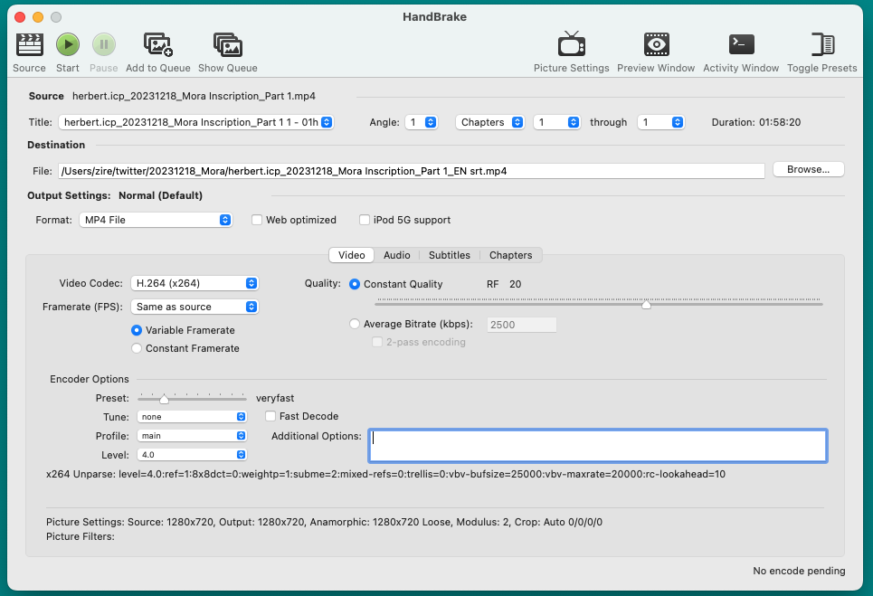
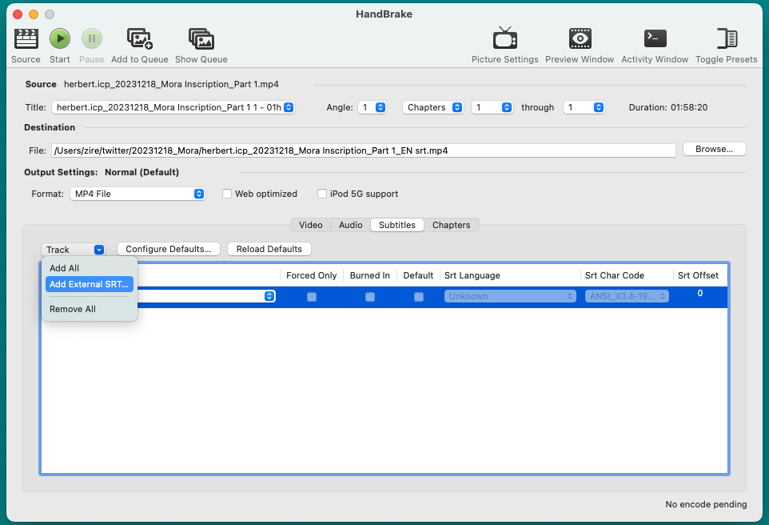
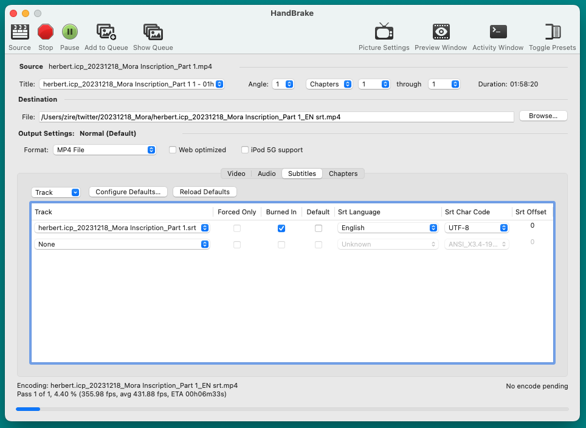
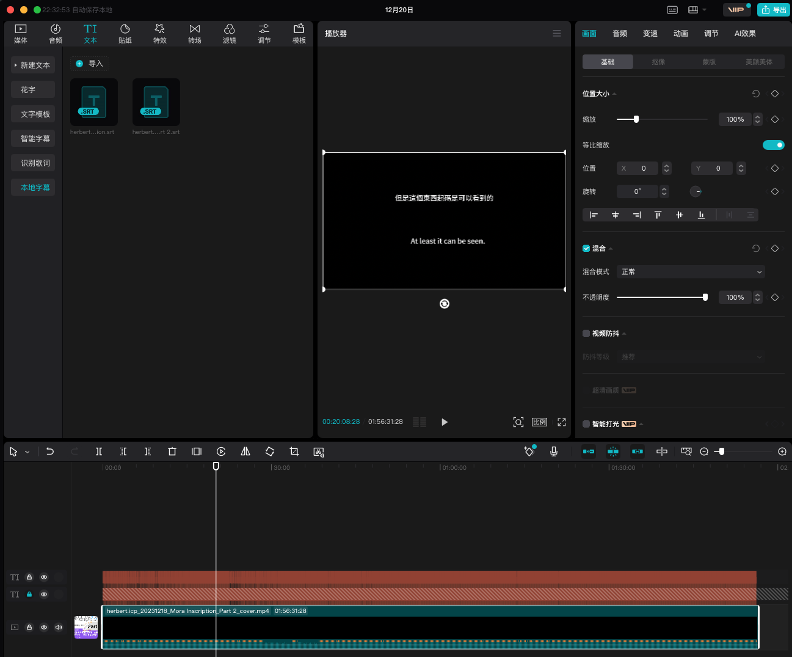

import Donation from '../../../donation.md';

# Add Subtitle Tracks to Video File

Transcribing a video/audio file will produce an `srt` subtitle file. There are two ways of displaying such a subtitle track when playing the video. If the video is played locally by a local media player such as [VLC](https://www.videolan.org/vlc/), usually the player would allow the srt file to be imported together with the video so that they can be viewed together. Many video platforms such as Youtube provide that option too, of uploading the srt file independently from the video so that they can be displayed together.

Another way is to 'burn' the subtitle into the video so that it becomes part of the re-rendered new video file. This way, the author can rest assured that the subtitle will always be displayed without having to worry how to upload the srt file, how to align that properly with the video along the same time line, and how to display that in the desired spot, etc. 

I often use two methods to handle this task, Handbrake and 剪映 (made by ByteDance). 

## Install Handbrake

[Handbrake](https://handbrake.fr/) is an extremely versatile and open-source video converter. It's free. While the ultimate Swiss-Army Knife FFmpeg can handle almost any multi-media scenario, Handbrake's advantage is that it has an intuitive GUI. 

Download and install Handbrake from its official site.

:::info
https://handbrake.fr/
:::

Run the .dmg file to install it.

## Add single subtitle

Load the input video in **Source**. Pick a folder for **Destination** for the output file. I usually choose `mp4` as file type, `H.264` as video codec, `Same as source` for Framerate ("FPS").

Go to tab **Subtitles**. Under **Track**, choose **Add External SRT**. 

Check `Burned in` option, set **Srt Language**, choose `UTF-8` as Subtitle file's Char Code. Press **Start** to start the renderig. The bottom bar displays the progress.

:::info
This method would display the burned-in subtitle at the bottom center of the video screen.
:::

## Add multiple subtitle tracks

Sometimes, it's useful to add two subtitles in both English and Chinese. Handbrake won't be able to handle such a task but 剪映 can manage this with ease. Capcut is a very powerful tool. It can display two subtitles in the middle of the screen with all kinds of fancy fonts if needed. Here we'll display both Chinese and English subtitles in the middle of the video so that viewers will not find it too boring when watching the video vs both tracks down at the bottom leaving the majority of the screen in black.

Install [video editor tool 剪映](https://www.capcut.cn/) on macOS. 

1. Import the input video file in **媒体** tab.
2. Import the two srt files in **文本/本地字幕**
3. Drag the video file from the top-left panel into the bottom panel
4. Drag the first srt file into the bottom panel, on top of the video file
5. In the middle panel **播放器**, drag the first subtitle to the middle of the screen
6. Choose **锁定轨道** for the frist srt file so that its position on the screen is locked
7. Drag the second srt file into the bottom panel in a separate track. 
8. In **播放器** panel, drag the second subtitle to the middle of the screen, but with enough margin away from the first one. Play the video to make sure the two subtitles are displayed at the desirable spots.
9. Click **导出** at the top-right corner of the application. That's it.

<Donation />