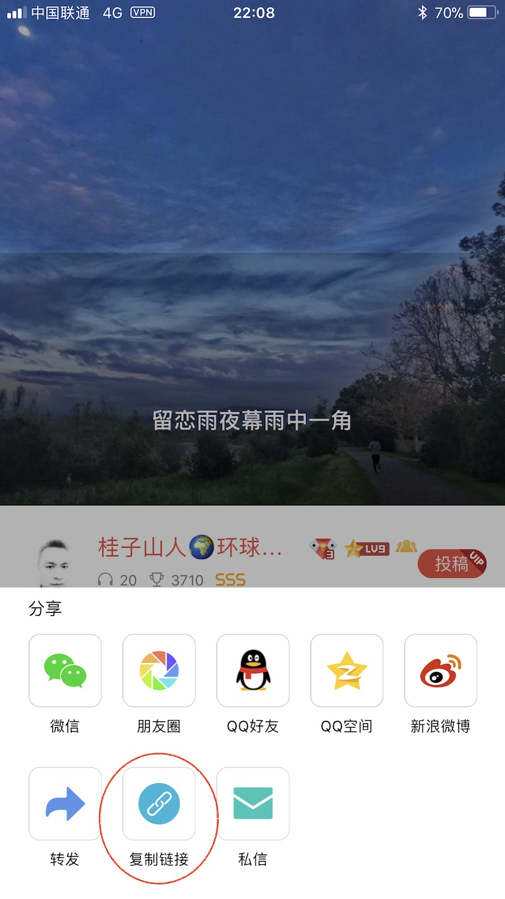
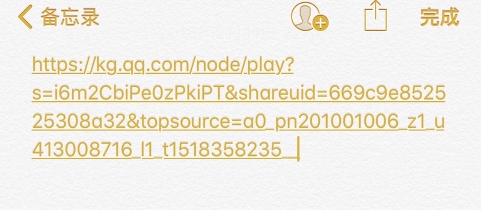
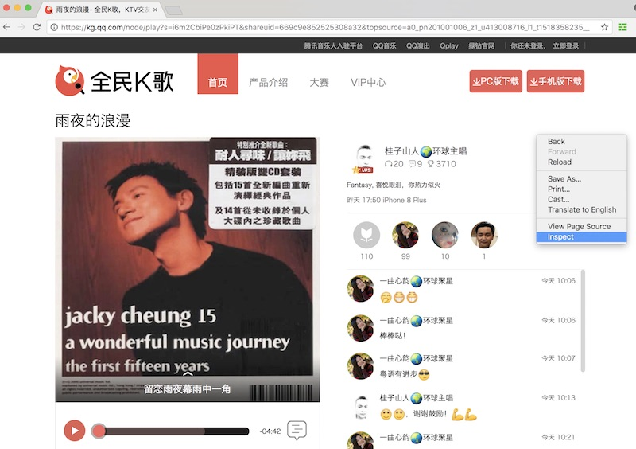
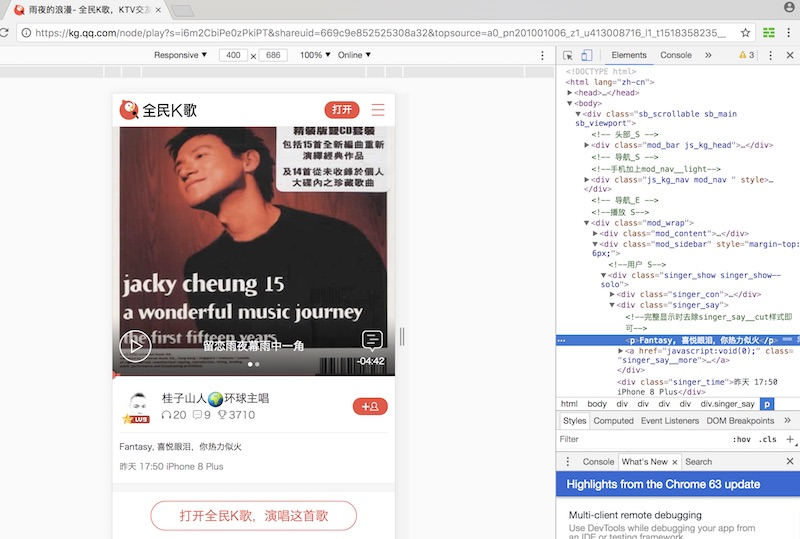
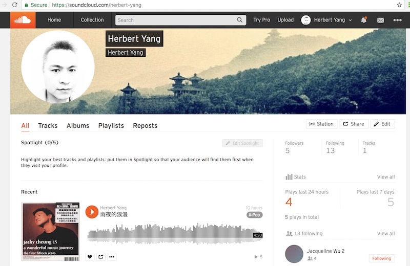

全民K歌为付费的VIP用户有提供把歌曲下载到本地手机的服务，不过要导出到电脑还是个麻烦。以下的方法可以从全民K歌的网页上直接把音乐文件扒下来，不需要借助任何额外的网站服务。

## 获得歌曲链接

在全民K歌app里打开歌曲，点击**分享**

在打开的分享菜单里，点击**复制链接**

在iPhone里，打开备忘录，将这个链接粘贴到一个新的帖子里。Android手机做类似的处理。这个歌曲网页的链接是这个样子：

## 获得m4a文件的地址

在Mac电脑上，打开在同一个iCloud用户下的备忘录。在手机上刚刚创建好的包含链接的帖子应该已近出现了，copy + paste这个链接。

在这个链接打开浏览器Chrome（这种技术活通常都是用Chrome而不是Safari），在页面上任一处点击右键，在打开的小菜单里选择**Inspect**

Chrome进入编辑器界面，在右边的编辑器界面的任何一处，按**command + f** 打开搜索栏，在搜索栏里打"**audio**"

在搜索结果里， 把**src**后面一长串链接拷贝下来，这就是音乐文件的源地址。

## 导出mp3文件

新开一个Chrome网页，把拷贝好的源地址粘贴在网址栏，文件马上就被下载到本地电脑。

把下载文件的文件后缀从.m4a改为**mp3**即可。

把mp3文件上传到[Sound Cloud](https://soundcloud.com/herbert-yang)的账号就可以直接嵌入到[网页文章](https://steemit.com/cn/@herbertyang/5w7a6a)里了。

