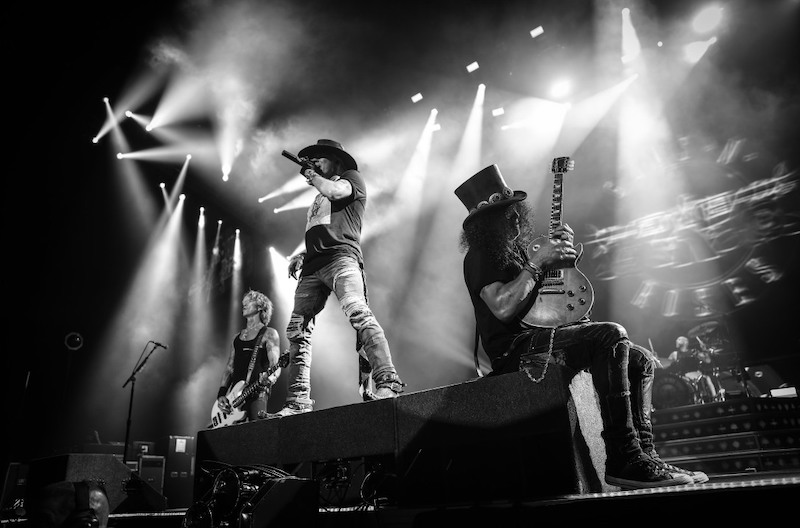

An arresting concert with Guns'n Roses in Boston

<!--truncate-->

终于一了夙愿，现场来到了枪炮与玫瑰的演唱会。记得小时候应城的堂哥带我去买他们的第一盘专辑磁带－Appetite for Destruction。堂哥描述这个乐队几乎“无恶不作“，追求“走调般的高音唱法“，但是“特别酷“。1988–1993, 一个摇滚史上再也不会重现的辉煌（Nirvana固然璀璨，但Cobain生前在演唱会上的成就和影响不能和Rose/Slash相比），枪炮与玫瑰成为glam rock最后的一个old school的传奇乐团。从那以后，美国本土被Nirvana的grunge和Smashing Pumpkins的alternative rock所占据，同时Oasis开始带领British Pop的侵略。新世纪伊始，乐坛则完全陷落在hip-hop的靡靡之音里。转眼十四年匆匆而过，和我一个时代的同龄人好多都根本没有听说过枪炮和玫瑰，让人不免唏嘘。

今天我应该感到很高兴，因为见到了Axl Rose。我们的座位离舞台只有十英尺。我和Rose最近时的距离就好比当年我在曼谷和张国荣（我至今很遗憾当时没去要个签名）邂逅时的远近。Rose还是活力十足，在舞台上不遗余力地左蹦右跳。几个经典动作跟当年一模一样。哎，衣不如新，人不如旧啊。他今天晚上没扎头巾，将一头长发束在脑后。一开始戴墨镜出场，后来扔掉了。略显沧桑之色，已不是在Sweet Child O’Mine里的那个像Johnny Depp的浪子了。

今天我应该感到很愤怒，因为Rose几乎迟到了三个半小时！大牌的演唱会我也去得不少了，不管是Suede, Prince, Oasis, Coldplay, 还是U2，一般都是让opening band预热一个小时左右然后登场。Oasis的闹腾了一个半小时，当时觉得很不爽。跟枪炮与玫瑰相比就是小巫了。两个opening band（Sebastian Bach和另外一个不知道名字的）各折腾了一个多小时。最要命的是每次换乐队的空隙里DCU Center的人都会把整个舞台重新布置一遍！第二天听地方电台说Rose十点钟还在纽约接受采访，几乎就回不来了。

今天我应该感到很高兴，因为我们没做火车来Worcester。我看演唱会是八点钟开始，就竟然一度天真地以为我们可以做火车来，然后赶午夜的最后一班回波士顿。Rose十一点半登场，唱足两个半小时。我们两点出会场，三点才开到家！到十一点左右的时候，我觉得场里的气氛越来越不对了－general admission里喝醉的人一个个地被保安拖出来；很多醉醺醺的大学生开始像野牛一样互相冲撞取乐，动则有人就真刀真枪地打得头破血流被保安架出去；很多装扮类似deadhead的大叔们蠢蠢欲动地好像准备要冲上舞台砸东西了。这个时候如果真的宣布show cancelled的话，火山会全面爆发，fight club即将成为血淋淋的事实。。。

今天我应该感到很遗憾，因为我实在没法分辨出Rose的声音。我觉得平心而论他今晚唱的水平是很高的，看得出非常投入。但我和衫阁嫒觉得大多数时候他的声音都淹没在乐器（Rose带了八个band member) 的惊涛骇浪中了。也许我听British Rock太多了，忘了glam rock／重金属本来就是这个样子的。听得出Rose的声音还是像以前那么激越高扬。他的声调如此之高，如此之尖细，听起来就像金属摩擦的声音一样，以至于我们只听得出最后拖尾的长音，调子什么的是绝对听不出来的了。唯一从头至尾听得清楚的是我们的最爱－Patience，多亏有前面那么一长段的清唱。相比之下，U2的演唱会尤显难得，Bono的嗓子绝对凌驾所有的乐器声和粉丝的尖叫声之上。

今天我应该感到很高兴，因为枪炮与玫瑰忠实地回顾了几乎所有大家都耳熟能详的经典。从Welcome to the
Jungle开始，骚动不安的观众就像突然被点燃了一般，满眼皆是挥动的手臂和舞动的人群；Sweet Child O‘Mine开头的吉他riff一抬头大家就更疯狂了，尖叫声此起彼伏；到Live and Die时over-the-top的焰火把人们的肾上激素催发到了顶端；在演绎Bob Dylan的Knockin’ on Heaven’s Door时会场已成了一个超级karaoke; November Rain和Patience让我们觉得一切路上的磨难和等待都是值得的。最后他们在Night Train的高潮中结尾，曲终人散。

巧的是Placebo这天晚上同时在波士顿的一个bar里献唱。鱼肉熊掌不可兼得啊。

今后的目标: Depeche Mode，Metallica（估计六城转转是不会再陪我去了），Smashing Pumpkins，还有达明一派。