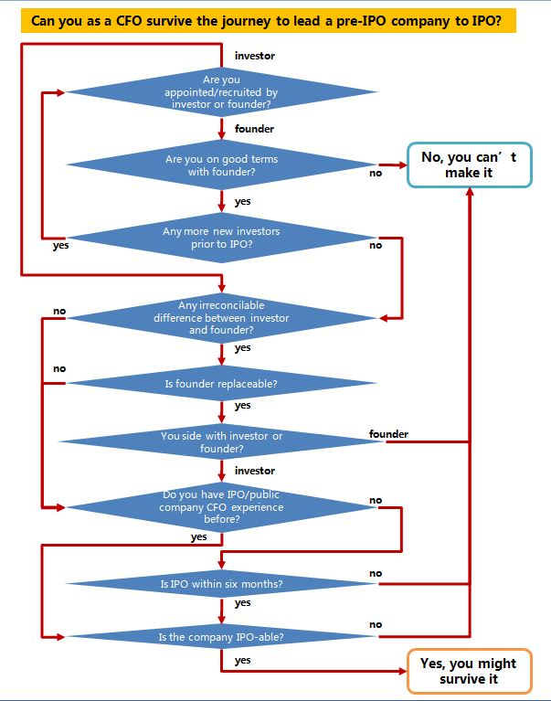

A decision tree to help you figure out if you can survive the CFO journey

<!--truncate-->

When you join a pre-IPO company as its CFO, the holy grail (well, for most) is to get this baby to IPO. It brings fame, exit money, and an enviable career achievement that will always give you a boardroom directorship for post-exit retirement life. 

This decision tree illustrates potential roadblocks along this journey and helps you figure if your set-up has all the right elements for your goal.

 

 
