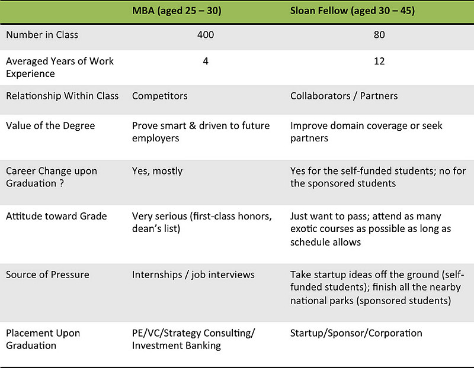

How does Sloan Fellow ("MSX") compare to MBA in Stanford Graduate School of Business?

<!--truncate-->

*[Confession of a Stanford Sloan Fellow Series](stanford-sloan-chronicle-summary) EP09*

---

Sloan Fellow (aka "MSx" since 2013) is a very unique program. It's in a league of its own with practically no other benchmark in this business. It's not an MBA, neither an EMBA. It's a 12-month residence program that grants you a Master of Science (in management) degree. Its tuition fee is the same as the two-year MBA program, and its academic rigor is much, much higher than any other EMBA or executive training program. For experienced professionals around my age group, Stanford's Sloan Fellow Program is the best and ideal destination before turning page over to the next chapter.

A comparison between Stanford MBA and Stanford Sloan Fellow.

## Age

Many of us are bringing our families to live together on campus

## Number in Class

Sloan's small class size makes it very conducive to form lasting bonding relationship. When graduate school's class size gets over 100, it becomes difficult just to remember everyone's name. With our current size of 81, the distance between any two students is still close enough to form meaningful friendship.

## Years of Work Experience

Many upper-middle managers from large corporations, some C-level executives from smaller companies, some senior officials from governments (Singtel's [Lee Hsien Yang](http://en.wikipedia.org/wiki/Lee_Hsien_Yang) is a Sloan Fellow alum), or some people just come here to chill out for good.

## Relationship within Class

MBAs are natural competitors within the class because most of them are shooting for very similar jobs: VC firms, PE firms, strategy consulting firms, or investment banks. Many might have various ideas before they come to the graduate school, but the business model of graduate school is designed to supply fresh meat for those industries. MBA students' golden window arrives after they have secured job offers roughly half a year before graduation. That's when people start checking out and having a good time without any peer pressure. For Sloans it's a stressful year-long situation throughout. Many self-funded Sloans in my class want to do startup and are looking for partners. We could be natural partners, given the diversity of our backgrounds. That shared sense of getting on a common soul-searching quest binds us together.

## Value of the Degree

MBA students need the degree to validate intelligence and drive, that they meet the bar for VC/Consulting/Ibanks. They're chosen for their future potential. This is not the case with Sloans. Many of my classmates are already overachieving executives or highly successful entrepreneurs. They're chosen because of the path they have traversed, or the ups and downs they have survived. A lot of Sloans need this platform as a transition, elevating to higher leadership positions in governments or global corporations, or pivoting to entirely new areas of interest.

## Change of Career

Mostly yes, for both MBAs and Sloans.

## Attitude on Grades

Stanford GSB does not disclose grades to any other party, including other students in the class. While MBAs might still fight for grades because their future employers use them as an effective filtering tool, a rational Sloan would not pay too much attention to grades (unless he/she is sponsored with specific grade requirement) because ... you really should not worry about grades as a sloan. Sloans pursue grades to the extend that the result satisfies his/her own ego and thirst for knowledge. We know that given our age, it's highly unlikely we'll ever come back to a university classroom. So we soak up knowledge as much as we can.

## Source of Pressure

For MBAs, it's about landing sexy jobs of the moment that every other smart ass in the class wants to get. For the self-funded Sloans, the pressure comes mainly from the anxiety of taking startup ideas off the ground and seeking suitable partners. 12 months is a transition period and it goes by really fast. For sponsored Sloans, they're all elite A-players from their sponsoring governments/companies, and their futures are already carefully planned. It might just turn out to be a year-long vacation for them.