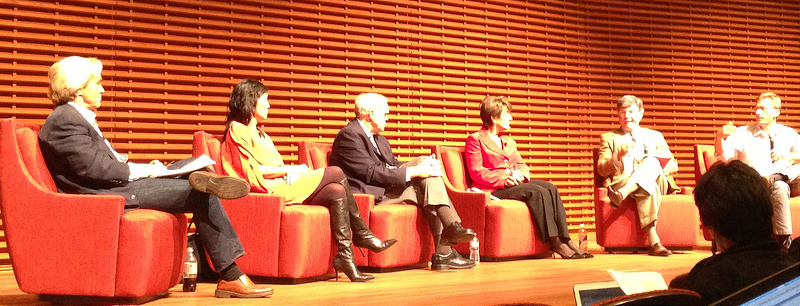

Tonight's speakers for "Election 2012"'s talk "The View from California": Stanford University President John Hennessy, Congresswoman Anna Eshoo (D-CA), and Accel Partners' Theresia Gouw Ranzetta.

<!--truncate-->

*[Confession of a Stanford Sloan Fellow Series](stanford-sloan-chronicle-summary) EP30*

---

Speakers:

- [Stanford University President John Hennessy](http://www.stanford.edu/dept/president/biography/)
- [Congresswoman Anna Eshoo (D-CA)](http://eshoo.house.gov)
- Accel Partners' [Theresia Gouw Ranzetta](http://www.accel.com/global/people/specialty/1/Theresia_Gouw).

## General

-   (Theresia) $2-3MM cost for complying with Sarbanes-Oxley Act for
    new IPO companies
-   (John) whoever in the White House will face one of the worst budget
    deficit ever
-   H1-B visa and [DREAM Act](http://en.wikipedia.org/wiki/DREAM_Act)
    was a big topic
-   Gouw was born in Indonesia, a first-generation American. I've seen a lot of excellent foreign-born English speakers and she has no accent whatsoever Amazing. She's well covered by major news media, such as [Forbes' Midas List of Tech Top Investors](http://www.forbes.com/lists/midas/2012/theresia-gouw-ranzetta.html) and [Times's Top Ten Most Influential Women in Technology](http://business.time.com/2012/07/20/the-ten-most-influential-women-in-technology/slide/theresia-gouw-ranzetta/).
-   (John) For many years Silicon Valley has been blessed with staying far away from Washington DC. Not anymore. Technology invented out of Silicon Valley has wielded such a tremendous impact on the entire American society that Silicon Valley needs to champion its own cause with a stronger voice in DC.

## Privacy Issue

-   (John) privacy information in credit card transactions vs privacy
    issues from Internet use. Any difference? No much.
-   (John) security issue is a much bigger issue than privacy
-   (John) opt-in vs opt-out (US vs Europe)... opt-in is better
-   (Anna) starting with children is easier
-   (Theresia) it's a very technically complicated issue for the congress/DC to tackle effectively. The moment DC creates some legislation regarding technology issues such as privacy, it'll become obsolete.
-   (Theresia) the evolution of patent law is a much more complicated issue than privacy. it's much more difficult to deal with patent officers in the Valley.

## How Does Majority/Minority Work in the Congress?

-   (Anna) if you are in the majority, be a senator as that's a very powerful position.
-   (Anna) tea party is bringing some insanity to science.
-   (Anna) ex-Speaker of the House Gingrich left his mark in the congress.

## California's Initiative Process

-   (David) US' constitution has amended by 17 times; while California's consitution , 100+ years younger, has been amended by more than 500 times.

Wonderful talk. There were many topics I just couldn't fully digest yet. Wish I had known more.