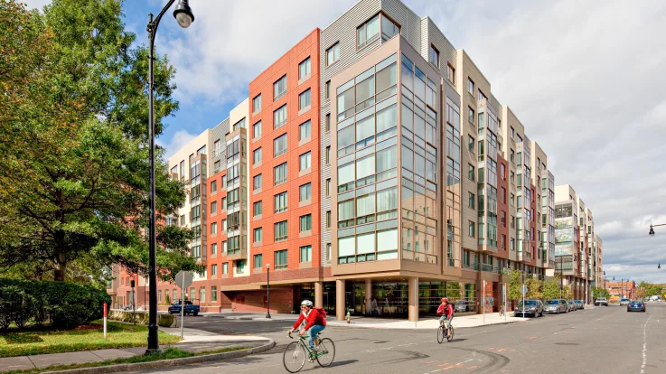

房子是个很奇妙的东西，往往第一眼就让人一见钟情。我们在康桥镇住过的这套公寓是由工厂厂房改建而成的loft。阳光从顶层天窗里跨越金戈铁马的层层横梁洒入空寂的大厅，四周廊灯微泛黄光，森然而略有凉意。

客厅里的面积虽然不大，但层高达7米，中间配上近3米的玻璃窗，摆炷香就可以拜佛了。

为了配合公寓不同寻常的比例，我们专门选择了狭长型的家俱，譬如沙发前的茶几和餐桌。餐桌极窄，适合小规模四人聚餐，鼻子碰鼻子，眼睛瞪眼睛，菜碟都得错开摆放才放得下。

那时我们刚刚从法国回来，很多照片跃跃欲试，想跟以前的西藏，圣托里尼一争雄长。为了公平起见，遂在楼梯上做了个简单的相廊。

相廊从一楼的客厅延续到二楼的书房，那个时候我的工具还没有进化到vim/MOU/Sublime，书房里的设施也很简单，唯书和沙发而已。

三楼是卧室，窗外隐隐传来Kendall Square的喧嚣，麻神理工神经叨叨的学生们又要开工了。

我们经常走去公寓旁秀丽的查尔斯河畔散步。点点白帆在河面上掠风而行驶向海湾，挥汗如雨的大学生们在皮划艇上奋力吆喝，金色晚霞抹在河对面波士顿市中心的层层高楼，夏季的查尔斯河生机盎然。

公寓旁的Kendall Square有家艺术影院。到了周末，我们站在一群白发苍苍的老爷爷老奶奶中，安静地排队买票，听听大家的吐槽和分享，逐渐接触到了《老男孩》里爆裂阴沉的朴赞郁，《春夏秋冬又一春》里禅意绵绵的金基德，和《色·戒》里忍无可忍无需再忍的李安。

离公寓更远一点，就是北美华人第一膜拜圣地 - 哈佛广场。这里的一家电影院里，每个周六晚都播放同一部电影《Rocky Horror Picture Show》，来自全世界各地的死忠粉在电影院外cosplay的场面能把无辜的路人吓个半死。

更偏僻的一个小巷里，有一家Brattle电影院，每年的2月14日都播放同一部电影《卡萨布兰卡》，粉丝情侣们不光在看电影，还会随着鲍嘉默念每一句铭心刻骨的台词。

很怀念那个在康桥镇风和日丽的日子。我们精心打造的工业化路线，在后来朝阳新家里峰回路转，发生了很大的变化。