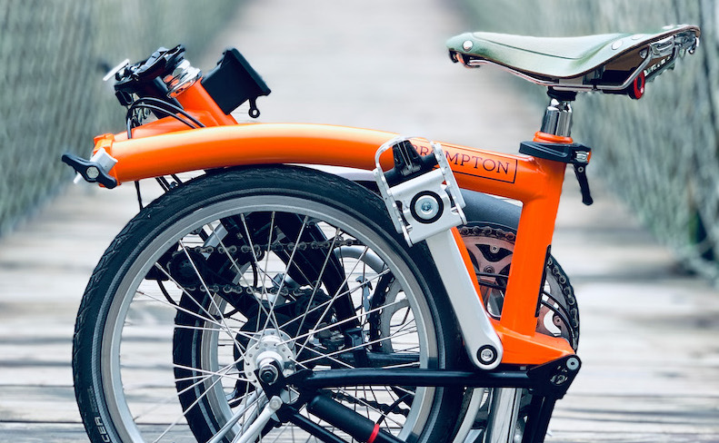
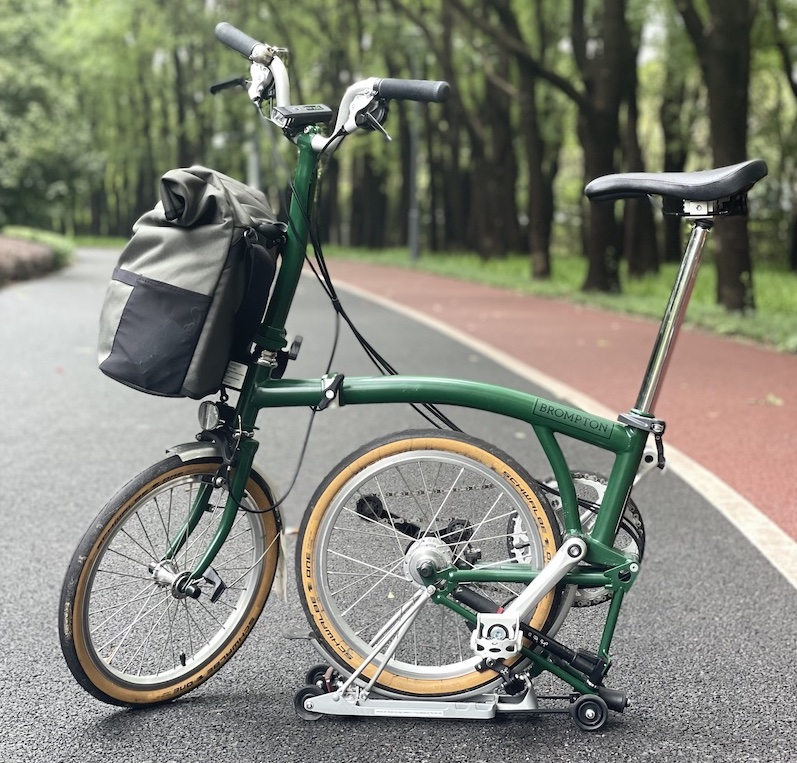
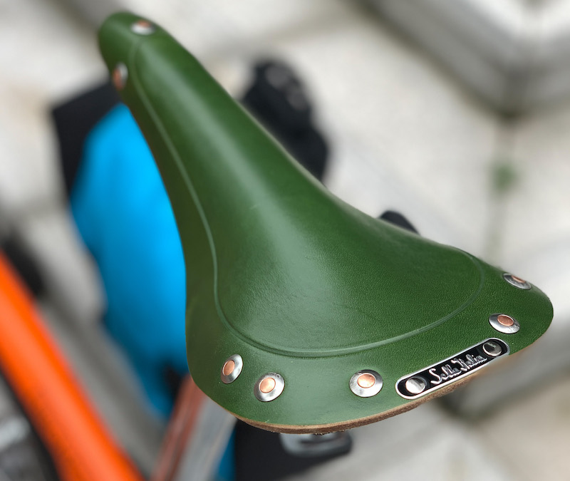
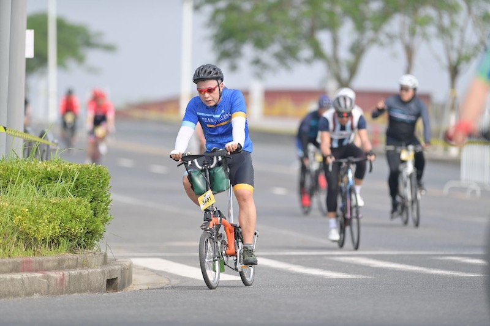
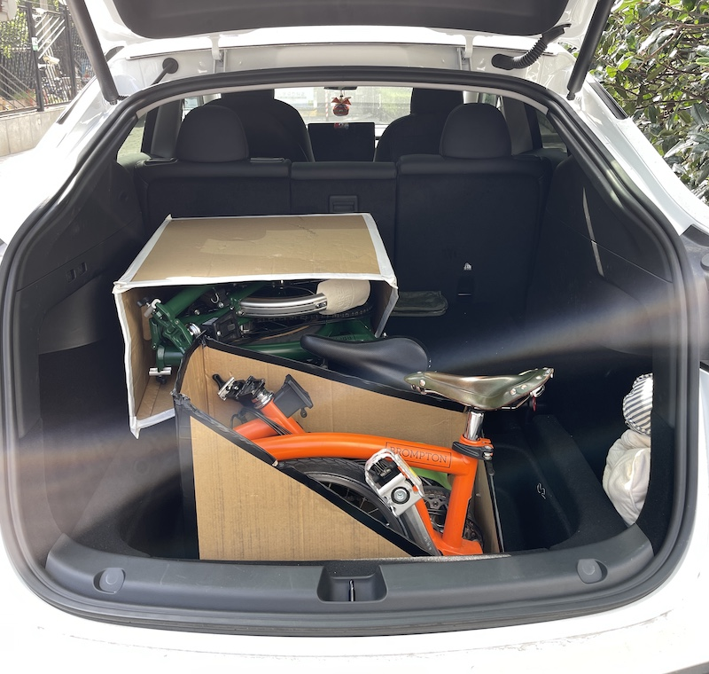
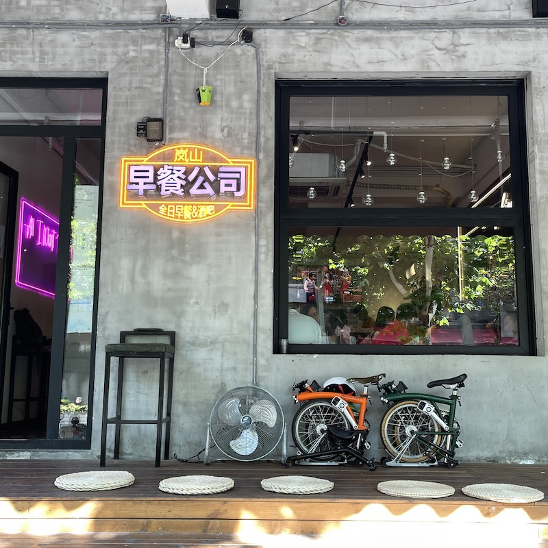
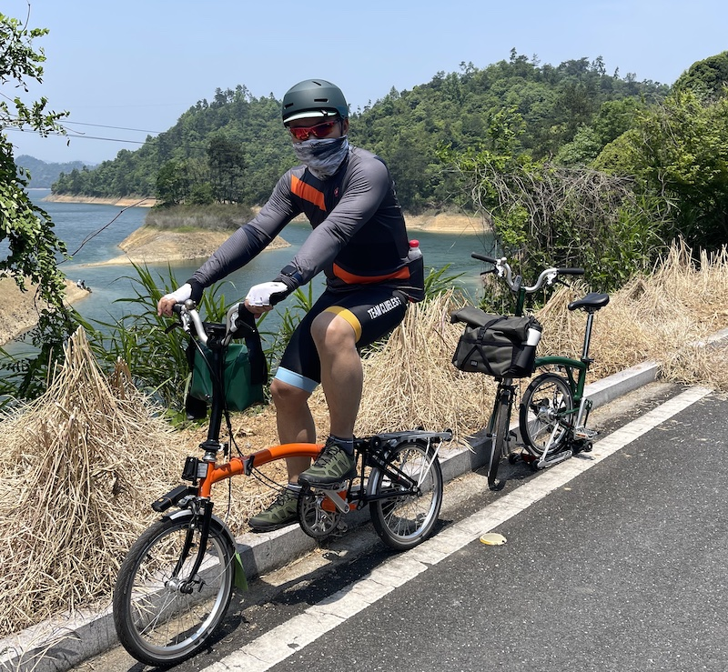

我为什么喜欢骑小布以及回答了无数遍的关于小布的问题

<!--truncate-->

在疫情蔓延的2020年，小布彻底地改变了我的生活。

[Brompton](https://www.brompton.com/)（国内称之为“小布”），是一个具有44年历史来自伦敦的全手工制作的折叠自行车。COVID-19开始的时候，出于卫生安全考虑，我开始骑共享单车上下班，尽量避免坐地铁（人太多）或者自己开车（停车难）。骑多了以后，很快遇到几个问题。我们住的小区周边到了上班高峰时共享单车很早就被抢空了，几乎得走到700-800米以外的地铁站才能找到单车。上海的共享单车主流品牌有好几个，但质量都比较差。刹车，座椅，车把，经常出问题。有一次我2-3公里的路程上不得不换了三辆车，很浪费时间。几百块钱成本的共享单车，也无法顾及到太多的人体工程优化，骑久了会腰酸背痛。而且，这些单车毕竟是大众共享的，每天放在外面日晒雨淋，也干净不到哪里去。真要讲究卫生，追求效率的话，共享单车不是一个长期解决方案，还是得骑自己的自行车。

住在Palo Alto的时候，几个朋友总是叫我周末去骑自行车。对于班里的欧美同学，骑自行车是顺理成章的活动和传统。我想起需要买车买骑行服就觉得太麻烦，似乎为了骑个车投入的时间精力太大。虽然呼朋唤友在风景如画的280上纵情驰骋，然后在roadhouse啸聚山林大快朵颐啤酒炸鸡谈天论地是件美妙的事情，但使用场景还是太狭窄了。不管是出于健身还是社交的目的，公路车只是选项之一，还有很多其他选择。

六城转提醒我除了公路车，还可以考虑折叠自行车。这对我是个新颖的概念，折叠自行车。。。是个什么？

光阴荏苒，如白驹过隙。一转眼离购买小布已经过去了一年多。我住在浦西，主要的活动区域都在长宁区，普陀区，静安区，徐汇区。小布已经融入到我生活里的每个场景。每天骑小布上下班，见客户，跟朋友喝咖啡喝茶聚餐，参加行业活动，买菜买水饺，理发，去税务局报税，带板凳去兴趣班，学习功夫，上足球课，跟布友聚会夜游上海，这只是日常。大的活动包括，坐高铁去桐庐的富春江边骑行，去无锡太湖环湖骑行，去千岛湖亲子骑行，参加环法自行车中国站上海滴水湖62km的挑战赛。

现在已经把小布安利给很多位位朋友（不算六城转），还有几位在pipeline里。为方便起见，特把常见的问题整理如下。

---

## 骑自行车有什么好？

首先，这是最卫生的生活方式，尤其在疫情蔓延的年代。公共汽车，地铁，出租车，共享单车，都会触及到其他人。只有骑自己的自行车，才会一劳永逸地解决这个问题。其次，这是最健康，最高效的生活方式。开车，不管自己开还是坐司机的车，是件很无聊的事情，没有锻炼的效果。走路，从交通的角度，效率太低，耗费的时间太长。而且，骑车很环保，对环境没有任何污染。最后，骑车通勤效率高，很多时候门到门的时间比开车或者打车还要短，因为完全不受堵车的影响，可以以极高的精度控制出门时间。

## 为什么不就用共享单车呢？

共享单车的质量无法保障。对经常骑行的人来说，从安全或者舒适的角度，都达不到要求。如果每天骑行45-60分钟，在生命1/24的这段时间里骑的车又破又旧又脏又难看还经常换来换去，是多么地无趣。当然，共享单车是适合大众消费者的。有的人喜欢穿Uniqlo，有的人喜欢穿Lululemon，青菜萝卜，各有所爱。

## 为什么不骑公路车？

骑公路车（大轮），是完全不同的场景。如果你有一堆朋友都骑公路车，经常周末骑个50-100公里，参加铁人三项或者各种比赛的话，当然公路车是合理的选择。如果你喜欢城市生活，而且住在市区里，那折叠自行车会方便很多。公路车不能折叠，无法带进写字楼商场餐厅，在马路拉起速度一溜烟是很帅，但是去不了什么地方，在市区中看不中用。停车也是个麻烦，几万元的全碳车，你会放心停在过道上跟各类共享单车摩托车放在一起吗？

很多布友同时也骑公路车。二者并不矛盾，还是取决于你的使用场景是什么。

## 为什么在折叠自行车的品牌里选择Brompton？

在折叠自行车的世界里，Brompton是全世界最好的品牌。其他的常见的品牌还有[Birdy](https://www.birdybicycle.com/), [Bike Friday](https://www.bikefriday.com/folding-bikes/), [Alex Moulton](http://www.moultonbicycles.co.uk/), [Dahon](https://dahon.com/) (“大行”)。AM帅得亮瞎眼，但实在太贵了，一辆车十几万起价，属于应该被挂起来的艺术品。而且，从理论上说，AM只不过是一辆可以折叠的自行车，其实并不算是“折叠自行车”，折叠起来非常，非常不方便，不实用。Birdy的品牌逼格跟Brompton在同一级别，但在国内很少能见到，缺乏核心粉丝用户的群体，而且，折叠起来不如小布方便 - 小布可以在几秒里被折叠/打开。Bike Friday几乎在上海没见过，也没怎么听到被人提起，按照我们这个行业的黑话，叫做缺乏生态。最常拿来跟小布作对比的，是台湾产的Dahon。大行的数量比较多，在路上常能见到，它的品类也比较丰富，便宜的几千元，贵的也是上万。从外表上来说，大行的横梁是直的，小布是稍微弯曲一点。那么区别在哪里呢？

我没有骑过Dahon，不好对比。这么说吧，小布是宝马/保时捷，大行是丰田/本田。都可以骑，都可以折叠，目标用户不同，大家可以按需自选。

除了这些卓越的功能性特点以外，小布最大的特点，就是颜值高。

她实在太漂亮了。

## 在国内/上海骑小布方便吗？能进地铁吗？能过黄浦江吗？能进办公楼吗？能进商场吗？

上海是非常适合骑自行车的城市，大多数马路都有自行车道（不像杭州，无锡或者武汉），而且在以肉眼可见的速度修建越来越多的专门骑车的绿道。从我过去一年多一个重度用户的经验来看，总体而言，去大多数地方都很方便。高德地图有专门的自行车路线，一般都比较准确，也更新及时。有一些马路，譬如南京西路，是不让走自行车的 - 但是跟南京西路平行的几条马路都可以骑，所以问题不大。

我几乎没有被任何办公楼/商场的保安拦在门口过。如果有保安问，在他面前折叠起来他就明白了，这无非是一件可以拎在手里的行李箱。听说有个别的写字楼连折叠自行车都不让进，譬如恒隆广场。上海的商场品类繁多，避开这几个钉子户就可以了。

上海的官方规则里折叠自行车是不能进地铁的 - 虽然经常听到布友仍然把小布拐带进去。这个问题不大，因为既然是骑自行车的话，其实没有太多场景非得要坐地铁。实在骑车不方便，就打车好了，把小布折起来放在出租车后箱里。

黄浦江是不能骑自行车过江的。要骑车过江，只能做轮渡。这一点上海是欠缺考虑了一点，但我的活动半径主要在浦西区域，所以影响不大。

## 小布有多重？拎起来方便吗？折叠起来方便吗？可以上自动扶梯吗？

二速的小布大概是13公斤，六速的小布稍微更重一些，大概14公斤。男生女生拎起来都没有问题。因为小布可以作为拖车折叠，所以如果需要搬运的距离比较远我就直接拖行了，几乎从来不需要手拎小布超过50米。

小布的折叠举世闻名，实在是一件让人叹为观止的艺术，非常方便，十五秒内可以完成。它有三种折叠的方式，没有亲眼见过的人会非常难以想象这是一个什么样的物种。

在商场里上下自动扶梯都没有问题，稍微注意一下前后的尺寸就可以了。

## 小布多少钱？在哪里买？“国布”是什么？

小布是个神奇的品牌，基本款式只有一个，13,900元，不分男女，但是在颜色，变速器，车把上有区别，而且还经常出各种联名限量版。基本款的材料是钢，还有钛合金版，起价19,150元。在中国只有三家小布的直营店，分别在北京，上海，沈阳。上海的直营店最近搬到静安嘉里中心北楼一层了，直接面对Lululemon。

Brompton的版权最近到期了，国内厂商开始做自己的小布 - “国布”。国布会便宜很多，而且颜色比较奔放。

## 会不会被小偷偷车？ 需要给小布上锁吗？为什么没有自行车支架？

不用担心。小布应该无时不刻地跟随在你身边。在高端自行车里有个说法，**车在人在**。你去大多数地方，都可以把小布拎进去，何必需要锁？这么好看的车，当然不会把它停在无人看护的地方了。

有位骑公路车的朋友的说法深得我心，既然是装逼，就要装到底。如果用支架的话，逼格全无（真正的原因是，支架完全没有必要，而且增加不必要的重量）。

## 骑小轮车，会不会被人笑话？骑小布会影响我的职业形象吗？

正常的自行车/公路车是24寸的大轮，小布是16寸的小轮。有人可能觉得，骑大轮车看起来雄壮威武，骑小轮车似乎比较柔弱甚至偏女性风格。一开始我也有这个想法，不过很快就打消了。小布的灵魂是“骚”，体现的是大都市里的灵活，张扬，腔调，特立独行和不拘一格。小轮才显得灵动，大轮在城市里反而显得笨拙甚至用力过猛。而且，小布的车身长度其实跟公路车差不多，所以，看起来落落大方，并不显得窘迫。其他的折叠自行车因为车身比较短，看起来就真的跟土拨鼠一样了。

Brompton是标准的英伦风度，默认情景是穿着西装领带骑着小车去参加董事会议。每年在伦敦举办的的BWC (Brompton World Championship)对着装有严格要求，需要尽量走英式复古风。大家都是穿着西装短裤，彩色袜子，彩色帽子，彩色领带骑着自己的小布来参赛。

小布走的是复古路线，所有的配件都可以换成更加精雕细琢的文艺范 - 这也是个无底洞。改装的诱惑是难以抗拒的，譬如这个绿色的意大利牛皮座椅Selle Italia:

## 骑小轮车快吗？转弯方便吗？

小布轻松碾压所有的共享单车，不亚于大部分的公路车。小布可以参加大多数的公路车竞赛，虽然得冠军不可能，但也不会落后太多。我五月份参加环法自行车中国站的滴水湖62KM挑战赛，以2小时14分完成比赛，均速27公里。总共大约2,000名选手参赛（绝大多数都是闪电或者Trek这样的公路车），包括了国内众多成名高手，我最后排名是1,045，几乎打败了一半的公路车。骑小布我的最高时速可达40公里，再往上就不一定稳得住了。公路车当然会更快，如果在平路上短距离比赛，任何公路车一提速都可以把小布拉爆，但这个比较意义不大。在长距离的竞赛里，最关键的还是耐力，在公路车上要一直保持30公里以上的均速也是不小的难度。在市区里骑车，因为过红绿灯需要走走停停，公路车的瞬间提速几乎没有什么作用，最后还是老老实实跟小布一起等绿灯。另外，小布轮子小，在小空间里腾挪要比大轮车更为方便。而且，小布的座椅高度可以自己随时调整，更加适合在市区里骑行。公路车为了速度和省力，坐垫都架得比较高，给腿最大的空间，但这样人得像虾米一样弓下来，在闹市里骑，其实看起来颇不自然。

## 有没有大轮子的折叠车？

有20寸和24寸的折叠车，但我觉得这样的车就太大了，意义有限。拎起来也重，放在车里也勉强。折叠车考虑16寸就可以了。

## 平时骑车需要带头盔吗？会不会很麻烦？

平时在市区里骑行我通常不带头盔，比较麻烦，而且因为速度并不会太高，也没有必要。如果骑比较长的距离到郊区，还是会带上头盔，更加安全一些。

## 下雨怎么办？

小布的配包是个大学问，建议在市区里经常骑行的话配一个完全防水的包。我通常在包里会带上一件完全防雨的骑行雨披，在真正的大雨里使用，这样雨披可以为人和车都挡雨。中等雨就穿一件Patagonia的雨衣，比穿雨披简单。小雨的话就披上一件薄薄的皮肤衣，稍微挡几滴雨就可以了。

## 小布可以放在车后箱里吗？

Tesla Model-3的后座里可以放两辆小布，一个竖着放，一个横着放。Tesla Model-Y里放两个小布当然绰绰有余，甚至还可以放一辆非折叠款的儿童车（譬如Early Rider)。

## 小布适合什么样的人？它的精髓是什么？

上海有几个小布微信群，大概有几百米布友。大致目测的话，男女各占一般，老中青各个年龄段都有。小布适合住在市区，喜欢品质生活，喜欢探索城市，喜欢呼朋唤友，喜欢泡咖啡店网红餐厅的人。对于住在郊区出入都是司机开车的人，小布可能过于清新了些。

布友对自己的小布都有一种病态的迷恋 - 你在其他公路车骑手身上是看不到这一点的。布友到了一处网红景点，先把小布靠墙拍照，再折叠起来拍照，再从不同角度，用不同景深来凸现小布的各处细节。小布也的确是上照，任何破旧的墙角铁门，红墙瓦房，前面摆辆小布顿时就蓬荜生辉，逼格逼人。布友跟自己的小布之间，有一种难以莫民的归属感和依赖感。

## 骑小布可以去什么地方？

上海的浦西还有很多老洋房，骑着小布穿街走巷是很惬意的。浦东的滨江大道是上海最有名的自行车道，从北段的北墙到南端的南墙，一共22公里，沿途都是公园，草坪，休息站，可以一遍骑车一遍尽享黄浦江景。苏州河的南北两岸也是骑车的高频路线，尤其到了靠近外滩有好几座大铁桥，是布友打卡圣地。在上海以外，几乎每个城市都有很好的专供骑车的绿道，杭州，苏州，扬州，宁波，南京等等。从全国来看，太湖环线，千岛湖环线，海南岛环线，台湾环线，青岛湖环线是几个最常见的骑行高赞路线。在疫情蔓延以前，欧美很多布友是骑着小布周游世界的。在国内也不乏有布友从上海骑到西藏。小布虽然定位为都市出行，但它的性能及其优越，质量非常可靠，公路车可以去的地方，它都可以去。

## 有哪些小布的网站可以关注的？

- 小布官网：https://www.brompton.com
- 小布国内公共号：`BromptonBicycle小布服务号`
- 小布微信小程序：`Brompton折叠自行车`
- 微信公共号：`神骑瞎侣`
- 微信公共号：`小布折叠车`
- 微信公共号：`小布与咖啡店`

## 购买小布有哪些选项需要考虑？

小布卖得超火，有时下了订单得等好几个月。如果不想等的话，走进店里，有什么就买什么。首先要选择二速，三速，还是六速。在上海这种平缓的城市里，二速就足够了。但如果以后想去江浙一带的景区譬如千岛湖骑行的话，还是需要六速。有了六速基本就可以上天入地，无所不能了。第二个选择是车把，有三种车把：S-把是平的，比较像公路车的骑法，得把背弓下去；M-把弯起来一点，适合大多数人；H-把稍微高一些，适合个子比较高的人。通常都是选择M-把。最后也是最重要的，就是选择颜色。小布有十几万种颜色的搭配，让人目眩神迷，这几乎是它相对于其他品牌最独特的地方。小布官方每年会推出几种新的颜色，譬如活力橙（我的），邮政绿（六城转的）。这些颜色在当年卖完后以后就不会再出了，只能通过二手交易市场买到。布友们聚会，第一件事情就是叽叽喳喳地点评其他小布的颜色。一辆颜色卓然不群的小布会往往引来布友们垂涎欲滴的眼神。我觉得，在购买第一辆小布时不用为颜色过于纠结。

因为，最让你心仪的小布，永远是下一辆。