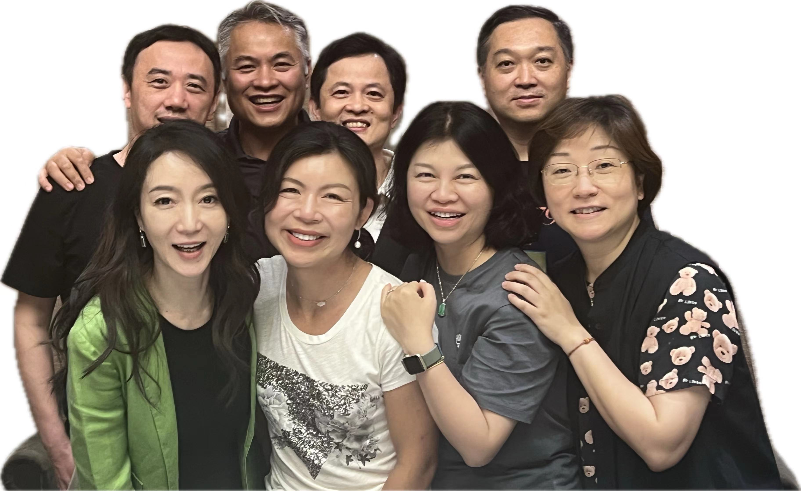
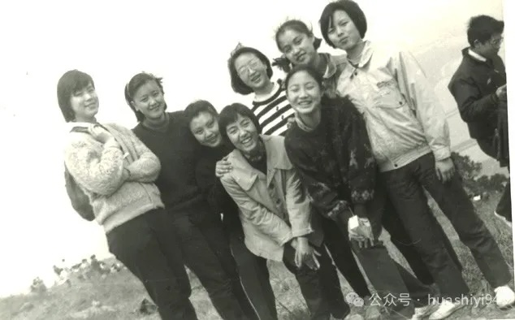
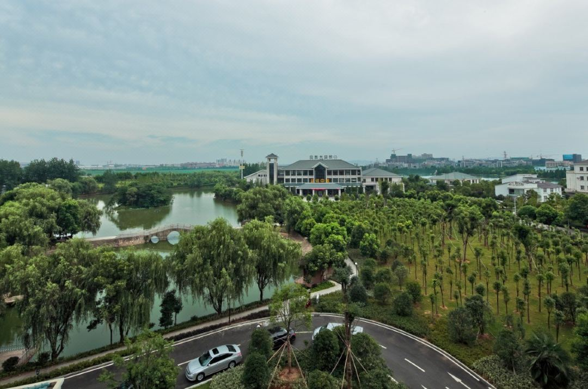
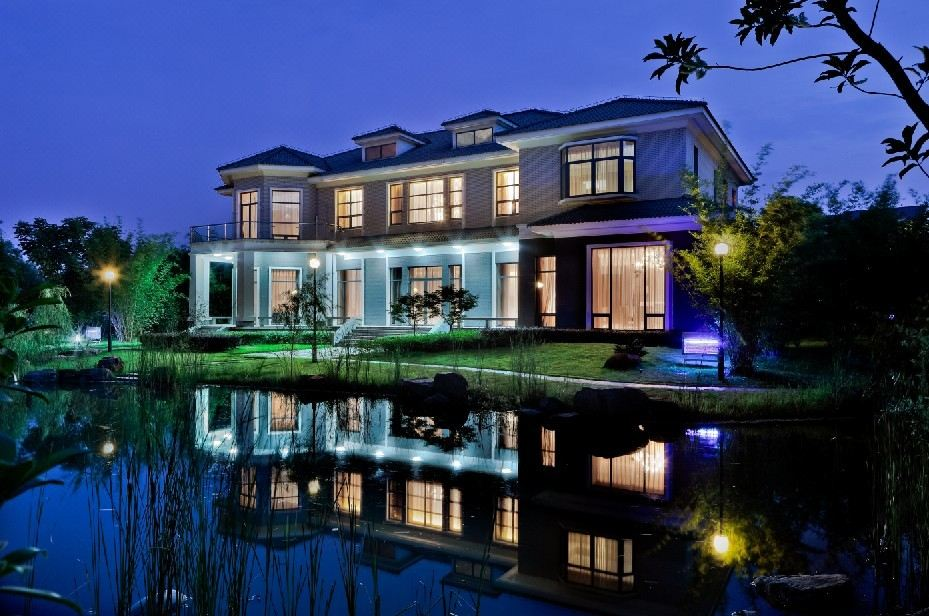
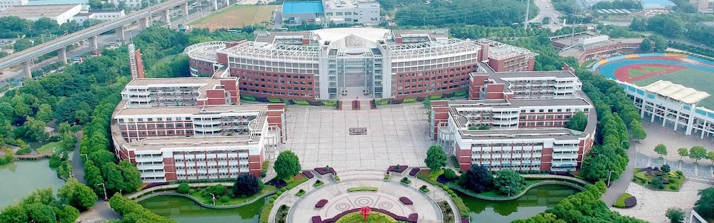
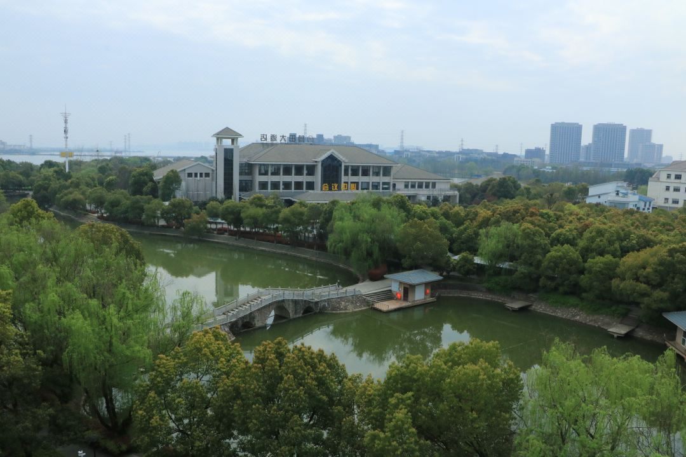
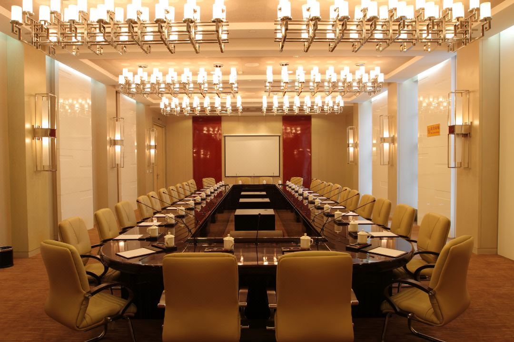
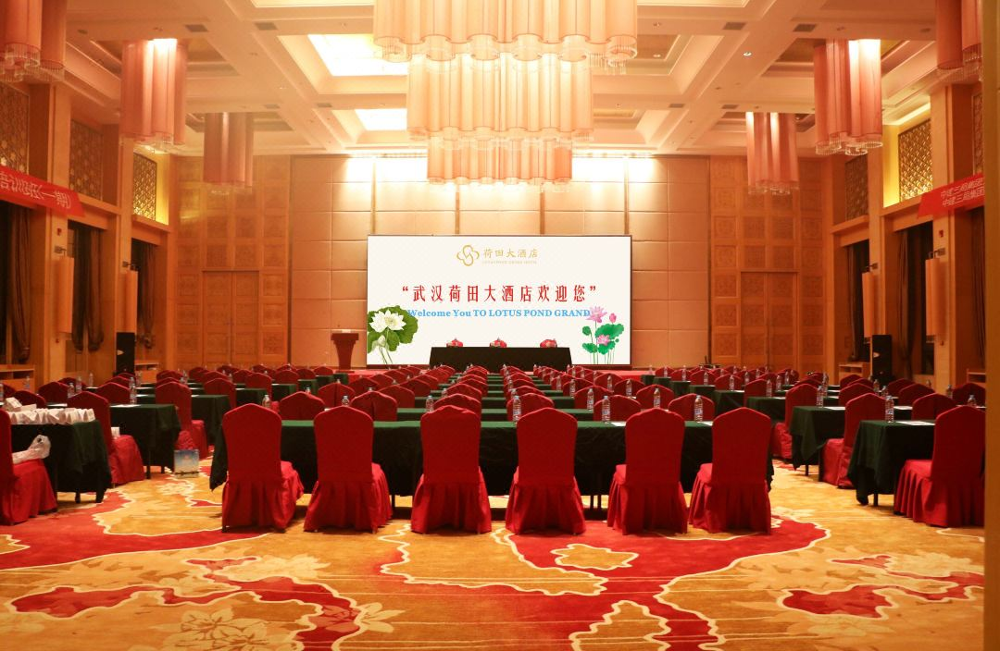
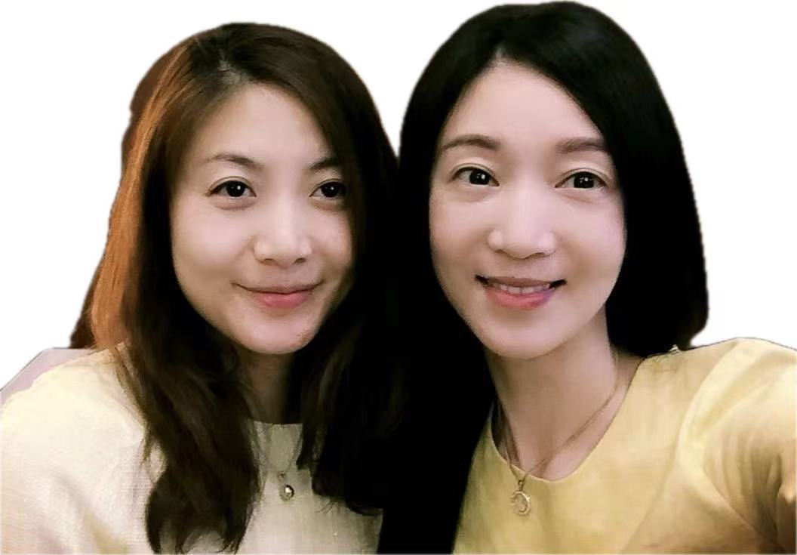

经过半年时间的筹划，终于发布了武汉华师一附中1994届三十周年返校庆典聚会的召集令

<!--truncate-->

## 召集令

武汉华师一附中1994届的各位同学们，

光阴荏苒，如白驹过隙。

弹指之间，我们离开千家街的华师一附中，走向五湖四海千行百业，已经有三十年了。

你想不想，

- 看看今天的华师一附中，在新校区的新气象？
- 拜访当年的老师，敬一壶茶，回首当年校园往事？
- 跟老同学们重新恢复联系，桃李春风一杯酒，江湖烟雨十年灯？
- 交流养生心得，育娃经验，事业方向，移民趋势？

一别多年，还记得当年的 Ta 吗？

回来吧，这个秋天，我们在武汉重聚，庆祝我们相遇相知相识的三十年，共同展望未来仍然可以共同度过的三十年。千家多少事，都付笑谈中。这是个难得的机会。

日期

> **2024年10月18日 - 10月20日**

地点

> **武汉市江夏区滨湖路16号荷田大酒店**

## 日程安排

### 10月18日，第一天

14:00 - 22:00，入住酒店。在酒店大堂 

14:00-16:00/19:00-21:00 有筹委会同学接待，发放流程表，T-shirt，祝福卡。

18:00 - 24:00，自由活动，各班小聚会

### 10月19日，第二天

08:30 - 09:30，在华师一附中新校区会议厅集合

09:30 - 11:30，参加校方参加的庆典仪式，校领导/学生代表发言

11:30 - 12:00，集体大合影

12:00 - 13:30，学校食堂午餐

13:30 - 15:00，部分同学参加在校高三学生的座谈会，大部分同学回到荷田大酒店

13:30 - 16:30，筹委会协调酒店提供以下娱乐选项
- 运动馆：网球，羽毛球，匹克球
- 指定区域：狼人杀，掼蛋，斗地主

13:30 - 16:30，各班节目排练，音响灯光测试，直播连线测试

16:30 - 18:00，自由组合走红毯合影，背景墙签名

18:00 - 22:00，在荷田大酒店的晚宴厅，参加年级晚会（提供晚餐 + 酒水饮料），各班表演娱乐节目

### 10月20日，第三天

08:30 - 10:00，早餐，湖边散步，合影 

10:00 - 12:00，分论坛座谈会
- 西医/中医养生
- 子女教育规划
- 移民生活分享
- 理财和创业
- 往事复刻
- 摄影和旅行

12:00 以后，自由时间，大家自行组团活动

## 如何报名？

感兴趣参加的同学，请完成下面几个步骤：

### 选择套餐

点击下面的付款链接，选择适合你的选项：

|  | 套餐 A | 套餐 B |
| --- | --- | --- |
| 价格| RMB 500| RMB 100|
| 适合人群 | 可以来武汉，参加嘉年华| 无法参加武汉的嘉年华|
| 权益 | 10/19-20 全天活动；活动酒店住房的协议价；电子相册；纪念文化衫 | 电子相册；纪念文化衫|
| 缴费窗口| 2024年7月8日起售，7月31日截止| 2024年7月8日起售，7月31日截止 |
| 退款| 7月31日前，全额；7月31日后，RMB 200| 不可退款|

### 套餐说明

1. 套餐 A 不包括如下需要各位同学自理的费用：
- 从常住地来返武汉的交通费用
- 在武汉当地的交通费用
- 酒店的房费（筹委会已经从酒店拿到统一折扣的优惠协议价格）
- 除了 10/19 午餐（学校食堂），晚餐（酒店宴会厅）以外的餐饮费

2. 套餐 A 收取的款项需要涵盖如下的活动费用：
- 活动酒店的定金
- 酒店宴会厅以及相关设备的租赁费用（10/19 晚 + 10/20 上午）
- 10/19 在活动酒店宴会厅的晚餐费用
- 10/18-20 嘉年华活动的宣传物料费用（易拉宝，横幅，手册，名卡等）
- 10/18-20 活动现场照片，视频的拍摄（专业摄影外包团队）
- 送给受邀请退休老师们的礼品费
- 电子相册的制作
- 纪念文化衫 T-Shirt 的制作费用

3. 活动费用说明：
- 微信付款小程序由筹委会成员，高三（1）班的联络员冯哲同学管理。
- 10/18-20 活动结束后，如果从同学们缴纳的500/100元活动费里，还有剩余款项，筹委会将会以1994届同学会的集体名义全部捐赠给华师一附中校友基金会。
- 海外同学如果无法使用微信支付，请找国内同学帮忙。付款小程序里同一名用户可以购买多个套餐，帮助海外同学实现垫付。

### 完成问卷

完成了付款后，请点击下面的链接，完成一个2分钟可以完成的小问卷，提供筹委会需要的额外信息。

### 参加接龙

参加年级微信群里的接龙，汇报进展。😁

## 联系

如有任何问题，请联系各班联络员：

| 班级 | 联络员 |
| ---| --- |
| 一班 | 冯哲|
| 二班 | 陈尧|
| 三班 | 梁兵|
| 四班 | 密凯|
| 五班 | 石春薇|
| 六班 | 王海|
| 七班 | 陈海航|
| 八班 | 吴芳|
| 九班 | 肖菁|
| 海外 | 鲍周晶|

感谢对这次活动的支持！

希望这次金秋聚会，不光是对过去少年时期的一个回顾，更多的是开启一段我们未来共同前行的新旅程。

衣不如新，人不如旧。在这个喧嚣动荡的时代，幼时结交的感情，弥足珍贵，历久弥香。