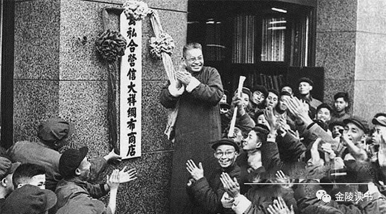

# 国家介入与商会的“社会主义改造” - 以武汉市工商联为例(1949 - 1956)

## 内容提要

1949年武汉解放之后，在接收改组原有商会、工业会的基础上成立了工商业联合会。新立的工商联直接受新兴政权之领导，在组织、人事及职能方面均已重新构建。与民国时期国家对商会的有限介入相较，共产党领导下的新兴人民政权对工商业联合会采取的是全面强势介入的政策。经改组重建后的工商联在对资本主义工商业的政治、经济改造中发挥了重要作用。

1949年新中国成立以后，为确立“崭新的”社会主义制度，对所谓“旧社会”进行了全面的介入与改造，民国时期普设的商会组织亦在其列。在整合原有各级商会、工业会的基础之上，创建了全国性的工商联组织体系。与民国时期的商会相较，工商联可以说是商会制度的又一次重大转型。新立的工商联组织在党和政府的直接领导之下，以私营工商业者为主要工作对象，成为对资本主义工商业实施管理及开展社会主义改造的重要组织基础。不过，以工商联在中国商会发展史中的转折性意义，学界对其关注却仍显不足。在对晚清及民国时期的商会史研究已取得丰富成果之后，确有必要对1949年以后的商会史加以关注，如此才能将商会史研究延至当代，构建中国商会的完整历史，也更能探究不同国家形态之下商会制度转型的内在根源及其历史作用①。本文拟以武汉市工商联为例，运用武汉档案馆所藏的工商联档案资料，对这一问题稍作探讨。

## 新国家的介入及武汉市工商联的创建

武汉位居九省要冲，自古以来就为工商辐辏之地，在华中地区呈网状辐射的商路格局中居于中心地位。武汉商人团体的发展有极为悠久的历史，在明清时期来自全国各地的商民就在汉口建立了为数众多的会馆、公所。在晚清民初，武汉也成立了新式的商会、同业公会，汉口总商会是当时具有全国性影响的商会之一。至1934年，汉口市商会下属工商同业公会共计159所[1]（p31）。至1947年，国民政府颁布《工业会法》，要求将工业行业从商会中分离出来另组工业会，汉口也成立了工业会。至1949年武汉解放前，汉口还设有工业同业公会11个，商业同业公会共82个，分属市工业会及市商会管理[2]（p320—322）。以商会、同业公会为主体商人组织网络在维护武汉商人的利益，推动行业自治，发展地方经济等方面都发挥了重要作用。

在新中国成立之后，如何有效利用这一历史性的制度资源，使之服务于国民经济的恢复与社会主义改造，成为新政府首先要面对的问题。从政治上讲，新国家的国体是无产阶级专政的社会主义国家，而商会及工商同业公会代表的却是“资产阶级”的利益。在国民党统治的时代，资产阶级还曾与无产阶级发生过激烈的冲突，资产阶级正是利用商会以及同业公会的集团力量与无产阶级抗衡，联合政府压制工人运动。但在另一方面，商会、同业公会又是最为普遍的商人团体，联系着广大的公司、行号和私营工商业者，其组织效能亦不容忽视。鉴此，中国共产党在全国基本解放、人民政权初步稳固的政治形势下，开始对商会进行全面干预与改组，以期将之改造为符合社会主义新生政权需要的工商团体。1951年7月，时任政务院副总理的陈云发表谈话，就表示工商联不同于旧商会，主要是私营企业利益的代表组织，但少数国营企业也可以作为团体代表参加；工商联实行全国、省、县三级制；同时，强调要加强党对工商联的领导[3]（p259）。这实是指明了商会改造的方向。

国家首先对商会重新进行了制度安排，在此基础上构建了全国性的工商联组织体系。1949年8月，中共中央发出《中央关于组织工商业联合会的指示》，做出了将商会改组为工商业联合会的正式决定。全国工商联筹备会于1949年成立，各省市先后成立了工商筹备委员会。同年9月，武汉市召开第一届各界人民代表会议，工商界建议成立新的统一组织。武汉市政府责成工商管理局于10月26日指导成立了市工商联筹备会。筹备委员由武汉市政府遴聘，早期确立有70人。11月，筹备会接管了原汉口市商会、汉口市工业会、武昌市商会及汉阳县商会，并在武昌及汉阳设立办事处。会员代表包括私营工商业者、手工业者、行商、摊贩，以及国营、公私合营、合作社的团体代表②。据1952年7月的统计，武汉市工商联的私营企业会员共39950户，占会员代表的绝大多数[4]（p312）。

就全国范围内看，在1952至1953年间，完整的全国工商联—省（市）工商联—县市（区）工商联的三级体系就基本建立。1953年10月，中华全国工商业联合会在北京正式成立，陈叔通任主任委员，会议选出执委209人[5]（p1）。武汉市工商联的成立要稍早一些，在1952年11月武汉市工商联第一届会员大会召开，正式宣布成立，由陈经畲任主任委员，执行委员会90人，陈亦为全国工商联之执委[4]（p306）。1952年10月至12月，硚口区、江汉区、江岸区、武昌区、汉阳区相继召开会员代表大会，成立区工商业联合会[6].武汉市工商联设置有执行委员会、监察委员会及组织、财经、税务、企改、调解、文教等专门办事机构。区工商联在组织上属市工商联领导，在有关全市的问题上遵行市工商联的决定和指示。各区工商联亦根据业务需要设置有相关组织，如硚口区工商联就设置了学习、组织、业务、税务四个专门委员会，分别推行宣传教育、组织设置、加工订货及税收征稽等事项[7]（p16）。武汉市工商联在直接吸收工商企业入会之时，也保留了原有的同业公会作为下属的专业性行业组织，市一级同业公会接受工商联之领导，在区一级也可设同业小组。武汉市工商联、区工商联及同业公会在职能上也稍有区分。据武汉市工商联的报告，市工商联在政治上经济上起一般号召动员推动的作用，并集中反映工商界各阶层的问题和意见，在经济活动方面，其重点是全市性和通业性的活动；区工商联主要是进行政治活动，并配合行业进行具体贯彻到户的经济性工作；同业公会以专业性工作调查统计协助研究任务改进为主[8].不过，在实际运行过程中，很难严格加以区分。在市工商联的统筹下，区工商联及同业公会均承担了政治改造及经济改造的任务。

国家还对工商联的人事安排及财务制度施加影响。武汉工商联之组建虽然以党政部门的直接领导为主，但不论是筹委会或者是正式成立之后的执监委会，其领导成员仍以工商界人士为主体。不过，这并非意味新政权仍然起用的是“原班人马”。政府显然非常重视这些人士在解放前活动及解放后的思想状况，重点起用的是与共产党具有一定历史联系或者在解放后能够认同社会主义路线、思想觉悟较高的人士参加。在此，可稍对解放前夕汉口市商会的情况作一追溯。斯时，中共地下组织已与武汉工商界建立联系，在中共主持的武汉市民临时救济委员会之中，就有贺衡夫、陈经畲、王际清、赵忍安等商界闻人参加，该会办公地点即设在汉口市商会之内。在1949年5月人民解放军进城前，汉口市商会、工业会还与地下党组织联合筹集救济粮分送各维持治安部队，维持社会秩序。在解放军进城之后，商会还为军队筹借粮食[9]（p587）。曾任武汉棉布业同业公会执委的王际清回忆说，在临近解放之时，中共武汉市委的宋洛和史林峰来到他家，代表中共中央中原局对他表示慰问，使之深受感动，“从此在共产党的领导下，走上光明大道”[9]（p583）。王在武汉解放后颇受重用，先后担任市政协主席、市工商联副主委，而贺衡夫、赵忍安也分别担任过武汉市工商联筹委会的主任委员或者副主任委员，这自然与其在解放前就与中共存有历史联系切切相关[10]（p37）。

在国家建立之后，政府主要通过政治运动及思想教育对工商业者进行思想改造，并依其表现对之实施甄别与选用，武汉市工商联筹委会之选定及改组基本按照这一原则进行。1951年底至1952年10月，党在全国范围内开展了“三反”、“五反”运动。武汉工商联在此阶段虽还处在筹备阶段，但也参与其中，对于领导成员或者会员在运动之中的表现，也加以考查与评定。有认为不合要求的，则予以重点“关照”，或是撤除其职务。1952年3月，武汉市工商联筹委会经议决撤销了陈焕章所担任的副主委职务，所请由市工商局批准，其原因就是在于陈焕章在“五反”运动中拖延抗拒，隐匿财物、拖欠物款，予以撤职严办。筹委会常委兼副秘书长杨笛楼在“五反”中与人订立攻守同盟，拒不坦白从前被本会停职反省又为法院传讯的历史，被撤职处分[10]（p32）。武昌区办事处在改组为区工商联之申请中就说，“本处经长时间筹备，但从未有一次彻底的改革，因此在各级负责人中进步力量太少，通过‘三反’、‘五反’运动以后，有些已被淘汰，同时又涌现了大批的积极分子”[6]（p3）。可见，各级工商联筹备及重组的过程本身就是人员更进的过程。从总体上看，受到处分的工商联领导成员及判刑的工商户所占比例并不高，但由于“五反”运动是新政权建立之后首次发动的针对资本主义工商业者的政治运动，开展范围之广、执行力度之大，均为此前所罕见。这种以意识形态与政治运动相结合的办法给广大私营工商业者包括工商联之领导成员以极大的震动，其潜在的威慑作用自不容忽视。不少人由此转变其思想认识，积极配合工商联之工作。

在武汉市工商联正式成立之后，工商联领导成员的选拔仍遵循了上述政治性原则，且国营企业及部门领导列入工商联领导层者有所增加。1952年11月28日，武汉市工商联第一届执监委中，陈经畲为主任委员，副主任委员包括申新纺织厂副经理华煜卿、市政府贸易局副局长沈以农、胜新面粉公司董事长王一鸣、公私合营后的市投资公司董事长余金堂、开明公司董事长林厚周、建新面粉公司经理王际清等人；1955年3月8日出任第二届执监委的有主任委员陈经畲，副主任委员10人，在上述6人基础上增加了人民银行武汉分行行长李赐恭、公私合营民生总公司副总经理童少生、公私合营申新纱厂副总经理厉无咎、江汉绸布公司副总汪富谦；1957年4月第三届主任委员王一鸣，副主委有所增减[11]（p32—110）。由此看来，工商联领导成员中有私营工商业背景的仍占多数，但在思想上多能认同社会主义，接受党的领导。

在经费方面，武汉市工商联在初立之时，仍以会员缴纳会费为主，收支自理。随着社会主义改造的进行，逐步改为由市财政统一支出，领导层及职员之薪水也基本由财政支出工资。如江汉区工商联的初期经费本是自筹自给，向工商户收取，但1958年后，经费改为由国库开支，工商联的干部亦正式编为国家干部[12]（p1）。就全市范围而言，在全市完成公私合营后，工商联就停止收取会费。1959年1月起，市工商联之经费收支纳入国家行政预算，人员编制列入行政编制[4]（p309）。这意味着，工商联领导的身份也逐步由工商业者转变为“半公家人”。言其为“半公家人”，是因工商联与政府部门尚存有性质上的差别，领导成员亦多另有企业本职。

新国家还明确限定，工商联与旧商会在性质方面有重大差异，职能范围亦有不同。1952年8月，中央人民政府政务院公布了《工商业联合会组织通则》，规定：工商联在性质上是各类工商业者联合组成的人民团体。工商联之基本任务包括领导工商业者遵守共同纲领及人民政府的政策法令；指导私营工商业者在国家总的计划下，发展生产，改善经营；代表私营工商业者的合法利益，向人民政府或有关机关意见，提出建议，并与工会讨论有关劳资关系问题；组织工商业者进行学习、改造思想和参加各种爱国运动[3]（p259）。同月，负责起草通则的中央私营企业局局长薛暮桥在政务院第147次会议上作了进一步的说明。薛暮桥认为工商联的建立主要是为了解决对私营工商业的组织领导问题。关于工商联的性质及职能，他认为，“现在我们的工商业联合会与过去的旧商会不同，它是新民主主义国家各类工商业者的组织，它担负着两方面的任务：一方面是领导工商业者遵守共同纲领及人民政府的政策法令，另一方面是代表私营工商业者的合法利益，向人民政府或有关机关反映意见，提出建议。”[13]（p3—4）薛暮桥的说明与陈云的讲话共同传递的信息是，建立新的工商联取代旧商会并非单纯的组织替代，而是国家改造私营工商业者的一项重要举措。工商联承担的任务不单纯是旧商会所谓“通官商之邮”，而是更强调它的政治性和服务性。当然，文件之中也强调代表私营工商业者的合法利益，但这并没有成为工商联的工作重点。

国家对于工商联政治属性方面的规定在政治体制方面有所落实。各级工商联要接受党和政府的领导，服从各职能部门的管理。在各级工商联建立之后，亦被作为工商界参政的代表组织纳入到统战及政协系统之中。武汉市工商联作为私营工商业者及工商界的代表组织参加了市政协，并选派代表在政协任职，同时市工商联的领导成员大多属于民建的会员，也要接受市委统战部的直接领导[11].这些，都突出了工商联的统战性。不过，工商联被定性为人民团体，又非政府机构，而是具有民间组织的象征意义。

## 工商联与社会主义改造的推进

在新国家对商会进行了“社会主义改造”，建立了与国家性质相符合的工商联体系之后，工商联反过来又成为恢复国民经济、对资本主义工商业实施社会主义改造的组织基础。本文就从对同业公会的组织改造、对资本主义工商业者的政治改造及经济改造等三个方面加以概括论述。

### 工商联与同业公会的组织改造

新国家对于原有商会和同业公会的改组在程序及方法上都有所不同。由于同业公会原为商会的基层组织，在商会的组织运作中有着不可替代的作用。工商联在筹备期间及正式成立之后，都将改组同业公会作为其重要工作内容。不过，各地对于同业公会之改造政策又有所不同。青岛等少数地区在初期将同业公会取消，不过后来又加以恢复。大多数地区如武汉一样积极采取措施对同业公会进行整顿[14].在薛暮桥对《工商业联合会组织通则》所作的说明之中，对同业公会实施组织改造的目的及其方针有明确的阐释。《工商业联合会组织通则》规定，市县工商联主要以企业或合作社为会员，但这并非要完全废弃同业公会，而是要将同业公会的性质加以转变。就他看来，“同业公会是工商界历久相沿的组织，过去且是工商业联合会的会员单位，它们具有更大的封建行会性。解放后有些同业公会得到了初步的改造，特别是‘五反’运动对同业公会的改造起着相当大的作用。但在组织上，同业公会仍然是各自独立的组织，它代表本行业的各工商户来参加工商业联合会，其经费的收支和干部的任免，均不受工商业联合会监督，这样就破坏了工商业联合会的统一性。”[13]（p3）“封建行会性”是政府对旧同业公会性质的认定，也说明它必须经改组方能被运用。说明还对同业公会之组织设置及其与市区工商联组织的关系作有解释，“在大城市和中等城市，凡属对国家经济有作用的行业，可继续保存同业公会的组织。……同业公会下可按业务相近，或按地区组织小组；区的行业小组受同业公会及区工商联或区分会双重领导”。在职能方面，“在有区一级组织的大中城市，同业公会主要应是在经济方面的活动，如组织各种加工订货，执行产销计划，评议税负，同业议价等。中小工商业者的一切政治性的活动，应该由区工商联或区分会来领导。”[13]（p6）

武汉市对同业公会的整顿基本按上述原则进行。在市工商联筹备会成立之后，即提出整顿同业公会的分类原则：工业同业公会与商业同业公会似以分开为宜；三镇分别组织；同类性质组织一个同业公会；以本市为限，本市以外同业公会有分支机构在汉亦可加入；户数太少可加入相近同业公会；公私均可加入。后推选出王一鸣等52人为市工商联同业公会整理委员会委员，王为主任委员，调查各公会情况，拟订整理方案，分批整理[15].第一期自1949年12月—1950年2月，完成粮食业、百货商业、化工工业、花纱商业、纺织染整工业、米面工业、绸布工业等七个行业的整理③。市工商联正式成立之后，继续对同业公会进行改组。到1953年3月重新提出改组同业公会的议案，该方案据“私营企业统一分类办法”，计划将汉口、武昌、汉阳三个地区现有的100多个同业公会（汉口79个公会，武昌23个公会，汉阳29个公会）调整合并为55个全市性的同业公会和同业委员会，并将公会内400多个名称不一的自然行业小组，依照分类目录的经营性质，统一调整为196个自然行业小组[8].后继改造基本按此进行。

自1950年开始，武汉工商联就提出对同业公会进行统一管理，即行政、人事、财经统一，要求同业公会接受工商联的垂直领导。具体来讲，就是由工商联对同业公会实行会费统一收支、干部统一调配、财产统一接管，并逐步实行集中办公。这样，就可改变了民国时期同业公会在会费支配及人事选派方面的自主权，将同业公会纳入到了工商联体系之中。此计划至1954年方才正式实施。1954年，武汉工商联以同业公会为单位，将业务相近者、依形势发展，会员减少者、业务不多不须另组者、行业虽不同但属同一国营企业单位领导者，前后分三批实行集中办公。集中的内涵是相近行业办公机构合在一起，集中办公同业公会的职工由工商联统一调配；财产由工商联统一管理分配。以行业论，第一批有机制卷烟业、油脂业与米面业，竹木业与砖瓦、灰沙业，酿酒业与食品制造业，文具用品与纸张业，分别联合集中办公。以地区论，汉口为重点区域，亦分三批进行，第一批于6月22日动员了16个同业公会迁至7个地点集中办公；第二批于7月3日动员了31个同业公会迁至12个地点集中办公。截至7月21日止，第一批和第二批集中办公的行业均已搬迁完毕。第三批则于7月21日起，分别动员24个同业公会迁至9个地点集中办公[16].在此基础上，武汉工商联仍适时对同业公会进行持续调整。1955年9月，武汉工商联又专门成立了调整改组委员会对同业公会进行整顿，选取绸布业及茶叶业、医药三个行业公会作为试点[17].改组后同业公会的委员会仍以私营企业主或其经理人员为主，也包括有国营企业人员，有的还是原任执委。武汉机器工业同业公会改组后，其原任执委就占相当比例[18].大致上，工商业对同业公会的调整是以行业归口改造及统一管理为组织原则的。

武汉市工商联对同业公会之组织性质及地位有清楚认识，在其业务报告之中，工商联认为同业公会是其领导下的一个专业性组织，在进行对私营工商业者的社会主义改造的过程中起统计监督协助政府教育同业。同业公会与区会并为市会之组织基础，“区工商联和同业公会像市工商联的左手和右手，虽是一以企业的改造工作为主，一以人的改造为主，但又必须紧密配合，在市工商联的统一领导下，分工合作，共同完成双重改造的任务。”[19]（p49—50）就二者分工合作、上下共举的组织关系而论，这一评论是相当精准的。

### 工商联与资本主义工商业者的政治改造

1952年底，中共中央提出要从新民主主义到社会主义的过渡时期的总路线，即要逐步实现国家的社会主义工业化，并实现国家对农业、手工业及资本主义工商业的社会主义改造。武汉工商联依据党和政府的要求，积极对私营工商业者进行政治宣传和思想教育，加强其对社会主义的思想认识，并配合推行党和政府的各类政策。不过，思想意义上的政治改造并不限于通常所说的社会主义改造时期，而是自工商联筹备时期就已开始。

政治改造的重点首先在于教育工商业者要爱国守法，拥护社会主义。此时之法，包括《共同纲领》及党和政府的政策法规。武汉市工商联作为全市工商界的统一组织，充分发挥其组织领导作用，对广大工商业者进行教育。在过渡时期总路线提出后，各级工商联组织自上而下，层层展开了对总路线的宣传教育工作。武汉市工商联“上承法意”，积极阐释走国家资本主义道路的必要性，并引导工商业者学习全国工商联编辑出版的《工商界学习参考资料》。在1954年新宪法草案颁布后，中华全国工商联发出关于普遍组织工商界讨论中华人民共和国宪法草案的通知，通知要求各地工商业联合会应在各级人民政府的统一布置和领导下，大力组织和推动私营工商业者参加这次宪法草案的讨论④。武汉工商联还及时传达政策精神，要求工商业者严格遵守国家的法律和计划，严格服从国家行政机关的管理和国营经济的领导，积极接受工人群众的监督。要求今后工商界“必须互相帮助，互相督促，真正做到爱国守法，消灭一切违法行为。”武汉市工商联在市委统一领导之下，还成立了市工商业业余政治学校，组织工商业者有系统有计划进行正规学习。江汉区工商联成立了业余政治学校分校，还开办了业余文化学校。根据自愿原则，将全区工商业者分别组织学习，计有745名工商界中的文盲和半文盲参加第二季度业余文化学习，有1038名具有初中文化者参加了业余政治理论学习，2870名高小以下水平者参加工商讲座学习。业余政治学校和工商讲座的学员通过学习之后，大多数会员能够认识“资本主义必然灭亡”和“共产主义必然胜利”的社会发展规律“[20]（p31）。

武汉工商联还大力动员工商业者支援抗美援朝，参加国债认购，使工商业者参与到社会主义建设事业之中，增强其对新社会的认同感。抗美援朝时，武汉工商界爱国情殷，1950年11月在市工商联扩大会议上，通过了“十大决议”的工商界爱国公约。同年12月，为庆祝平壤解放，市工商联组织8万人参加游行。1951年5月，工商界慰劳中国人民志愿军和救济朝鲜难民，两次共捐献人民币（旧币）23.35亿元。1951年下半年，响应抗美援朝总会的号召，捐献人民币661亿元，折合战斗机44架，超额14架[9].为解决财政困难，1950年，国家发行“人民胜利折实公债”，分配给武汉市工商界推销公债500万份，市工商联筹备会成立了公债推销委员会，并在武昌、汉阳及汉口各同业公会分别成立推销分会，调查研究各业情况，按照推销额协商分配到业，再由各业公会劝销到户认购。在认购时，有人想到国民党发行债兑现很少，以致认购不踊跃，经市工商联反复宣传，方有所改观。1954年到1958年的五年中，国家每年发行经济建设公债，市工商联均积极建立市、区、业推销组织，协商分配，催促入库，每年均超额入库[4]（p331）。

在对资本主义工商业的社会主义改造开始后，私营工商业者大多对加工订货、实行收购包销的措施存在顾虑，因而态度消极。在工业方面，一些企业要求自产自销，不愿按计划生产；在商业方面，不愿与国家建立批购关系，期望自由购销，以获得更高利润。武汉市工商联根据这一情况，将辅导私营工商业者纳入国家经济计划、走国家资本主义道路作为主要工作来抓。工商联采取座谈、政策报告会等形式向私营工商业者宣传解释政府的各项政策措施，对重点行业营业情况进行调查研究，使某些私营工商业者对经销、代销、批购的认识有所转变。1954年9月，国务院通过《公私合营工业企业暂行条例》，市工商联立即组织公私合营企业的私股代表座谈，并吸收部分已申请公私合营待批的私营工业负责人参加，反映申请公私合营的意见。市工商联的这些努力在一定程度上纠正了所谓“公私合营可以丢包袱”，“只有大企业才能公私合营、中小企业将被淘汰”的顾虑，打消了一些人怕公私合营后调动工作、降低工资的担忧[4]（p323）。武汉工商联还要求工商业者采取积极努力的态度，凡是已纳入国家资本主义轨道的工商业，应该遵守国家计划，服从国营经济领导；已经改善为公私合营企业的私方，应该在公方代表的领导下，尽职尽责；尚未走上国家资本主义道路的工商业，应该服从国家政策，服从统一安排，积极准备条件来接受社会主义改造[8].1955年10月，毛泽东邀集全国工商联执委会在北京座谈，希望资本家能够认识社会发展规律，掌握自己命运，放心接受改造。武汉市委统战部在市委指示下，决定分做两级向下传达会议精神。自12月5日开始，市工商联分别召开了常委扩大会议和监委扩大会议，由陈经畲等传达了毛泽东的指示。12月9至26日，又召开执监委扩大会议，以传达和大会讨论为主，出席的为市、区工商联和同业公会的全体委员等共1466人。通过这两次会议，贯彻了中央关于工商业社会主义改造的有关精神，“使资本家认识到全行业合营和定息办法对大、小、公、私都有利，是社会主义的办法”。江汉区工商联从1955年12月29日至1956年1月7日，举行了五次报告会，由区工商联正副主委和监委召集人分别传达了毛泽东的指示。通过宣传，会员的眼界扩大了，思想也开朗了。新民机器厂的孙茂林说，“在旧社会里，工商业者真作孽，当一个小资本家，在国民党的残酷统治下，钱虽然容易赚，但物价一天几个样，手里的钱一下子就变成了水。”公平布店的李上进说，“子女都得到党和政府的培养和教育，也不需要他的这份财产，所以也没有理由留恋私有制。”[20]（p24）姑且不论此是否工商业者的真实心态，但至少说明经过思想教育之后，私营工商业者已经认识到接受社会主义改造、走公私合营的道路是难以回避的历史潮流。

### 工商联与资本主义工商业的经济改造

在健全组织基础及加强思想教育的同时，武汉工商联积极按照党和政府的工商管理政策及过渡时期总路线的要求，协助政府维护市场经营秩序、实施工商业调整计划。在社会主义改造开始后，工商联又大力引导私营工商业者参加加工订货、代购代销、定资定息及公私合营，引导工商业者走上国家资本主义道路。

武汉市解放之后，政府亟需加强对工商业的调查了解，实施新的工商管理政策，以稳定经济及社会秩序。为此，市政府开始从粮、棉、纱、布、油、盐、煤炭、牙行等攸关民生的八个行业办理工商业登记的工作。武汉市工商联通知各同业公会，要认真实施登记，为政府提供准确的经济信息。1950年12月至1951年1月，工商联又协助政府进行经济普查工作，为政府的经济决策提供了重要参考[4]（p315）。甫经战争，武汉市的经济形势十分严峻，市场投机严重，物价仍然高涨，威胁民生经济。1951年10月，武汉市工商联企业改进委员会制定开展明码实价的工作计划，并成立物价组，统一调查研究全市商品的价格。要求各行业同业公会成立物价小组，编制货品类别，议定标准价格。1951年11月20日起，武汉市工商联向各业同业公会发出正式通知，要求全市工商业户从即日起一律实行明码标价。针对少数私营工商业者的囤积居奇及投机掺假行为，武汉市工商联于1953年7月起配合市贸易局，重点对14个行业和2个市场进行检查。在春节、国庆节等节日期间，更与各同业公会组织行业检查组，抑制乱涨价行为。这些活动对于稳定经济秩序、平抑物价发挥了重要作用[4]（p318）。

在国民经济恢复的过程之中，武汉市还存在货物滞销、失业增加、劳资矛盾加剧等问题。在这种情况下，国家开始对工商业进行系统调整工作，即调整公私关系、产销关系、劳资关系。武汉市工商联协助市政府积极开展此项事务。针对私营工商业者提出的加工订货管理混乱、定购代销价格不合理等情况，1950年，武汉市工商联推派华煜卿、王际清等委员与国营企业代表组成工商业公私关系协商委员会，合理调整地区减价和批零差价，照顾私商利润。在产销关系方面，市工商联在工商局领导下，于1950年9月组织了私营企业改进委员会，召开各行业改进会，协助企业改革管理制度，加强生产经营的计划性，改变了国营企业与私营企业各自为政、计划与自发生产不谐调的状况。在劳资关系方面，武汉市工商联积极宣传《武汉市关于私营企业劳资争议调处程序暂行办法》及《武汉市工商企业劳资双方商订集体合同暂行办法》等政策，并辅导私营工商业者进行劳资协商，订立集体合同，调解劳资矛盾，对缓和劳资矛盾起了一定作用[4]（p320）。

经济发展与社会建设政策的展布，均需有充裕的财政支持，而财政又有赖于税收。问题是，新的税制尚未颁布，财政又需求孔亟，不仅要按时缴纳，还往往提前预征，私营工商业者均感税负压力颇大。1949年底，武汉市税务局拟征收营业税及所得税，实施颇感困难，后在工业会、商会之协助下召集各业公会开会，评定税率及税额，终于按期入库。后随抗美援朝及国家建设之需，税收征稽之重要性更加提高。1951年3月起，武汉市工商联开展集体纳税活动，并号召各同业公会积极协助。工商联的号召得到各工商户的响应，营业税之征收十分顺利，此后基本上做到月税月清。与此同时，工商联又发起集体预缴所得税的活动。经与税务局协商，工商户可按上年纯益率及自报营业额估税入库，缓解了财政困难，不过此举也使工商户的负担加重。为协助税务局改进征收方法，市工商联及区会还派代表参加了市税务复议委员会和工商业税民主评议委员会及分评会，以期税政合理[4]（p317）。

在资本主义工商业的社会主义改造开始以后，工商联一方面的任务是政策宣传，另一个重要的任务就是配合有关部门，具体推进加工订货、批购代销及公私合营政策的贯彻实施。在实施上述政策之中，政府对于各行业、各企业之具体情况，如企业的生产能力，产销关系，价格差异，任务分配等，均须依赖工商联及同业公会的组织性支持。在加工订货及代购代销方面，市工商联发挥重要统筹作用，多由市工商联及有关部门将计划任务分解给各行业同业公会，再由同业公会将任务分解至各企业。从1953年到1954年，武汉市私营工业大部分变为国家加工订货，其商品由国家统购包销。私营商业中许多行业向国家批购货物，或为国家代购、代销和经销各种商品。到1955年，代销、经销户共有4042户，大部分商店与国营商业建立了批购关系[4]（p324）。在公私合营的过程之中，工商联之统筹作用更不容忽视。市工商联先协助政府进行“归口管理，统筹兼顾，全面安排”，教育工商业者为申请公私合营作好准备。1955年12月，市工商联召开常务委员会扩大会议，传达国家的改造方针。不久，北京市以及其他各大城市实现全市资本主义工商业全行业公私合营的消息相继传到武汉。武汉市工商联各级组织在政府领导下，全力以赴，竟用两天时间就办完全市所有工商业户全行业公私合营和合作化的申请手续[4]（p324），使党和政府对资本主义工商业的社会主义改造与和平赎买政策，在武汉得到全面贯彻。

## 小结

1949年新中国成立，国家性质骤变，国家对于商会之制度需求有根本改变。新成立之工商联为在党和政府领导之下对私营工商业实施管理的人民团体，与原商会在组织形态、人员选派、职能范围等方面均有明显差异。武汉工商联成为武汉市的工商界统一性组织，并在各区设立了分会，建立了与全国工商联体系一致的地区体系。同时，武汉工商联要接受武汉市委及市政府的领导，接受各部门的业务领导。工商联作为私营工商业者的联合性组织，亦被作为工商界的代表组织，参与新国家的政府体系。工商联在组织设置、人事财务、性质职能等方面都要遵从新国家的安排。可以说，新国家对工商联的全面介入的确使工商联成为集统战性、经济性、民间性于一体的复合性组织。工商联组织实施对同业公会的改组，参与到国民经济恢复及社会主义改造的进程之中，为新国家各类政策的实施立下重要功勋。从协助政府的角度来讲，工商联的职能发挥基本上达到了政府的预期目标。

但问题是，武汉工商联是否如《工商联组织通则》所设定的是私营工商业者利益的维护者呢？依上所论，国家对工商联进行了全面的介入，工商联也将承担政府所规定之管理职能作为主要任务，工商联又如何获得工商业者的支持并以推进种种政策呢？这就要从私营工商业者对工商联的看法来加以分析。经过改造的工商联虽然在人事上仍然保持了不少工商界的人员，但在部分私营工商业者的眼中看来，工商联只是新国家的政府类组织，而并非工商业者自身利益的维护者。江汉绸布公司的一位私方人员说：“我们是工商联公债推销支会的会员，不是工商联的会员，因为工商联除公债外，没有替我们做旁的事。”[20]（p31）工商联一意以执行政府法令政策为己任，实际上在某种程度上忽视了对私营工商业者利益的维护。工商联工作之获得推动，其权力在相当程度上来自新国家的专政之威，而并非完全出自私营工商业者的自发认同。从这个角度说，工商联的民间性已迅速退化。虽然这种观念上的差异并未最终阻碍社会主义改造的实现，但却增加了工商联在推行有关政策时的难度。在社会主义改造彻底完成之后，工商联的经济性工作实际上也大为削弱，而统战工作则成为其主要职责。

## 注释：

①关于1949年后工商联的研究还十分不足，较具学术性研究的论文有刘建中：《二十世纪五十年代广州工商社团组织》，马敏：《中国商会的现代演变》（第三届中国商业史国际学术讨论会论文）。在朱英主编的《中国近代同业公会研究与当代行业协会》（中国人民大学出版社，2004年版）一书中对1949年后同业公会的演变情况有所论述，亦涉及到工商联的组织改造问题。

②武汉市工商业联合会编：《武汉市工商业联合会成立大会汇刊》，1952年印刷，第142页。

③参见武汉市工商业联合会编：《武汉市工商业联合会成立大会汇刊》，第142页。

④参见新华社新闻稿：《全国工商联发出通知普遍组织工商界讨论宪法草案》，总第1482期，1954年第6期，第18页。

 ## 参考文献

[1]武汉市档案馆（以下简称武档）。汉口市政概要[Z].bB13—3，1934.1.

[2]武档。市社会局统计辑要CU1—25—37[Z].1949年4月。

[3]陈清泰。商会发展与制度规范[M].北京：中国经济出版社，1995.

[4]武汉地方志编纂办公室。武汉市志——社会团体志[M].武汉：武汉大学出版社，1997.

[5]全国工商联文史办公室。中华全国工商业联合会大事记（1953—1993）[M].北京：中华工商联合出版社，1993.

[6]武档。关于将各区办事处改组为区工商联的计划[Z].119-126-18，1952.8.

[7]武档。硚口区工商联1953年工作总结[Z].119-80-58，1953.

[8]武档。武汉市工商联关于同业公会问题的汇报[Z].119-126-27，1954.

[9]政协武汉市委员会文史学习委员会。武汉文史资料文库（第三卷，工商经济）[Z].武汉：武汉出版社，1999.

[10]武档。本会筹备委员会履历[Z].119-126-4，1952.

[11]武档。本会委员履历表[Z].119-126-5，1957.

[12]武档。江汉区办事处改组为区工商联[Z].119-126-19，1952.

[13]武档。工商业联合会组织通则说明[Z].119-126-449，1952.8.

[14]武档。参加中华全国工商业联合会组织工作汇报会议情况[Z].119-126-443，1955.8.

[15]武档。武汉市工商联第一期整理工作情况[Z].126-119-12，1950.2.

[16]武档。武汉市工商联实行同业公会集中办公[Z].119-126-27，1954.5.

[17]武档。改组同业公会情况简报[Z].119-126-27，1955.10.

[18]武档。武汉市各同业公会委员、组长名册[Z].119-126-137，1956.3.

[19]武档。关于工商联组织问题的意见[Z].119-126-449，1956.11.

[20]武档。武汉市江汉区工商业联合会第一、二、三季度工作总结[Z].119-79-43，1956.

## 作者

魏文享，华中师范大学中国近代史研究所副教授

杨天树，华中师范大学历史文化学院研究生

来源：[《华中师范大学学报：人文社科版》2005年第5期](http://journal.ccnu.edu.cn/sk/CN/volumn/volumn_1201.shtml#)
