# 老汉口华界大董家巷片 拆还是留？

10月15日，有市民举报大董家巷百年建筑平江商业会馆正在拆除，这绝不是施工方“临时工”心血来潮，而是有领导、有组织的行动。16日，江汉区文旅局到现场予以阻止，但平江商业会馆和二盛一巷3号钱庄的外立面遭到破坏，墙上打了大洞，部分细节破坏。

18日上午，江汉区文旅局约请有关文化保护专家现场考察，并再次形成意见上报区政府。专家意见以原地原貌保护为主，个别专家说即使迁移集中保护、活化利用，也要慎重，不能野蛮。

汉口租界西式、中西合璧建筑（约160年历史），汉口明清水火战乱、自然更迭建筑（约500年历史），汉口受租界影响以模范区为代表的建筑（约100年历史）。

## 老汉口华界历史建筑

汉口历史风貌区应该由两种历史风貌构成。一种是汉口开埠通商后形成的近代城市风貌（租界区——中国三大租界之一，及模范区），一种是明清以来的中国传统商业手工业城市风貌（华界区，汉口镇是“九省通衢”，“天下四聚”、四大名镇之首）。

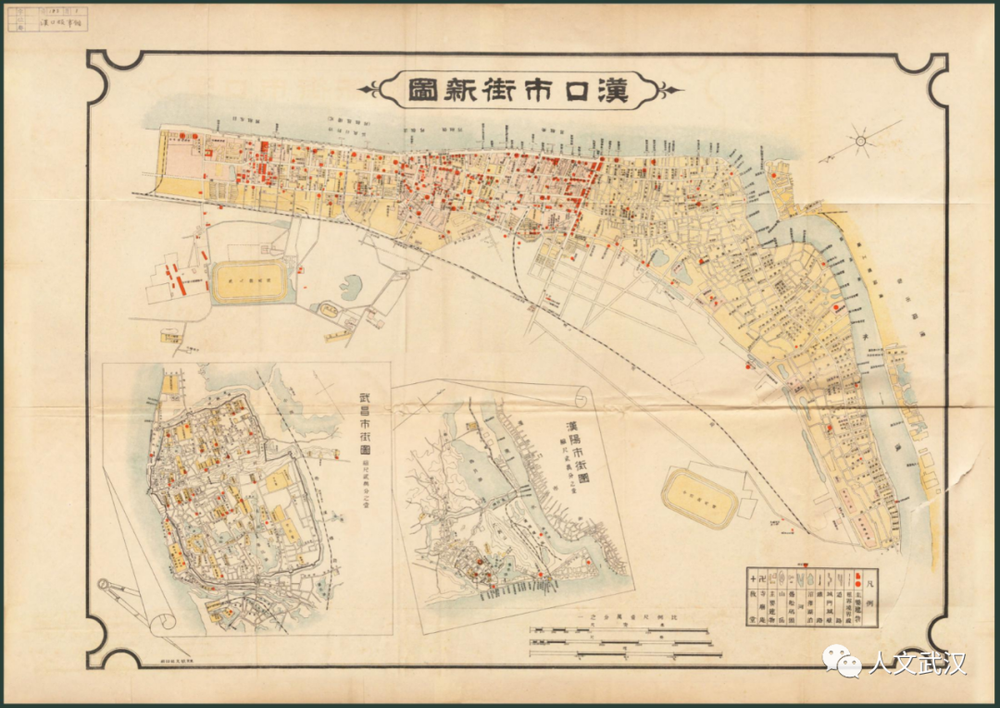

大董家巷位于与汉正街同时发展起来的黄陂街（大兴路）

明万历《汉阳府志》（1613年刻本）的记载“汉口黄陂街，大率黄孝人也”，距今407年了。

清代的大董家巷片区更是汉口的政治中心，有江汉关监督公署、汉阳府同知署、守备署、礼智巡检司等政府机构。还是商业、手工业集中地，形成花布街、打铜街、打扣巷、衣服街、袜子街、草纸街、剪子街、芦席街以及龙王庙码头、大码头、四官殿码头等。帝主宫可说是汉正街小商品市场的源头。

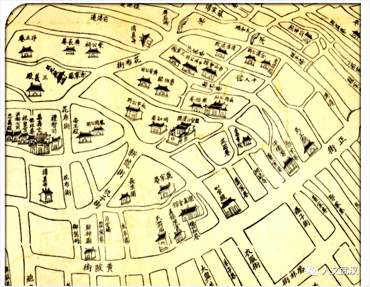

大董家巷片区会馆、公所林立聚集，如太平会馆（安徽）、长郡会馆（湖南）、平江会馆（湖南）、湖嘉会馆（浙江）等；还有龙王庙、回龙寺、马王庙、四官殿、二圣祠、帝主宫等宗教寺观。

民国时期，黄陂街与汉正街、花楼街共同组成华界最重要的商业文化街区和居民里巷居住区，至今保留有一定数量的清代和民国历史建筑，是不可多得、不能再生的历史文化资源。

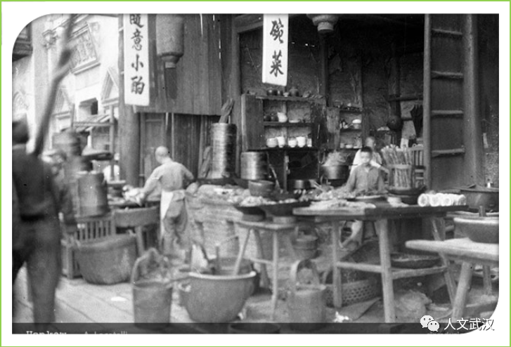

根据《武汉市花楼街片历史风貌街区保护规划与控规细则》（武汉建设年鉴2013），大董家巷片位于此历史风貌街区保护范围。《细则》强调“散点历史建筑的保护”与“线性街巷空间的延续”，并力求用“场所再现、试听再现的方式”实现“历史传承与文化积累”。

然而与该规划相违背的是。在目前正在实施的汉口历史风貌区旧城改建项目中，大董家巷片区已被列为拆迁区域，在红线范围图上属于“汉正天街”项目第 65、66 号地块，相关腾退工作已经展开，除匹头公会列入“保护名录”的建筑之外，整个片区面临被整体拆除灭失的危险。

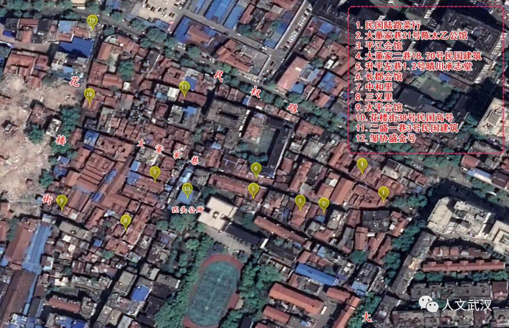

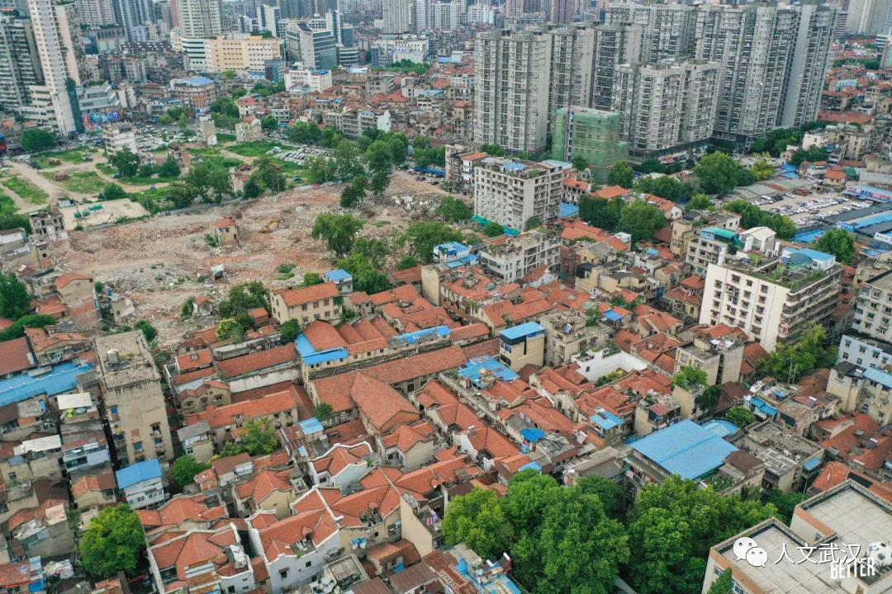

## 太平会馆

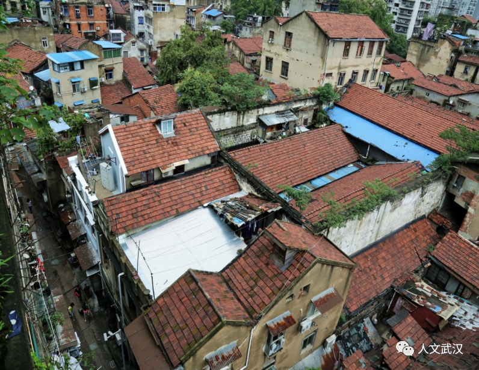

汉口太平会馆是安徽太平县(今黄山市黄山区)商人所建。道光年间《汉口丛谈》记载衣铺街回龙寺建有太平会馆。现在汉口太平会馆是在太平天国战后重建的。《太平县志稿》说光绪望仙人李埙，“咸丰十年，汉口太平会馆毁于兵燹，埙贾于汉，心甚忧之。同治间，募捐重建，苦心毅力阅十余年，光绪八年始告成。”

太平商人是安徽第二大商帮宁国商帮的一部分。其代表人物王琴甫、王森甫、项竹坪、谭芝屏等活跃在汉口商业、慈善、社团等管理活动。

花楼街10号原新华织带厂，二盛村60号，大董家巷等区域内，留有大量完整的青砖墙及石库门、碑刻、铭文、柱础、石板路等。二盛村侧还是夏口劝学所及商业学校旧址。

## 长郡会馆

约建于清道光年间。现仅存门楼，类似于澳门圣保罗教堂仅存主立面而被称为“大三巴牌坊”的不完整建筑。

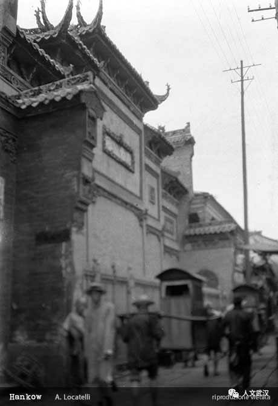

## 平江商业公会

三层西式建筑，《夏口县志》记载“清光绪二十二年由平江旅汉销售纸茶油蔴捐资建造”，“专为旅汉平江商业同人集会之所”。1910年落成不久毁于辛亥战火，1919年5月重建。

1927年5月“马日事变”后，中共平江县委书记陈景潜“跑反”武汉,落脚于此。大革命失败后，杨开慧寄与毛泽东的信件，由大董家巷的湖南同济布庄秘密转送井冈山。杨开慧牺牲后，也是由同济布庄出面，收敛遗体安葬。

1931年，为打破对苏区的经济封锁，平江县工农兵苏维埃政府贸易局通过工商界人士联系，运用武汉平江商业公会等作渠道，出口苏区物资，运进食盐和粮食，改善苏区的经济状况。

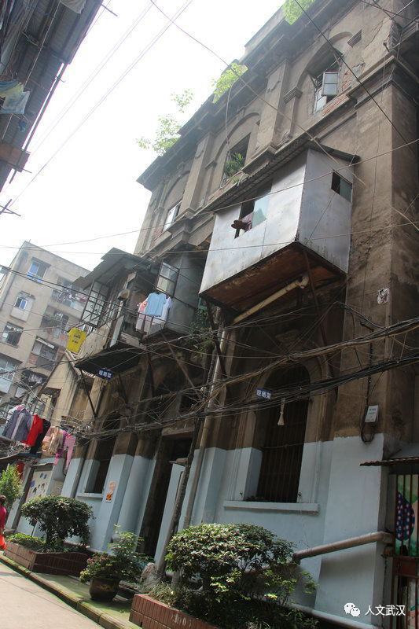

## 花楼街38号 源昌丝绸号

约建于20年代，独立二层石库门楼房。结构完整，木雕精美。有原装厚重大木门，并有墙脚地界碑。

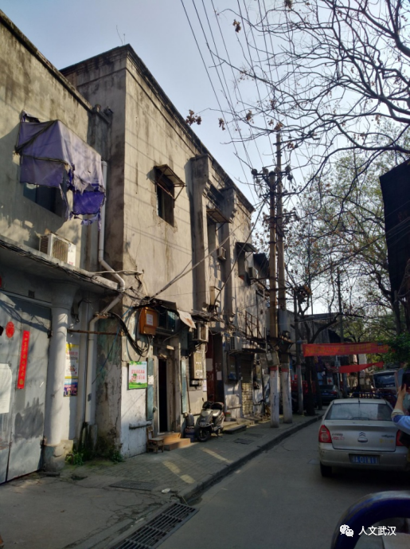

## 二盛一巷3号 民国钱庄建筑

约建于30年代，独立二层楼石库门楼房。结构完整，地面水磨石、内部木窗、隔板、楼梯、天窗、铁艺栏杆保存较好。

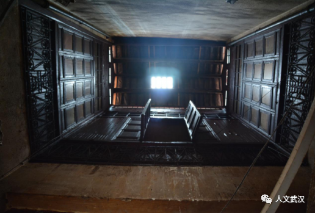

## 升平左巷1号2号 晴川承志堂客栈建筑

约建于20年代，二层联排石库门楼房。天井的石板地面、内部木窗、隔板、楼梯等保存较好。左侧有晴川承志堂墙脚地界碑，曾作为客栈经营。

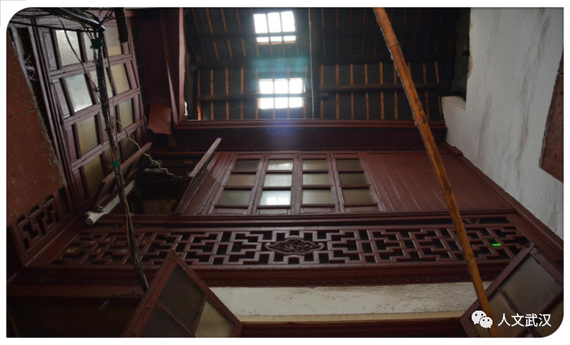

## 民国汉口陆路菜行

大董家巷与董家二巷交会处，二层建筑呈三角形造形独特，为民国汉口陆路菜行所在地。

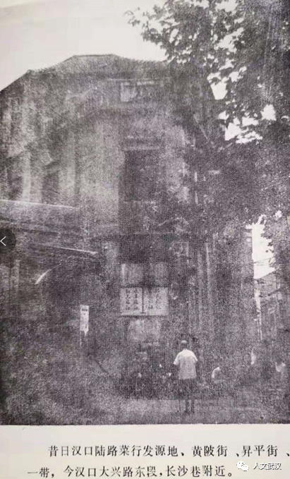

## 大董家二巷18，20号民国建筑

大董家二巷18，20号三层民国建筑，原新民旅社。

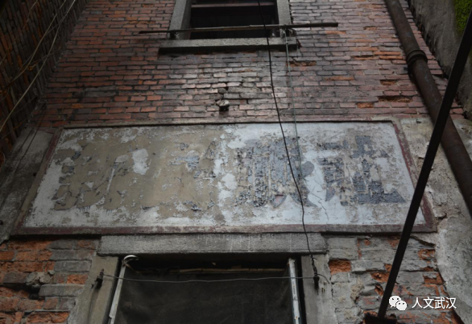

## 三义里

1927建成，有16栋石库门二层楼住宅。在“官砖”“汉裕”铭文砖砌成的清水红砖墙墙体上，镶嵌着“舒姓赋丹书屋”、“武昌熊江陵堂”（香烟商家）、“黄安谢三元堂”（棉纱商家）以及“麻城王荆树堂”、“麻城唐馀庆堂”、 “汉阳万南纪堂”等多块墙脚地界碑，具有珍贵的史料价值和观赏价值。清末，此地有三义祠。

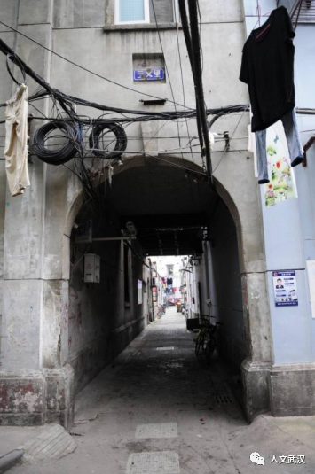

## 中和里

建于20年代，有7栋独立清水红砖墙石库门房屋，巷道两分别砌有聂善理堂、欧阳慎余堂、黄三河堂、王三多堂等多块墙角地界碑。保存如此完整的墙角界碑在武汉还不多见。黄家和欧阳慎余家后人一直居住至两层普通民居建筑。

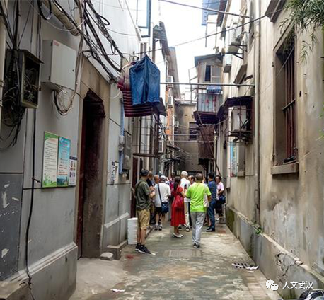

## 大董家巷21号 陈太乙房产

两层普通民居建筑。陈太乙后代陈宏愚回忆为陈家大家庭所居房产。

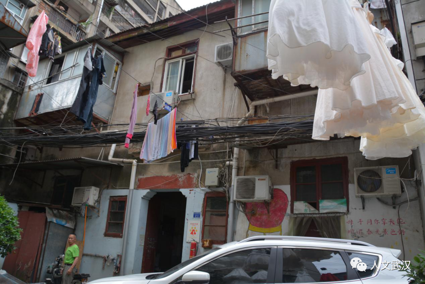

武汉著名老字号药店“陈太乙”，1922年由洪湖新堤人陈焕章创办。民国时期，在郭家巷（今民权路）白布街口（今花楼街广益桥）建起一栋临街砖混结构的楼房，颇为壮观，取自己姓与“太乙真人必有灵丹妙药”之意命名“陈太乙药店”。以其子陈正权名义登记注册。

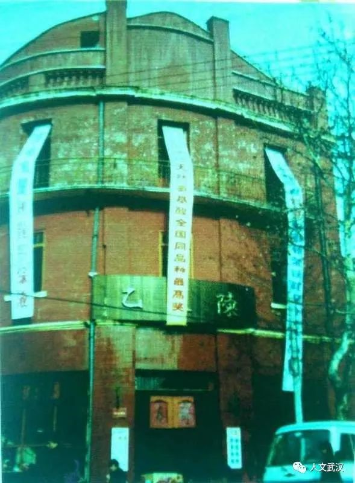

## 反思

随着武汉市城市建设飞速发展，如何保留城市发展和历史文化的脉络，一直是政府和社会各界困扰和不断反思的问题。近来，“汉口历史风貌区及武昌古城旧城改造、两湖隧道”等项目在大力推进。武昌武胜门宋城墙遗址的保护，汉口汉正天街建设中老建筑的留拆等等也再一次引起关注。

如何在经济建设中保护和利用城市历史文化最直观和最生动的载体——历史优秀建筑，引发社会各界的不断呼吁。“万物有所生，而独知守其根”！

## 关于我们

人文武汉志愿者团队是由武汉市学术、新闻、教育、科技、工程、文化各界人士及民间文保志愿者，组成的学术性、公益性、非营利性文物保护社会组织。2017年12月荣获中国文保基金会第九届“薪火相传——寻找中国文物故事杰出传播者”全国十佳团队称号。

打捞江城记忆 串起散落的珍珠

钩沉三镇往事 回眸过眼之烟云

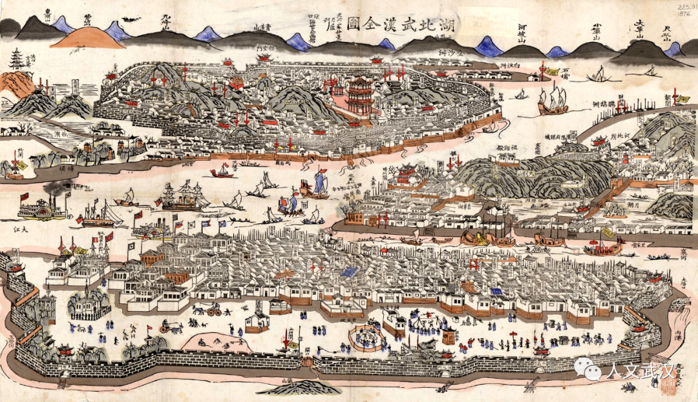

编辑：田联申

欢迎来稿 请注明原创

243386934@qq.com

[原文链接](https://mp.weixin.qq.com/s/G1BeQbRNdHnIE6yJdiyZkA)

