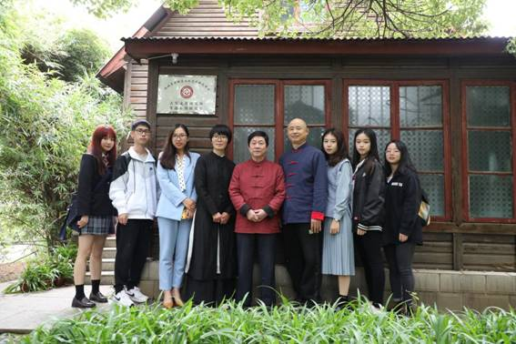
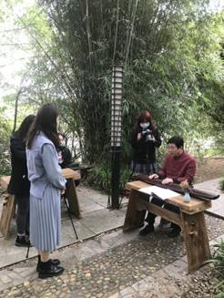
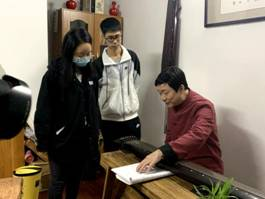
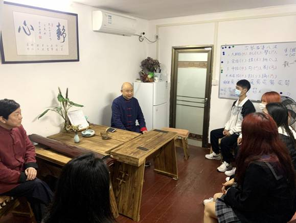
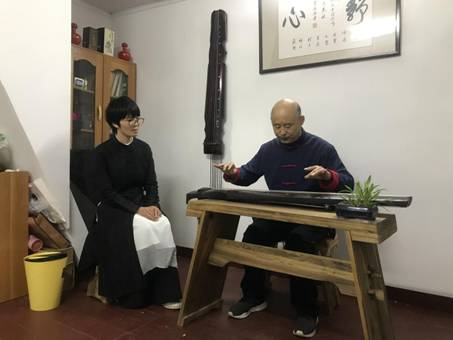
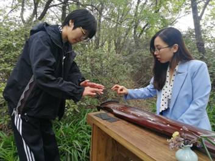
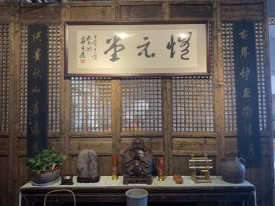
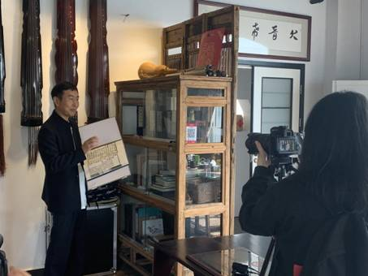

# 琴音袅袅起 请君倾耳听

（通讯员：刘玥含）

2020年10月20日，艺术与传媒学院 “非遗”纪录片拍摄小组孔诗雨、刘越、黄娟、程颖睿、商毅、姜诚六名同学在指导老师谢思的带领下，前往马鞍山森林公园恬逸园古琴文化研究所、非遗东湖研究室进行古琴文化学习并进行“非遗”纪录片拍摄。

## 品·名师大家 摄·古琴文化

此次考察学习对象是古琴陈派传人，刘庆义老师师承著名古琴家陈树三先生。陈树三先生是武汉老字号中药店“陈太乙”的第二代传人，也是国内著名古琴家。他独创的“三线谱”——将古琴谱转换成现代曲谱,让古琴在现代艺术演奏中演绎出新的光彩。谈起恩师，刘老师深情的说：“陈树三先生是一位和蔼的老师，那时老师对我们要求非常严格，要求我们每天必须练琴，上课必须守时。每次练琴，老师都会告诫我们，弹琴的人心要正，要清净，不能有杂念。” 陈树三先生还特意赠给刘庆义老师一张清朝光绪年间的古琴“爽籁”，嘱咐他好好练琴。

退休后刘庆义老师成立了自己的古琴工作室，继续传承古琴文化。“现在武汉知道古琴、了解古琴的人越来越多。之所以成立这个工作室,想传承的不仅仅是陈先生的技艺，而是想让更多的年轻人了解古琴这种传统文化，把古琴文化继续传承下去”。刘庆义老师一直致力于传承发扬古琴文化，将陈树三先生独创的“三线谱”进行普及。古琴再也不是“曲高和寡”、“生人勿进”，而是人人都可以学习的优秀传统文化。

## 解·古琴历史文化 知·古琴风貌传统

在古琴文化研究所非遗东湖研究室，湖北省非遗研究中心副主任古琴文化研究所常务副所长陈思中研究员非常热情的向同学们介绍了古琴的历史文化背景以及古琴的发展传承文化。在追寻传统文化的道路上，陈思中教授结合自身的经历和对古琴的热爱，创作了一种歌曲与古琴演奏相和的全新表演方式。

陈教授告诉大家：“我们一直在做古琴文化的教学与传承研究，致力于古琴文化的普及工作，古琴文化其实并没有那么遥不可及，我们开设研究所、学堂等就是希望可以让古琴文化‘进校’、‘进社区’、‘进家’，看到有学子们前来拍摄、记录古琴文化，这是同学们对于古琴文化向往的表现，我们非常乐意并且欢迎大家的到来。”

## 学·琴弹指法 悟·古琴内涵

经过老师们对于古琴的讲解和介绍，激发了同学们对古琴的强烈兴趣。研究所谭润芳老师兴致勃勃的教大家古琴的结构与基本指法：“古琴的尺寸其实是很讲究并且富有很强的文化内涵的，古琴的琴长约三尺六寸五，象征一年三百六十五天；琴头宽六寸，象征六合；琴尾四寸，象征四时。将古琴横陈案上，琴头在右琴尾在左，琴面上有13枚泛音标志名徽，有七弦，音色各不同。”

谭老师还重点强调了坐姿和指法：“要端坐于琴前，鼻尖与琴的第四徽平齐。最后，谭老师告诫同学们：“如果坐姿和指法的不规范，会导致抚琴时气息不畅，指力不足，走弦不顺，会给后续更高级技法的练习造成阻碍。”

古琴，又称瑶琴、玉琴、七弦琴，是中国传统拨弦乐器，至今为止已经有三千年以上历史，属于八音中的丝。古琴音域宽广，音色深沉，余音悠远。要说古琴文化研究所非遗东湖研究室是对于古琴思想、文化与技艺上的研究，那么恺元堂古琴社就是古琴文化落地传播的“根据地”了。

为了更好的便于古琴文化深入人们的生活，陈教授在研究所的基础上又在武汉市内多所院校中都落地设立了学堂。通过研究所、学堂等可以让古琴文化“进校”、“进社区”、“进家”，的方式，让古琴文化更加“亲民”，让古琴也变得像是普通寻常乐器一般受到民众的喜爱。

东湖恺元堂古琴社的陶老师向同学们介绍了琴社所用的教学教材以及琴舍的教学情况。“在拜访期间，还有学生前来学习古琴，这让我们感到古琴文化的传播不再只是纸上谈兵，陈教授他们是真正做到‘落地入脑’了，这让我们的纪录片的拍摄也更加有信心了。”此次前往拍摄的刘越同学向我们介绍道。

“今年正好由我来讲授《纪录片创作》这门课，我希望同学们对于专业知识的学习不只局限于课堂，保护与传承非物质文化遗产、弘扬传统文化一直都是国家的号召与期望，作为新时代新青年我们也有这样的责任和担当，因此我便自主与武汉本地的非物质文化传承人进行联系，希望我们的同学们可以通过镜头的语言将‘它们’记录下来，更好的保护和传承非遗文化，不让这些珍贵的文化遗产失传，对于学生们来说把他们的专业知识付诸社会实践也是非常有意义的事情。”谢思老师高兴的说道

此次拍摄“古琴”纪录片的目的不仅仅只是让同学们拍摄一段纪录片，更多的是希望同学们可以通过这次经历学到更多有关“非遗”的文化内涵，提升自身的文化素养，同时通过镜头的语言将“非遗文化”记录下来，并通过纪录片的形式将“非遗文化”传播给更多的人。

本次非遗系列纪录片拍摄分为古琴、汉剧、湖北大鼓、扬子江糕点四个非遗项目，古琴纪录片拍摄小组，只是我院积极进行“非遗进课堂”，保护和传承非遗文化的“第一站”，

非物质文化遗产是我国各族人民在长期生产生活实践中创造的丰富多彩的瑰宝，是中华民族智慧与文明的结晶，是连结民族情感的纽带和维系国家统一的基础。保护和利用好我国非物质文化遗产，具有重要意义。此次“非遗文化进课堂”是我院积极进行武汉本地非遗文化与高校课堂融合的先进实践尝试，我院还会继续将文化的传承与弘扬作为己任，推进课程改革，培养更多优秀实践型人才。

## 档案

[原文链接](https://am.whxy.edu.cn/info/1032/1503.htm)