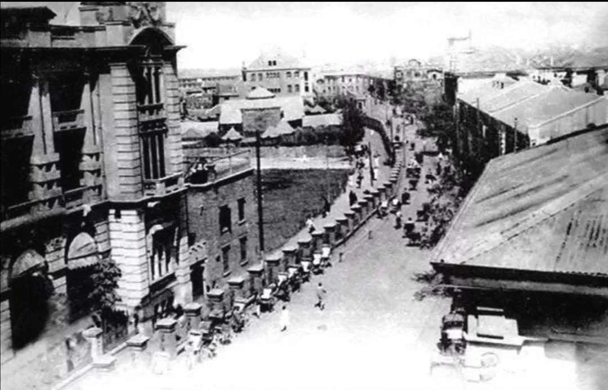
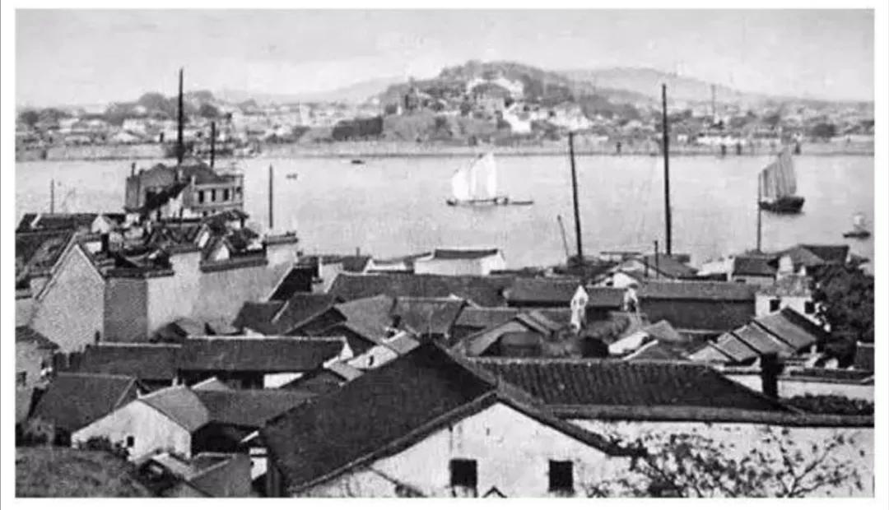
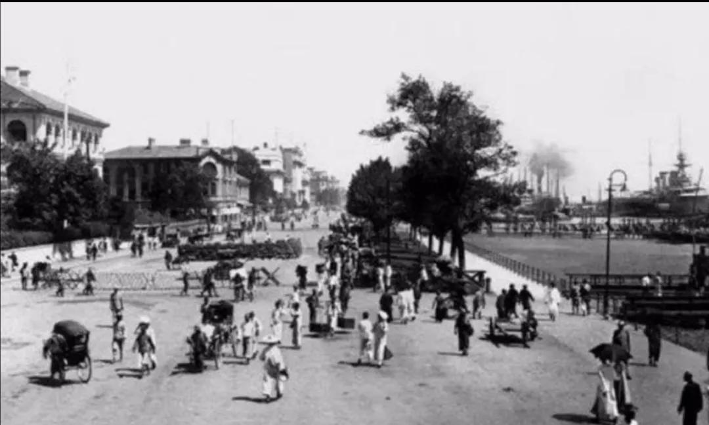
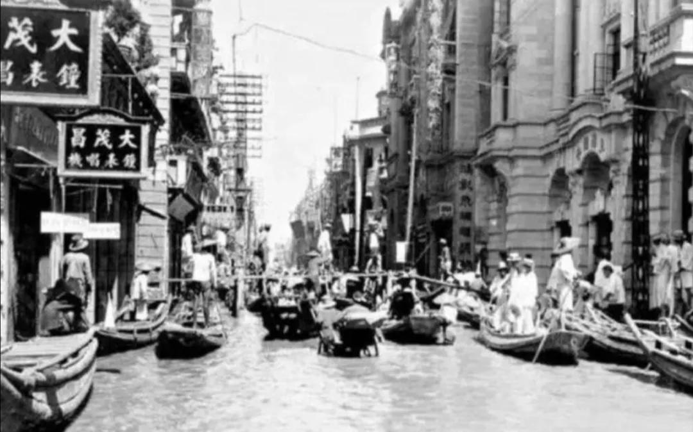
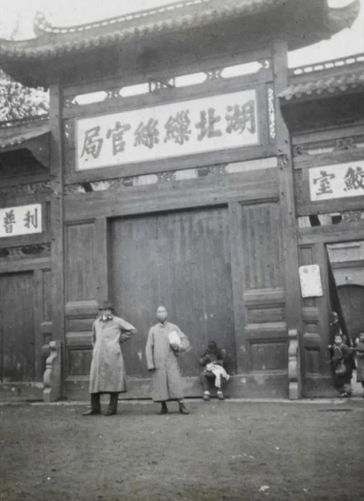
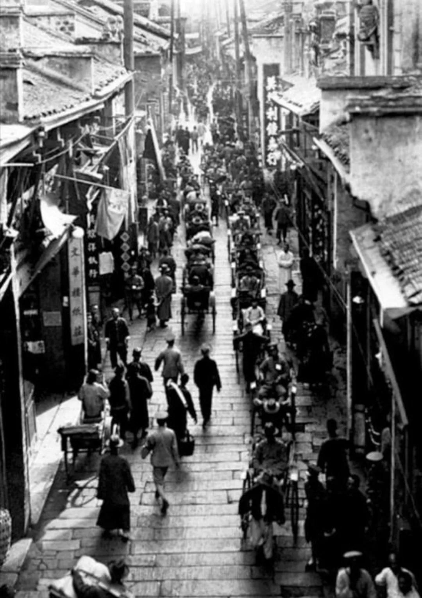
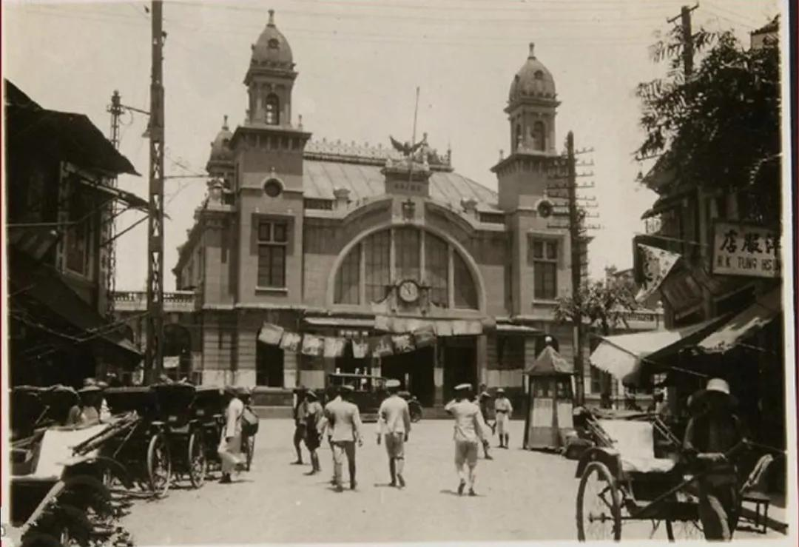

# 民国期间的大诈骗案，首领居然是个女文盲！

1946年7月间，武汉发生了一起“张五婆大骗案”，诈骗金额达13亿元之巨，受骗人数直接间接达数千人之多，不仅轰动武汉三镇，而且传遍当时的全国各地。诈骗案的主犯张五婆，是一个没有职业，没有资产，没有文化，没有权势，而又年过50的老太婆。

## 张五婆

张五婆夫家姓张，娘家姓冯，户口上名为张冯氏，湖北黄陂人，住在汉正街祥和里7号。其夫张中健，是黄陂张家大湾人氏，原在汉口开设裕德衣庄，歇业已8年，家道衰落，不得已在利济路摆“测字推卦”摊骗人取财维生。

张五婆，矮小的身材，小脚，梳妆打扮得干净利落。她平日走东家串西家，为张家办喜事，为李家办丧事，“热心快肠”;这家接媳妇，那家生小孩，她周情答礼，也面面俱到，成为街道里巷之间的一个兜得转、吃得开的人物。其实此妇是心机深密，老练圆滑。

抗日战争胜利以后，张五婆也带着日伪时期的社会习性，与当时胜利复员的社会环境一拍即合，就成了一个不用广告的骗子手。

张五婆大骗案不是她一个人干的，她有着一批的同伙，逐步形成个诈骗集团。张五婆的一个重要同伙名叫王翼飞，当时32岁，湖北汉阳五岭岗人，沦陷时期曾当过日伪军的少校副官。其妻王赵氏，山东人，口齿明快，擅长交际。

抗战胜利，王翼飞从伪军出来以后，穷得是一穷二白。后来，夫妻二人靠邀会、标会、代人存放款、诈骗起家，购置汉正街凌云里房屋，室内陈设华丽。王翼飞身着西装革履，出门乘坐自备新人力包车，举止极为阔绰，曾以一部分存款投入大中企业公司，担任该公司协理。

## 诈骗

1945年底，经邻居朱王氏介绍，王翼飞和张五婆相识，由于双方都是邀会、存放款的老手，语言投机，互相结纳，互为会首。

王翼飞的气派非凡，又有一个大中企业公司协理的职衔，王妻赵氏又打扮得花枝招展，能说会道，有着更大的号召力。王与张五婆合谋后，王要利用张五婆的社会力量，张要利用王在外面的交际场面，自然一拍即合，形成一个诈骗集团。

张五婆大骗案中，还有一个得力的“干将”，是个吃斋的女人，名叫刘汉斌，人称“刘师兄”(也有称为“二师兄”)，住在汉正街光裕里。这个名义上的斋姑，却颈带金项链，手带金镯子，招摇过市。

刘汉斌在外面交际很广，经常有一些身穿国民党军官服的人跟随着她。刘原来是从“邀会”、“标会”中与张五婆结识，后来为张五婆代收会钱、存款，从中取利。她在外面收存款利息1分到1分半，存入张五婆处，则提高为2分到3分。刘还请了一个管账人为她记账。

张五婆的党羽，还有“十姊妹”，其中有汪大姐、韩二姐、陈三姐、杨四姐、柯五姐、刘六姐、俞七姐、孙八姐、黄九姐、吴十姐。她们多是中年妇女，在标会上与张五婆结识。

张五婆对她们装出一副十分关怀的样子，她们家中有事，张五婆不仅为她们出主意，还亲自动手给她们帮忙。特别是她们家中有急需用钱的时候，张五婆出面代办邀会，或是将其他的会款，暂时挪借。于是她们结拜为十姊妹，同时拜张五婆为“干妈”，成为张五婆“邀会”“标会”诈骗的心腹爪牙。

“邀会”、“标会”，是旧社会武汉民间自发的一种借贷、存钱方式。刚开始时是带有互助的性质，标利很低。但是到了抗日战争胜利以后，由于国民党的官吏劫收分赃，贪污横行，压迫人民，扩军内战，造成恶性通货膨胀，货币不断贬值，物价一日数涨，有钱的商人乘机兴风作浪，囤积居奇，巧取牟利。而劳动人民日夜辛苦，换来的几张纸币，未过几天，就变得不值钱，难于买进生活必需品。社会上人情冷漠，劳苦人民有了困难，借贷无门，人们不能不寻求其他途径，以应付这种局面。于是，“邀会”、“标会”方式，就更加广泛盛行于全市的街道里巷之中。

“邀会”、“标会”参加的人多数是妇女，一般是利用省吃俭用节省下来的钱，或是暂时可以不用的钱，存一个会，一方面可以准备急时需要用，一方面可以获取一定利息。由于货币不断贬值，物价不断上涨，来会的人越来越多，“标会”所标的利息越来越高，这就逐渐的变成了一种高利贷形式。由于这种高利贷的引诱，“标会”的人更多，会钱金额就更大。

在当时物价飞涨的情况下，“标会”、“邀会”是诈骗，其实更大的诈骗是纸币大量发行。“邀会”与“标会”的骗局，不过是小巫见大巫而已。

张五婆的诈骗活动，是从“邀会”、“标会”开始的。“邀会”“标会”主要是会首有信誉，不至“塌会”。张五婆在开始“邀会”时，这一点是做得比较好的，“标会”、收钱、付钱，都清清楚楚。她本人“邀会”可以不付利息，来会的人也多有甜头，有了信誉，就进行邀第二个会、第三个会，有时她也参加别人邀的会，照例出标付利息。这样，结识的人就不断增多。收“十姊妹”为干女以后，“十姊妹”又分途串连“邀会”、“标会”，以一串十，以十串百，以百串千。一个月30天，几乎天天标会，有时天要标几个会。

张五婆与刘汉斌、王翼飞夫妇结识以后，三个“山头”的邀会、标会的队伍，汇合在一起，人数膨胀到数千人，钱数达到亿元以上。他们又变换了一个方式为存款、放款，许以大1分、大2分以至大3分的高利。刘汉斌在外面收存款，给利息1分到1分半，转手存到张五婆处，则提高为2分到3分，从中取利。而张五婆与王翼飞夫妇，则是互有往来，只是凭口对账，没有手续。

张五婆许以高利收到的会钱、存款，并没有投资经营工商业，没有把死钱变为活钱，而是用来购买一些黄金首饰，并于1946年1月至5月先后在黄陂县张家大湾购置六处田产，4月间在汉口汉正街购置祥和里房屋。

## 追债

张五婆、王翼飞等一伙所收会钱、存款，时深日久，负利过巨，到1946年7月，本利总数达到13亿元，来源不继，难以弥补，诈术渐穷。平日从中食利而供她们驱使者，如云龙、罗端甫(刘汉斌的管账人)、陆四元、陈复璋、喻延章、汪傅氏、常金万等人，怕越陷越深，受到牵累。而存款者如许胡氏、冯傅氏、黄刘氏、吴马氏等，因受到她们经手参加会和存款人之催促，纷纷向张五婆追索债款。

起初，王翼飞夫妇还出面周旋，说“钱有着落，大家不要着急”，力图挽回局面，继续掩盖行骗。一直拖到7月下旬，骗子们再也无力再拖了，就在这无可奈何的时候，张五婆诿称有12亿元和一些金银首饰银元等存放王翼飞之手。

放款人追到王翼飞家中追寻下落，而王不但否认张五婆有钱存放他处，反说他有2亿元存在张五婆处，他本人只负外债8000余万元。事实既经揭开，债权人亦齐集对付。

8月18日，债权人汪云龙、罗端甫、陆四元、陈复璋、喻延章、汪傅氏、常金万、许胡氏、冯傅氏、黄刘氏、吴马氏等共百余人，将张五婆、王翼飞、王赵氏和王家的车夫梁家茂抓住扭送武汉警备司令部军法处。押经繁华市区，像游行队伍一样，王翼飞胸前挂有一个牌子，上书“大骗犯王翼飞”，前面有几个人沿途高呼:“请看十三亿元大骗案主犯王翼飞!”有四个强壮有力的人挟挽着王翼飞前进，后面跟着男男女女的债权人100余人。有些老太婆走不动，坐着人力车跟随，计有27辆人力车。

队伍所经之处许多人围着观看，交通为之阻塞。还有些人跑上前去，朝着王翼长面部吐口水。有的人揪住王赵氏的头发，叫骂不止。

## 庭审

张五婆、王翼飞等当被武汉警备司令部军法处收押。虽然许多债权人表示对法院不信任，要求由军法审判。但警备司令部军法处认为，此案属于刑事诈骗案件，而且还附带民事债务关系，应由地方法院审判，遂将人犯一并解送汉口地方法院审理。

汉口地方法院检察官水范九承办此案，经数次侦讯，于8月24日认定张五婆、王翼飞、王赵氏共同犯诈骗罪，提起公诉。

债权人在抓住张五婆、王翼飞、王赵氏那天，往光裕里抓刘汉斌，遇有两个军人上前将刘汉斌带走。过了几天，债权人发觉刘汉斌在街上走，又是那两个军人随行，于是上前盘问。那两个军人见形势不对，仓皇溜走，群众遂将刘汉斌扭送法院，予以收押候讯。

在张五婆、王翼飞、刘汉斌处直接标会和存款的债权人，既是受骗者又是骗人者。在她们每个户头下面又有许许多多的枝节债权人。这些债权人，见会款没有着落，自然不肯甘心放手，于是集合起来到法院告状，到武汉行辕、警备令司部、市参议会、市政府请愿，要求迅速追出债款，偿还债务。

张五婆的干女十姊妹之一的孙八姐，其夫是驳船工人，因受她名下债权人追逼债款，几天没有吃饭，8月24日在汉口法院检察官提起公诉的法庭上大吵大闹，昏倒在地，经灌水10分钟才苏醒过来。

就在这天，检察官水范九退庭，受到债权人的包围，法警被殴打。院长刘泽民出来，晓谕债权人进行登记，将材料汇送法院听候处理。但债权人仍滋闹不休，法院拘捕了骚扰闹事者3人。其余的人有的跑到警备司令部军法处长面前下跪不起，要求将此案提交军法审判。有的人表示对司法机关不信任，要求将张五婆、王翼飞等交给债权人处理。

8月28日，汉口法院刑庭庭长陈振纲偕同书记官胡必勘，带领法警6名及部分债权代表到祥和里张五婆的住宅和凌云里王翼飞家中，进行了搜查。

8月30日上午，汉口法院刑庭开庭公审。法庭内外，挤满债权人、律师、新闻记者和观众。刑庭庭长陈振纲担任审判长，签提主犯张冯氏(张五婆)、王翼飞、王赵氏到庭。当庭上讯问在祥和里和凌云里搜査出来的物件，张冯氏、王翼飞供认为己物后，庭前秩序大乱，变成“法庭无法”。庭上只有宣布，将张五婆、王翼飞、王赵氏收监，停止审讯。

9月1日、2日、3日，法院都开庭审讯，每次最后都是以揪打王翼飞夫妇、秩序大乱而告终。陈振纲庭长事后对记者说:“这件案子真是伤脑筋。”

9月12日，法院对大骗案公开宣判。陈振纲宣读判决书主文:“王翼飞、王赵氏、张冯氏，共同以犯诈欺为常业，各处有期徒刑七年，禠夺公权七年。王翼飞、王赵氏侵占部分无罪，梁家茂无罪。”“关于债务部分应付假执行。”并谕各犯，如不服本判决可于10日内提出上诉。

此案民事部分的执行，一直拖延至1947年4月，汉口地院执行庭传告债权人代表及辩护律师胡经明、全斌、朱公善、肖逢时等到庭说明，即日在法院对张冯氏、王翼飞之动产、不动产进行公开拍卖以偿还债务。

关于刘汉斌问题，刑庭陈振纲曾在法庭上宣称:“刘汉斌蓄谋诈骗有据，应请检察官调查，提起公诉。”

在那之后，也没有见到检察官的上诉书，也未见到刑庭判决书。究竟是否是刘汉斌有门路买通了法院法官，已然没有了下文。总之国民党时期的法律多如牛毛，但终归“钱能通神”。所谓喧嚣一时的张五婆大骗案，也就不了了之。

## 档案

[原文链接](https://baijiahao.baidu.com/s?id=1767231867335122056&wfr=spider&for=pc)