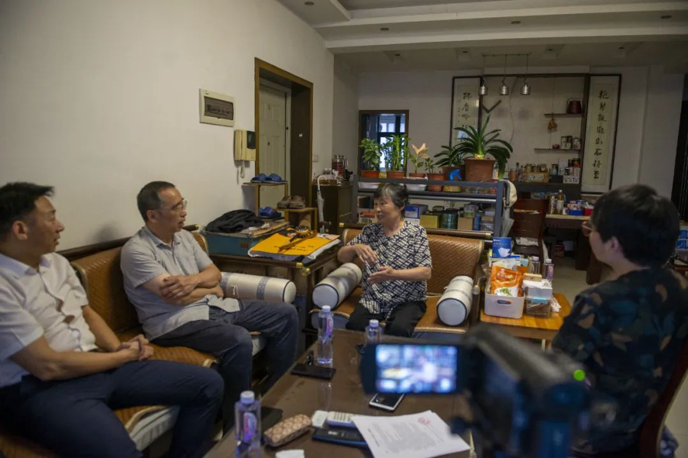
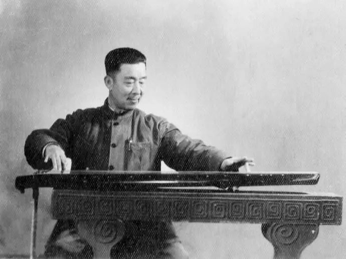
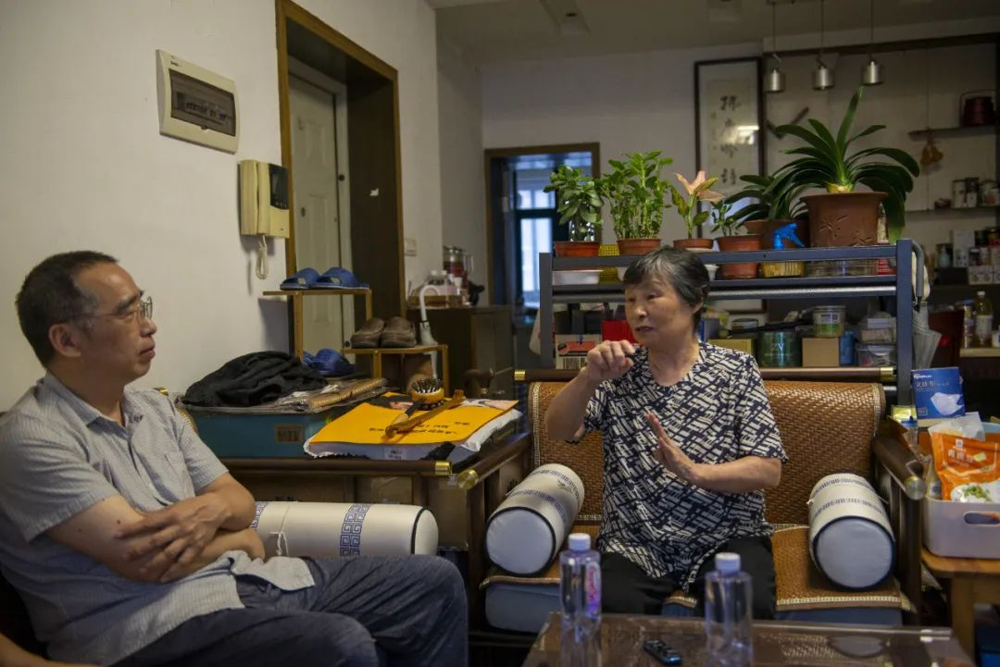
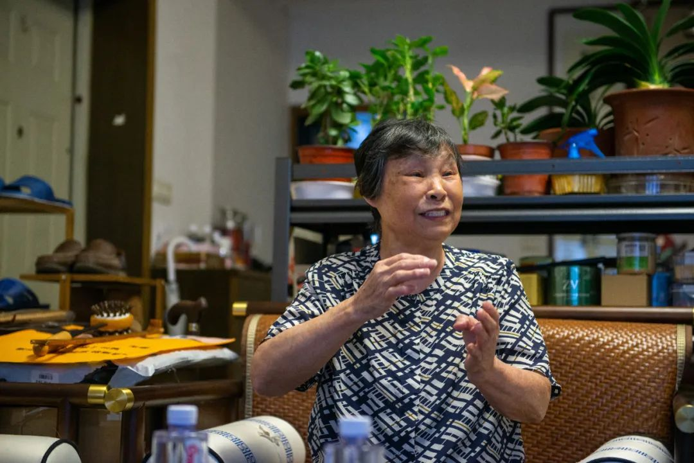
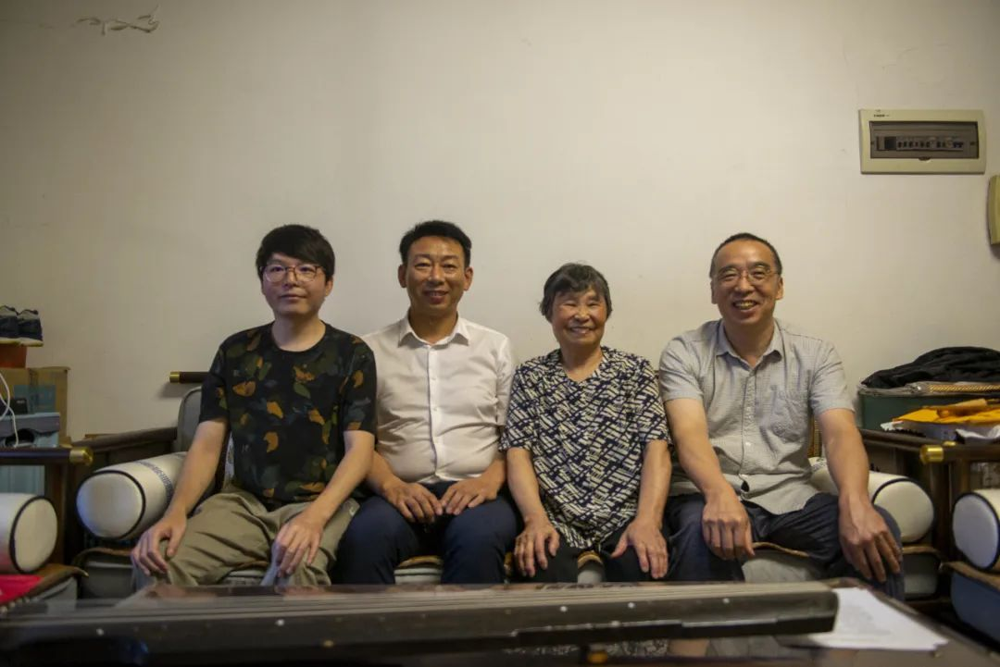
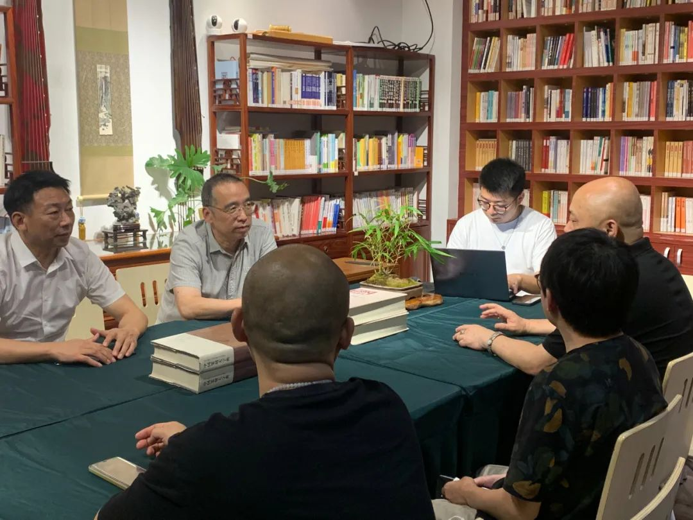

# 武汉古琴研究会“楚地琴家琴人口述实录”访谈工作正式启动

## 访谈会

2023年7月19日，研究会“楚地琴家琴人口述实录”正式启动。

第一期采访目标将以武汉老琴家陈树三的古琴传承为主要脉络，对其琴事活动、琴学研究、琴艺传承进行梳理，并对其传人进行阶段性的采访。

采访小组至武汉老琴家金德华老师家中进行录音摄像采访。本次采访活动由彭宇文会长牵头，周启元会长，陈宜外会长，研究会理事陈鹏、古吉康等参加此次采访活动。

提到楚地琴家琴人，不可不提及陈树三先生。

陈树三（1899-1975），湖北省文史馆馆员，省政府参事室参事，省政协二届委员、三届常委、四届副主席，全国政协三、四、五届委员，民革中央委员，省民革副主任等职。         

武汉“陈太乙”药店的第二代传人，著名法官、古琴家，琴棋书画无所不通。古琴师承于张宝亭、赵正义。对于古琴艺术的贡献在于他自创的“三线谱”，它将古谱转换成现代曲谱，更方便于后人弹唱，这一贡献曾引起业内轰动，时任中国古琴会会长的查阜西曾专程来汉切磋探讨。

金德华老师是武汉著名琴家陈树三先生的亲传弟子，是当时武汉乃至全国为数不多的学琴前辈，可谓是武汉古琴事业发展的亲历者和见证者。本次访谈主要围绕，金德华老师对自身习琴难忘的经历，恩师陈树三先生的生平情况、艺术成就以及所亲历的武汉古琴事业的发展做出讲述，为我们还原了旧时武汉的习琴轶事及习琴环境。

不知不觉间访谈接近尾声，研究会彭宇文、周启元、陈宜外会长等于金老师合影留念。金老师也表达了对武汉古琴研究会一直以来工作的认可，以及所取得的一些列成果的肯定，勉励研究会同仁们再接再厉，开启武汉古琴事业发展的新篇章。

未来武汉古琴研究会也将继续深耕挖掘知音文化、荆楚古琴文化艺术的研究工作，以楚地琴家发掘为抓手、以知音文化为基础，开展“楚地琴家琴人口述实录”访谈工作，将古琴艺术上升到文化发展的高度。一同拓展知音文化的内涵外延，着重开展楚地古琴文化历史挖掘，推动相关领域知音文化课题研究，力争早出研究成果！

2023年7月19日，研究会第二次会长会议顺利召开，研究会会长罗成伟，副会长彭宇文、周启元、陈宜外，副秘书长陈嘉伟，办公室副主任刘波参加会议。本次会议就“楚地琴家琴人口述实录”访谈工作的启动及后续工作开展计划做出讨论安排。

## 武汉琴台古琴文化艺术研究会

研究会由全市热爱古琴艺术和文化的古琴爱好者、团体自愿结成的学术性、全市性、非营利性的社会团体，成立于2016年6月10日，武汉市文化局为业务主管单位。
2016年成立至今，积极开展挖掘、传承、普及工作。2016年至2022年，连续七年承办武汉琴台音乐节古琴板块活动，多次组织古琴传承活动及推动“传统文化进校园”，相继在武大、华科、中国地质大学、中南民大等十余所高校举办古琴讲座活动。同时开设琴台讲坛栏目，广邀全国各地古琴名家、琴人代表与研究会开设讲座。曾先后设立琴台太和琴社、车站小学、江汉大学、泰康之家·楚园等古琴传习基地。

研究会地址：武汉市汉阳区罗七路金龙公馆9楼东侧
联系电话：027—84226291

## 档案

[原文链接](https://mp.weixin.qq.com/s?__biz=MzI5Nzc0MDA4NQ==&mid=2247495869&idx=1&sn=74a39d68b9080486f6ac6716418e4d5d&chksm=ecb2c2e7dbc54bf1272927804d08db6a9be6a20b4abd4468e8745e09ef599aca66ac76c9233a&scene=27)

