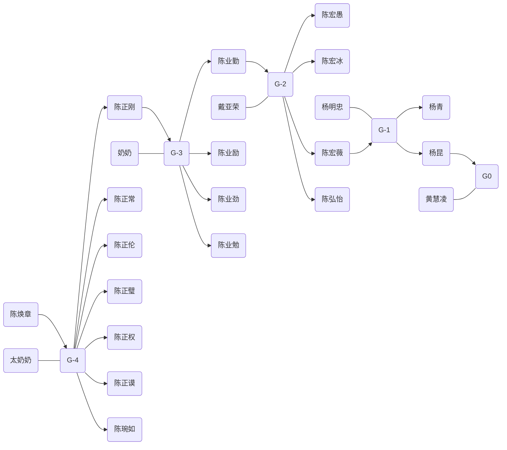

# 家庭传承

## 武汉汉口杨家

G-2:
- 杨寿山

G-1:
- 彭荣生
- 杨明忠
- 杨友运
- 杨鸿运

G0:
- 杨青
- 杨昆

G+1:
- Brandon Yang

## 武汉汉口陈家

G-4: 
- [陈焕章](02.chen_huan_zhang.md)

G-3:
- 陈正刚
- 陈正常
- 陈正伦
- 陈正权
- 陈正璧
- 陈正谟
- 陈琬如

G-2:
- 陈业勤（陈练明）
- 陈业励（陈宜）
- 陈业慧
- 陈业劲
- 陈业勉

G-1:
- 陈宏愚
- 陈宏冰
- 陈宏薇
- 陈弘怡

G0:
- 杨青
- 杨昆

G+1:
- 杨忱智

